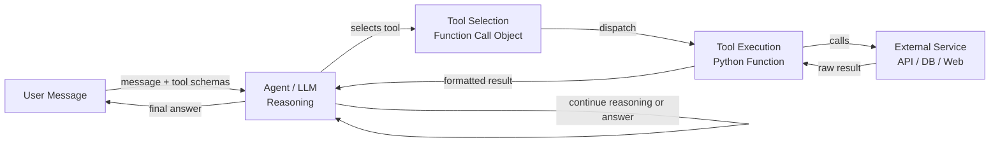

# 代理工具和行动

## 定义

工具和行动是 AI 代理的双手。虽然 LLM 提供推理和语言理解，但工具赋予代理影响世界的能力：搜索网络、运行代码、查询数据库、发送消息或调用任何外部 API。没有工具，代理仅限于从训练数据中知道的内容；有了工具，它可以访问实时信息、执行计算并采取有副作用的行动。

在 OpenAI 和 Anthropic 生态系统中，工具使用的机制称为**函数调用**（OpenAI）或**工具使用**（Anthropic）。开发者定义一组工具 schema——每个工具名称、用途和参数的结构化 JSON 描述——并将它们包含在 API 请求中。当 LLM 决定需要工具时，它返回结构化的工具调用对象而不是纯文本。调用代码执行该工具并将结果反馈给对话。这个循环重复，直到代理产生最终答案。

可用工具的广度本质上是无限的：如果某些东西可以表达为 Python 函数，它就可以成为工具。常见类别包括网页搜索、代码执行沙箱、SQL 或 NoSQL 数据库查询、文件系统访问、REST API 调用、电子邮件和消息集成，以及与 GUI 交互的计算机使用工具。设计良好的工具——具有清晰的 schema、可预测的行为和有用的错误消息——是开发者可以做的提高代理可靠性的最有影响力的事情之一。

## 工作原理

### 工具 Schema 定义

每个工具都由 LLM 用于理解何时以及如何调用它的 schema 描述。Schema 包括：名称（简短的 snake_case 标识符）、描述（清晰的自然语言解释工具做什么以及何时使用它）和参数对象（描述每个参数的 JSON Schema：名称、类型、描述以及是否必填）。描述的质量直接影响代理选择和调用工具的可靠性。模糊的描述导致误用；精确的描述和示例导致准确的工具调用。

### 工具选择

当 LLM 收到用户消息和一组工具 schema 时，它在每个步骤决定是直接回答还是调用工具。这个决定在函数调用数据的微调期间被隐式学习。在实践中，工具选择受系统提示（可以指示代理何时偏好某些工具）、工具描述的具体性以及模型仅从训练数据回答的置信度影响。提供 `tool_choice` 参数可以以编程方式强制或限制工具选择。

### 工具执行和结果注入

当 LLM 输出工具调用时，调用代码拦截它，根据 schema 验证参数，执行相应的函数，并收到结果。这个结果——无论是字符串、JSON 对象还是错误消息——被格式化为 `tool` 角色消息并附加到对话历史中。然后 LLM 在完全了解工具输出的情况下生成下一步。失败工具调用的错误消息很重要：代理必须知道工具失败了，以便可以重试、尝试替代方案或向用户寻求澄清。

### 多工具和并行工具调用

现代 LLM API 支持并行工具调用：当模型识别出多个工具调用是独立的时，可以在单次响应中请求多个工具调用。例如，代理可能同时对三个不同的查询调用 web_search，而不是顺序调用，将延迟减少三分之二。调用代码并行执行所有工具，收集结果，并在下一轮一起反馈。尽可能将工具设计为无状态和幂等，最大化并行执行的收益。



## 适用场景 / 不适用场景

| 适用场景 | 不适用场景 |
|---|---|
| 代理需要训练数据中没有的实时或外部信息 | 任务可以完全从模型的知识回答 |
| 需要有副作用的行动（发送电子邮件、写文件、更新 DB） | 工具在没有适当沙箱或速率限制的情况下引入安全风险 |
| 需要超出 LLM 能力的计算（算术、代码执行） | 每次工具调用都增加延迟，任务对时间敏感 |
| 结构化数据检索（SQL 查询、API 响应）至关重要 | 工具 schema 太复杂，模型经常误用 |
| 可以组合多个专业工具来解决复杂任务 | 工具的失败模式是不可恢复的，可能造成损害 |

## 优缺点

| 优点 | 缺点 |
|---|---|
| 将代理扩展到静态训练数据之外 | 每次工具调用增加延迟和 API 成本 |
| 支持现实世界的副作用和自动化 | 工具误用可能导致不可逆的行动 |
| 通过 JSON Schema 支持结构化、经过验证的 I/O | 设计清晰的 schema 需要仔细的提示工程 |
| 并行工具调用减少整体响应时间 | 更多工具增加了模型选择的认知负担 |
| 完全可扩展——任何 Python 函数都可以成为工具 | 必须明确实现错误处理和重试 |

## 代码示例

```python
"""
OpenAI function calling example with multiple tools:
- web_search: retrieve current information from the web
- safe_math: evaluate arithmetic using operator-based parsing (no eval)
- get_weather: fetch weather data for a city

The agent loop continues until the LLM produces a final text response
with no tool calls.
"""
from __future__ import annotations

import json
import math
import operator
import os
from typing import Any

from openai import OpenAI  # pip install openai

client = OpenAI(api_key=os.environ.get("OPENAI_API_KEY", "sk-placeholder"))
MODEL = "gpt-4o-mini"

# ---------------------------------------------------------------------------
# Tool implementations
# ---------------------------------------------------------------------------

def web_search(query: str, num_results: int = 3) -> str:
    """
    Mock web search. Replace with a real search API such as
    Tavily (https://tavily.com) or Serper (https://serper.dev).
    """
    return json.dumps({
        "query": query,
        "results": [
            {
                "title": f"Result {i + 1} for '{query}'",
                "snippet": f"Relevant information about {query}.",
            }
            for i in range(min(num_results, 10))
        ],
    })


def safe_math(operation: str, a: float, b: float) -> str:
    """
    Perform basic arithmetic safely using an explicit operator table.
    Supports: add, subtract, multiply, divide, power, sqrt (b unused), log.
    This avoids arbitrary code execution entirely.
    """
    ops: dict[str, Any] = {
        "add": operator.add,
        "subtract": operator.sub,
        "multiply": operator.mul,
        "divide": operator.truediv,
        "power": operator.pow,
        "sqrt": lambda x, _: math.sqrt(x),
        "log": lambda x, base: math.log(x, base) if base else math.log(x),
    }
    if operation not in ops:
        return f"Unknown operation '{operation}'. Supported: {', '.join(ops)}"
    try:
        result = ops[operation](a, b)
        return json.dumps({"operation": operation, "a": a, "b": b, "result": result})
    except (ValueError, ZeroDivisionError, OverflowError) as exc:
        return json.dumps({"error": str(exc)})


def get_weather(city: str, units: str = "celsius") -> str:
    """
    Mock weather API. Replace with OpenWeatherMap or similar.
    """
    mock_data = {
        "city": city,
        "temperature": 22,
        "units": units,
        "condition": "Partly cloudy",
        "humidity_percent": 65,
    }
    return json.dumps(mock_data)


# Map tool names to Python functions
TOOL_FUNCTIONS: dict[str, Any] = {
    "web_search": web_search,
    "safe_math": safe_math,
    "get_weather": get_weather,
}

# ---------------------------------------------------------------------------
# Tool schemas (sent to the LLM with every request)
# ---------------------------------------------------------------------------

TOOLS = [
    {
        "type": "function",
        "function": {
            "name": "web_search",
            "description": (
                "Search the web for current information. Use this tool when the user asks "
                "about recent events, facts that may have changed, or anything that requires "
                "up-to-date information."
            ),
            "parameters": {
                "type": "object",
                "properties": {
                    "query": {
                        "type": "string",
                        "description": "The search query to execute.",
                    },
                    "num_results": {
                        "type": "integer",
                        "description": "Number of results to return (default 3, max 10).",
                        "default": 3,
                    },
                },
                "required": ["query"],
            },
        },
    },
    {
        "type": "function",
        "function": {
            "name": "safe_math",
            "description": (
                "Perform a mathematical operation on two numbers. "
                "Supported operations: add, subtract, multiply, divide, power, sqrt, log. "
                "Use this instead of trying to compute arithmetic mentally."
            ),
            "parameters": {
                "type": "object",
                "properties": {
                    "operation": {
                        "type": "string",
                        "enum": ["add", "subtract", "multiply", "divide", "power", "sqrt", "log"],
                        "description": "The arithmetic operation to perform.",
                    },
                    "a": {
                        "type": "number",
                        "description": "The first operand (or the only operand for sqrt).",
                    },
                    "b": {
                        "type": "number",
                        "description": "The second operand (base for log, ignored for sqrt).",
                    },
                },
                "required": ["operation", "a", "b"],
            },
        },
    },
    {
        "type": "function",
        "function": {
            "name": "get_weather",
            "description": (
                "Get the current weather for a city. Use this tool when the user asks "
                "about weather conditions, temperature, or humidity in a specific location."
            ),
            "parameters": {
                "type": "object",
                "properties": {
                    "city": {
                        "type": "string",
                        "description": "The city name, e.g. 'Tokyo' or 'New York'.",
                    },
                    "units": {
                        "type": "string",
                        "enum": ["celsius", "fahrenheit"],
                        "description": "Temperature units (default: celsius).",
                        "default": "celsius",
                    },
                },
                "required": ["city"],
            },
        },
    },
]

# ---------------------------------------------------------------------------
# Agent loop
# ---------------------------------------------------------------------------

def dispatch_tool_call(tool_call) -> str:
    """Execute a single tool call and return the result as a string."""
    name = tool_call.function.name
    args = json.loads(tool_call.function.arguments)
    print(f"  [Tool call] {name}({args})")

    if name not in TOOL_FUNCTIONS:
        return f"Error: unknown tool '{name}'"

    result = TOOL_FUNCTIONS[name](**args)
    preview = result[:120] + ("..." if len(result) > 120 else "")
    print(f"  [Tool result] {preview}")
    return result


def run_agent(user_message: str, system_prompt: str = "You are a helpful assistant.") -> str:
    """
    Agent loop: send message, handle tool calls, repeat until a final answer is produced.
    """
    messages = [
        {"role": "system", "content": system_prompt},
        {"role": "user", "content": user_message},
    ]

    print(f"User: {user_message}\n")

    max_turns = 10  # Safety limit to prevent infinite loops
    for _ in range(max_turns):
        response = client.chat.completions.create(
            model=MODEL,
            messages=messages,
            tools=TOOLS,
            tool_choice="auto",  # Let the model decide; "none" disables tools
        )
        msg = response.choices[0].message

        # If no tool calls, we have the final answer
        if not msg.tool_calls:
            print(f"\nAssistant: {msg.content}")
            return msg.content

        # Append the assistant message with tool calls to history
        messages.append(msg)

        # Execute all tool calls (for parallel execution use asyncio + concurrent.futures)
        for tool_call in msg.tool_calls:
            result = dispatch_tool_call(tool_call)
            messages.append({
                "role": "tool",
                "tool_call_id": tool_call.id,
                "content": result,
            })

    return "Max turns reached without a final answer."


if __name__ == "__main__":
    # Example 1: requires web search
    run_agent("What are the main differences between GPT-4 and Claude 3?")

    print("\n" + "=" * 60 + "\n")

    # Example 2: requires safe_math tool
    run_agent("What is 2 raised to the power of 16, and what is the square root of that?")

    print("\n" + "=" * 60 + "\n")

    # Example 3: requires weather tool
    run_agent("What's the weather like in London right now?")
```

## 实用资源

- [OpenAI 函数调用指南](https://platform.openai.com/docs/guides/function-calling) — 涵盖工具 schema、并行调用和函数定义最佳实践的官方文档。
- [Anthropic 工具使用文档](https://docs.anthropic.com/en/docs/tool-use) — Anthropic 关于 Claude 工具使用的指南，包括流式传输、计算机使用和多工具模式。
- [Tavily AI 搜索 API](https://tavily.com/) — 专为 LLM 代理设计的搜索 API，提供干净的结构化结果，非常适合工具使用。
- [LangChain 工具概念](https://python.langchain.com/docs/concepts/tools/) — LangChain 中工具设计模式的高级概述，包括自定义工具和内置集成。
- [Gorilla：连接大量 API 的大型语言模型（Patil 等人，2023）](https://arxiv.org/abs/2305.15334) — 关于微调 LLM 以在数千个工具中准确选择 API/工具的研究。

## 另请参阅

- [AI 代理](/docs/agents)
- [Anthropic 工具使用](/docs/agents/anthropic-tool-use)
- [代理框架概述](/docs/agents/frameworks-overview)
