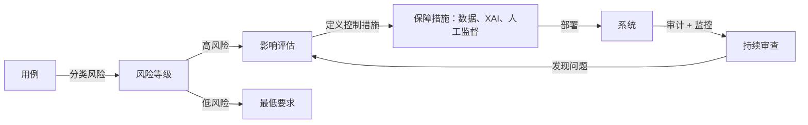

# AI 伦理

## 定义

AI 伦理是关注道德原则、治理结构和实践标准的领域，这些原则和标准指导 AI 系统的设计、部署和监督方式。核心原则包括公平性（避免歧视）、透明度（使系统对受影响者可理解）、问责制（明确分配结果责任）和隐私（尊重个人的数据权利）。这些原则通过行为准则、影响评估、审计流程以及日益增多的约束性法规来落实。

伦理 AI 不仅仅是为了防止伤害——它也在积极推动为不同利益相关者带来有益的结果。这包括确保 AI 的益处得到公平分配，受影响的社区在出现问题时有实质性的救济途径，以及 AI 的发展不会以破坏民主制度或个人自主权的方式集中权力。伦理提供了技术安全和公平工作在其中运作的规范框架。

在实践中，AI 伦理直接与 [AI 安全](/docs/ai-safety)（在风险和对齐方面）、[AI 中的偏见](/docs/bias-in-ai)（在公平性结果方面）以及[可解释 AI](/docs/xai)（在透明度要求方面）相连接。监管正在迅速将伦理转化为法律：欧盟 AI 法案引入了分层风险分类、强制透明义务和禁止的实践，使伦理和影响评估对高风险应用程序具有法律要求。组织现在必须将抽象原则转化为具体的设计决策、[评估实践](/docs/evaluation-metrics)和部署控制。

## 工作原理

### 从原则到实践的转化

伦理原则通过结构化流程变得可操作。影响评估识别谁受到系统影响、什么可能出错、伤害有多严重以及有哪些可用的缓解措施。伦理委员会（内部或外部）在部署前根据组织和监管标准评估拟议系统。

### 监管合规



### 治理结构

组织通过负责任 AI 政策、模型卡片、数据集的数据表以及设计决策和问责链的文档来实施治理。人机协作机制为重大决策保留有意义的监督。利益相关者参与确保受影响的社区对影响他们的系统有发言权。

## 何时使用 / 何时不使用

| 使用时机 | 避免时机 |
|---------|---------|
| 在受监管或高风险领域（医疗、招聘、信贷）设计或部署 AI | 系统不做出重大决策且不直接影响人员 |
| 需要符合监管要求（欧盟 AI 法案、GDPR、行业规则） | 该应用程序是没有部署路径的纯研究原型 |
| 推出面向公众的 AI 产品或服务 | 所有输出在采取任何行动前都由合格的人员审查 |
| 管理影响客户或员工的第三方 AI 工具 | 该工具纯粹是内部使用的，结果完全可逆 |

## 比较

| 概念 | 范围 | 主要成果 |
|------|------|---------|
| AI 伦理 | 原则、治理、价值观 | 政策、影响评估、问责框架 |
| AI 安全 | 技术对齐和风险 | 鲁棒性技术、防护措施、监控系统 |
| AI 中的偏见 | 跨群体的公平性 | 公平性审计、去偏见方法、指标报告 |
| 可解释 AI | 可解释性 | 解释、特征归因、审计工具 |

## 优缺点

| 优点 | 缺点 |
|------|------|
| 降低法律和声誉风险 | 伦理审查可能减慢开发周期 |
| 建立用户和公众信任 | 原则通常模糊，难以操作化 |
| 创建问责制和审计追踪 | 公平性指标可能相互冲突，也可能与准确性冲突 |
| 鼓励主动预防伤害 | 全球监管碎片化增加了合规复杂性 |

## 代码示例

### 生成简单的模型卡片（Python）

```python
from dataclasses import dataclass, asdict
import json

@dataclass
class ModelCard:
    model_name: str
    version: str
    intended_use: str
    out_of_scope_use: str
    training_data: str
    evaluation_metrics: list[str]
    known_limitations: str
    ethical_considerations: str
    contact: str

card = ModelCard(
    model_name="loan-approval-classifier",
    version="1.2.0",
    intended_use="Assist loan officers in reviewing consumer loan applications.",
    out_of_scope_use="Fully automated loan decisions without human review.",
    training_data="Internal loan data 2015-2023; balanced by income bracket and region.",
    evaluation_metrics=["accuracy", "F1", "demographic_parity", "equalized_odds"],
    known_limitations="Underperforms for applicants with non-traditional credit histories.",
    ethical_considerations="Reviewed by ethics board Q1 2024. Fairness audited across gender and race.",
    contact="ai-governance@example.com",
)

print(json.dumps(asdict(card), indent=2))
```

## 实用资源

- [欧盟 AI 法案](https://digital-strategy.ec.europa.eu/en/policies/regulatory-framework-artificial-intelligence) — 欧盟监管框架，包含风险等级和合规要求
- [OECD – AI 原则](https://oecd.ai/en/ai-principles) — 关于可信 AI 的国际原则
- [Google – 负责任 AI 实践](https://ai.google/responsibility/responsible-ai-practices/) — 在 AI 开发中应用伦理的实用指导
- [Model Cards for Model Reporting (Mitchell et al.)](https://arxiv.org/abs/1810.03993) — 透明度文档的奠基性论文
- [AI Now Institute](https://ainowinstitute.org/) — 关于 AI 社会影响的研究

## 另请参阅

- [AI 安全](/docs/ai-safety)
- [AI 中的偏见](/docs/bias-in-ai)
- [可解释 AI](/docs/xai)
