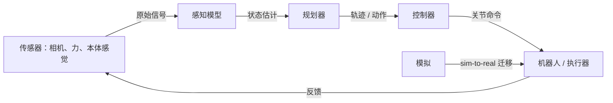

# AI 与机器人技术

## 定义

AI 在机器人技术中是将机器学习和 AI 技术应用于在现实世界中行动的物理智能体的领域。它涵盖三个核心问题：感知（从传感器数据理解世界状态）、规划（决定下一步做什么）和控制（通过执行器执行动作）。与纯数字 AI 应用不同，机器人系统必须实时处理物理不确定性、延迟和安全约束。

现代 AI 机器人技术使用[强化学习](/docs/rl)、模仿学习和[计算机视觉](/docs/cv)来训练直接将传感器输入映射到动作的策略。一个重要范式是 sim-to-real：在模拟中训练策略（数据廉价且失败安全），然后转移到真实硬件上。这需要域随机化、系统识别以及有时的在线适应，以弥合模拟动态和真实动态之间的差距。

在实践中，机器人技术与[深度强化学习](/docs/drl)（用于基于策略的控制）、[多模态 AI](/docs/multimodal-ai)（用于丰富的传感器感知）和[边缘推理](/docs/local-inference)（用于实时板载处理）相连接。范围从工业操作和仓储到手术机器人和自主导航——每个用例都带来速度、精度和安全约束之间的不同权衡。

## 工作原理

### 感知-规划-控制流水线

传感器（相机、力/扭矩、本体感觉）输入到**感知**模型，这些模型估计状态（例如对象姿态、场景布局）。**规划器**（经典或学习的）生成轨迹或高级动作（例如"抓取方块 A"）。**控制器**（例如 PID、学习策略）执行低级命令（关节力矩、速度）以跟踪计划。

**端到端**学习在一个网络中将原始传感器输入映射到动作；**模块化**流水线分离感知、规划和控制，以提高可解释性和可重用性。训练通常在模拟中进行（[DRL](/docs/drl)）；sim-to-real（域随机化、系统识别）和安全约束对于部署至关重要。



### Sim-to-Real 迁移

模拟允许无限的训练数据和安全的探索。Sim-to-real 技术弥合差距：域随机化改变物理参数和视觉纹理，使策略能够泛化到真实变化。系统识别根据真实硬件校准模拟参数。残差策略在模拟基础上学习小的修正。

## 何时使用 / 何时不使用

| 使用时机 | 避免时机 |
|---------|---------|
| 任务需要与非结构化环境进行物理交互 | 任务完全基于规则且确定性（经典机器人技术足够） |
| Sim-to-real 迁移可行且安全约束可管理 | 没有足够容错和测试的安全关键应用程序 |
| 有足够的演示或模拟数据可用 | 实时硬件延迟与推理要求不兼容 |
| 需要针对不断变化环境的实时自适应策略 | 标注或演示数据太少或太昂贵 |

## 比较

| 方法 | 训练来源 | 优势 | 局限性 |
|------|---------|------|-------|
| 强化学习 | 模拟 rollouts | 探索新颖策略 | 需要大量样本，存在模拟差距 |
| 模仿学习 | 人类演示 | 从演示中快速学习 | 泛化效果不超出演示范围 |
| 经典控制 | 模型 + 规则 | 可解释、确定性 | 无法扩展到复杂感知 |
| 端到端学习 | 传感器 → 动作 | 统一训练 | 更难调试和部署 |

## 优缺点

| 优点 | 缺点 |
|------|------|
| 适应非结构化环境 | Sim-to-real 差距可能需要昂贵的校准 |
| 从数据中学习策略，无需显式编程 | 安全约束难以编码到学习策略中 |
| 模拟允许低成本训练 | 需要仔细的传感器和硬件集成 |
| 模型可在多任务场景中迁移 | 实时推理要求限制模型大小 |

## 代码示例

### 简单策略循环（Python / OpenAI Gym 风格）

```python
import gymnasium as gym

env = gym.make("FetchReach-v2", render_mode="human")
obs, info = env.reset()

for step in range(200):
    # 替换为学习的策略；这里使用随机动作
    action = env.action_space.sample()
    obs, reward, terminated, truncated, info = env.step(action)
    if terminated or truncated:
        obs, info = env.reset()

env.close()
```

### 域随机化（概念）

```python
import numpy as np

def randomize_env_params(base_mass: float, base_friction: float) -> dict:
    """随机化物理属性以改善 sim-to-real。"""
    return {
        "mass": base_mass * np.random.uniform(0.8, 1.2),
        "friction": base_friction * np.random.uniform(0.5, 1.5),
        "joint_damping": np.random.uniform(0.01, 0.1),
    }

# 训练期间：在每次重置时重新采样环境参数
params = randomize_env_params(base_mass=1.0, base_friction=0.5)
```

## 实用资源

- [Spinning Up in Deep RL (OpenAI)](https://spinningup.openai.com/) — 机器人控制的 RL 基础
- [Google Robotics Research](https://research.google/pubs/robotics/) — 学习机器人技术研究概述
- [Gymnasium Robotics](https://robotics.farama.org/) — 学习机器人技术 RL 研究的标准环境
- [Isaac Gym / Isaac Lab (NVIDIA)](https://developer.nvidia.com/isaac-gym) — 用于机器人 RL 的 GPU 加速物理模拟框架

## 另请参阅

- [强化学习](/docs/rl)
- [深度强化学习](/docs/drl)
- [计算机视觉](/docs/cv)
- [多模态 AI](/docs/multimodal-ai)
- [边缘推理](/docs/local-inference)
