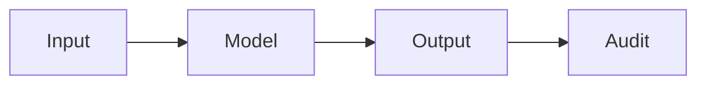

# AI 安全

## 定义

AI 安全解决高级 AI 的风险：滥用、意外行为和对齐 (systems doing what we intend). It includes robustness, interpretability, and value alignment.

它与…重叠 [AI ethics](/docs/ai-ethics) (governance, fairness) and [bias in AI](/docs/bias-in-ai) (unfair outcomes). For [LLMs](/docs/llms) and [agents](/docs/agents), alignment (例如 RLHF, constitutional AI) and guardrails are the main levers; [explainable AI](/docs/xai) supports auditing and debugging.

## 工作原理

**输入**由**模型**处理以产生**输出**。**审计**（测试、监控、红队测试）检查输出是否安全、对齐且 robust. Research and practice focus on: **alignment** (RLHF, constitutional AI, scalable oversight) so models follow intent; **robustness** (adversarial testing, distribution shift) so they behave under edge cases; **monitoring** in production to detect misuse or drift. Safety is considered across the lifecycle from 设计 and data to training, evaluation, and deployment. Formal methods and interpretability ([XAI](/docs/xai)) support the audit step.

## 应用场景

AI 安全适用于任何高风险或面向公众的系统：从设计到部署的对齐、鲁棒性和监控。

- Auditing and red-teaming high-stakes or public-facing models
- Alignment and guardrails for LLMs and agents (例如 RLHF, constitutional AI)
- Robustness testing and monitoring in production

## 外部文档

- [Anthropic – Safety](https://www.anthropic.com/research) — Research on AI safety and alignment
- [OpenAI – Safety and responsibility](https://openai.com/safety)

## 另请参阅

- [AI ethics](/docs/ai-ethics)
- [Explainable AI](/docs/xai)
- [Bias in AI](/docs/bias-in-ai)
