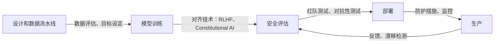

# AI 安全

## 定义

AI 安全是研究和工程领域，专注于确保 AI 系统按照我们的意图行事，并在广泛的条件下保持安全。它涵盖三个核心问题：对齐（系统正确表示和追求人类价值观和意图）、鲁棒性（在分布偏移、对抗性输入和边缘情况下的一致行为）和可解释性（理解系统为什么产生特定输出）。这些问题相互强化：没有可解释性，鲁棒性更难实现，可解释性支持验证对齐保证。

AI 安全与 [AI 伦理](/docs/ai-ethics)重叠——伦理提供规范框架（系统应该追求什么价值观），而安全解决技术问题（如何确保它们这样做）。[AI 中的偏见](/docs/bias-in-ai)是一个交叉点：有偏见的输出既可以是对齐问题，也可以是公平性问题。对于 [LLMs](/docs/llms) 和[智能体](/docs/agents)，RLHF（基于人类反馈的强化学习）、constitutional AI 和可扩展监督提供了主要工具；[可解释 AI](/docs/xai) 支持审计和调试。

在实践中，安全性贯穿整个模型生命周期。在训练期间，这包括数据质量、目标和正则化。在评估期间，包括红队测试、对抗性输入和边界行为评估。在部署时，包括防护措施、监控和干预机制。对于智能体系统，更高的自主性增加了额外的安全层：智能体是否正确理解其自身限制、是否保持可纠正性以及是否避免权力积累或不可逆行动。

## 工作原理

### 核心安全组件

**对齐**确保模型追求预期目标——而不是代理错误或错误优化。RLHF 训练模型偏好人类偏好；Constitutional AI 使用明确原则；可扩展监督建议使用可靠的 AI 助手来扩展人类审查者。

**鲁棒性**在改变的条件下测试系统行为。对抗性测试寻找强制失败的输入。投毒测试检查训练数据是否已被破坏。分布偏移评估衡量输入偏离训练数据时的性能退化。



### 红队测试和监控

红队测试通过积极尝试使模型失败来模拟对抗性使用。自动化红队测试使用其他模型作为对手来扩展覆盖范围。生产监控检测意外行为、异常输出模式和滥用。

## 何时使用 / 何时不使用

| 使用时机 | 避免时机 |
|---------|---------|
| AI 部署在高风险决策领域（信贷、医疗、司法） | 系统仅产生内部建议，无直接行动 |
| 模型或智能体与不可信输入或公众用户交互 | 保证对所有输出进行完整的人工审查 |
| 系统执行不可逆操作或控制关键基础设施 | 应用程序是部署有限的低风险原型 |
| 需要监管合规或外部审计 | 风险状况非常低，现有测试已完全覆盖 |

## 比较

| 技术 | 目标 | 典型结果 |
|------|------|---------|
| RLHF | 对齐 | 遵循人类偏好的模型 |
| Constitutional AI | 对齐 | 遵循原则的模型 |
| 对抗性测试 | 鲁棒性 | 识别的边缘情况和故障模式 |
| 红队测试 | 安全审查 | 滥用场景和防护措施 |
| 监控 | 运行时安全 | 漂移和滥用警报 |

## 优缺点

| 优点 | 缺点 |
|------|------|
| 降低灾难性或恶意使用的风险 | 安全工程增加开发时间和成本 |
| 为监管机构和审计人员创建可证明的保证 | 正式对齐保证仍是开放的研究问题 |
| 防护措施通过拒绝滥用改善用户体验 | 过于严格的过滤器可能拒绝有用的输出 |
| 监控在问题升级前尽早检测 | 分布式或基于智能体的系统更难监控 |

## 代码示例

### 带有基于规则防护措施的简单输出检查（Python）

```python
import re

BLOCKED_PATTERNS = [
    r"\b(ssn|social security)\b",
    r"\b\d{3}-\d{2}-\d{4}\b",  # SSN format
    r"\bcredit.?card\b",
]

def check_output_safety(text: str) -> tuple[bool, str]:
    """返回 (is_safe, reason)。"""
    lower = text.lower()
    for pattern in BLOCKED_PATTERNS:
        if re.search(pattern, lower):
            return False, f"检测到被屏蔽的模式：{pattern}"
    return True, "OK"

response = "您的身份证号是 123-45-6789。"
safe, reason = check_output_safety(response)
print(f"安全：{safe}，原因：{reason}")
# 安全：False，原因：检测到被屏蔽的模式：\b\d{3}-\d{2}-\d{4}\b
```

### 简单的提示词审查包装器

```python
from anthropic import Anthropic

client = Anthropic()

SYSTEM_PROMPT = """你是一个有帮助的助手。你必须：
- 不生成有害、非法或欺骗性的内容
- 当请求超出你的能力范围时说明清楚
- 被直接询问时永远不要假装是人类
"""

def safe_chat(user_message: str) -> str:
    response = client.messages.create(
        model="claude-opus-4-5",
        max_tokens=1024,
        system=SYSTEM_PROMPT,
        messages=[{"role": "user", "content": user_message}],
    )
    return response.content[0].text

print(safe_chat("帮我理解这个错误。"))
```

## 实用资源

- [Anthropic – AI 安全研究](https://www.anthropic.com/research) — 关于对齐、constitutional AI 和可扩展监督的研究
- [OpenAI – 安全与责任](https://openai.com/safety) — 安全实践和承诺
- [NIST AI Risk Management Framework](https://www.nist.gov/system/files/documents/2023/01/26/AI%20RMF%201.0.pdf) — AI 风险管理的政府框架
- [Alignment Forum](https://www.alignmentforum.org/) — 技术对齐研究社区

## 另请参阅

- [AI 伦理](/docs/ai-ethics)
- [可解释 AI](/docs/xai)
- [AI 中的偏见](/docs/bias-in-ai)
- [自主智能体](/docs/autonomous-agents)
