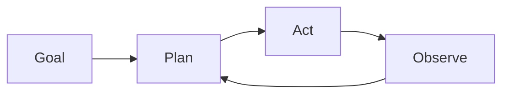

# 自主智能体

## 定义

自主智能体在有限的人类输入下在较长时间范围内追求目标。 They plan, use tools, and adapt when the environment or task changes (例如 coding agents, research assistants).

They sit at the “high autonomy” end of the [agents](/docs/agents) spectrum: 不是一个用户轮次一个响应，而是运行长循环 (plan → act → observe → replan) until the goal is met or a limit is hit. [Subagents](/docs/subagents) and [推理 patterns](/docs/reasoning-patterns) (例如 ReAct, ToT) are often used inside autonomous agents to structure planning and action.

## 工作原理

The agent starts from a **goal** (例如 “implement feature X”). It **plans** (possibly breaking into steps or sub-tasks), then **acts** (工具调用, code edits, search). The **observe** step captures results (tool outputs, errors, state) and feeds back into **plan** for the next iteration. The loop combines planning, memory (what was tried, what worked), tool use, and often reflection (例如 self-critique). It runs until a stopping condition: task done, step/budget limit, or human-in-the-loop check. Safety and oversight (例如 approval gates, rollback) are important when autonomy is high.

## 应用场景

自主智能体适用于长期、多步骤的工作，系统必须在没有逐步人工输入的情况下进行规划、行动和适应。

- Long-horizon coding agents that plan, edit, and test
- Research assistants that gather sources, summarize, and iterate
- Data pipelines that adapt when inputs or schemas change

## 外部文档

- [From Prototypes to Agents with ADK – Google Codelabs](https://codelabs.developers.google.com/your-first-agent-with-adk#0)
- [LangChain – Autonomous agents](https://python.langchain.com/docs/concepts/agents/)

## 另请参阅

- [Agents](/docs/agents)
- [Subagents](/docs/subagents)
- [Reasoning patterns](/docs/reasoning-patterns)
