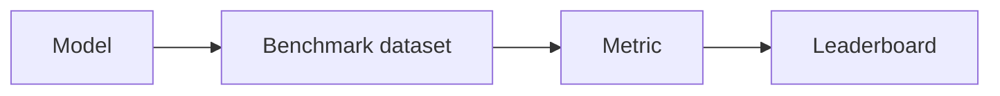

# 基准测试

## 定义

基准测试是标准化的数据集和评估协议 (例如 GLUE, SuperGLUE for NLP; MMLU for broad knowledge; HumanEval for code). They enable comparison across models and over time.

They 依赖于 [evaluation metrics](/docs/evaluation-metrics) 和固定分割以便结果可比较. 对基准的过拟合是一个已知问题; supplement with out-of-distribution and human eval when deploying [LLMs](/docs/llms) or production systems.

## 工作原理

A **model** is run on a **benchmark dataset** (固定提示或输入，标准划分). **Metrics** (例如 accuracy, pass@k) 被计算 每个任务 and often averaged; results are reported on a **leaderboard** or in papers. Protocols define what inputs to use, how to parse outputs, and which [metrics](/docs/evaluation-metrics) to report. Reusing the same benchmark across time lets the community track progress. Care is needed: models can overfit to benchmark quirks, and benchmarks may not reflect real-world quality—use them as one signal among others.

## 应用场景

Benchmarks give a common yardstick to compare models and methods; use them together with task-specific and human evaluation.

- Comparing NLP models (例如 GLUE, SuperGLUE, MMLU)
- Evaluating code generation (例如 HumanEval) or 推理
- Tracking model and method progress over time

## 外部文档

- [Papers with Code – Leaderboards](https://paperswithcode.com/)
- [MMLU (Hendrycks et al.)](https://arxiv.org/abs/2009.03300) — Broad knowledge benchmark
- [HumanEval](https://github.com/openai/human-eval) — Code generation benchmark

## 另请参阅

- [Evaluation metrics](/docs/evaluation-metrics)
- [LLMs](/docs/llms)
