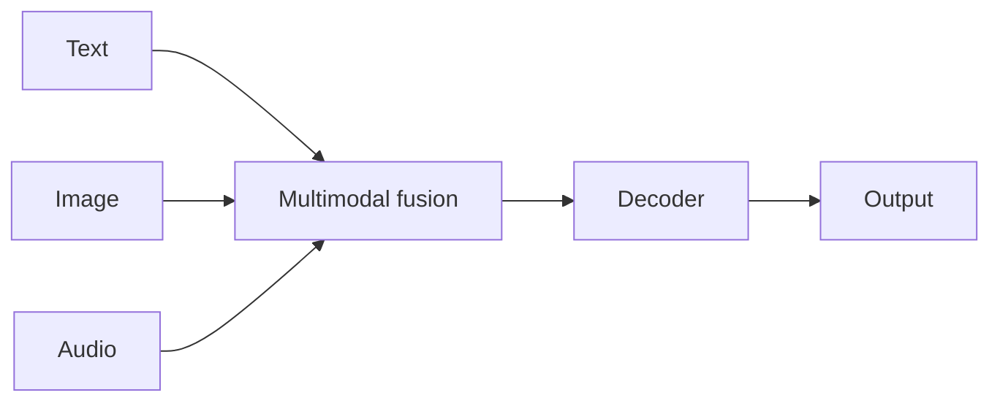

# Case study: Gemini

## 定义

Gemini is Google’s 家族 [LLMs](/docs/llms) with **native multimodal** support: text, image, audio, and video in one model. It succeeds earlier Google models (例如 [BART](/docs/case-studies/bart) in the encoder-decoder line) and is offered in multiple scale tiers (Nano, Pro, Ultra) for different latency and capability trade-offs.

Gemini is trained and deployed across Google products (Search, Workspace, Vertex AI, Android). Use case: chat, [multimodal](/docs/multimodal-ai) understanding and generation, coding, and [agent](/docs/agents)-style tool use.

## 工作原理

**多模态输入**（文本、图像、音频、视频）在统一的 [transformer](/docs/transformers) 中编码和融合tack. The **decoder** generates text (or structured output) conditioned on all modalities. **Scale tiers**: smaller models (例如 Nano) for [edge](/docs/edge-reasoning) and on-device; larger (Pro, Ultra) for maximum capability in the cloud. **Integration**: same models power Gemini in Search, Workspace, and Vertex AI APIs. [Prompt engineering](/docs/llms/prompt-engineering) and [RAG](/docs/rag) or tools extend use in applications.

## 应用场景

Gemini fits when you need multimodal understanding or generation and optional integration with Google’s stack.

- Chat and assistants with image, document, or video understanding
- Multimodal search, summarization, and content generation
- Coding and 推理 via API or Google products

## 外部文档

- [Google AI – Gemini](https://ai.google.dev/gemini-api) — API and overview
- [Google – Gemini models](https://deepmind.google/technologies/gemini/) — Model tiers and capabilities

## 另请参阅

- [LLMs](/docs/llms)
- [Multimodal AI](/docs/multimodal-ai)
- [BART](/docs/case-studies/bart) — Predecessor in the encoder-decoder line
