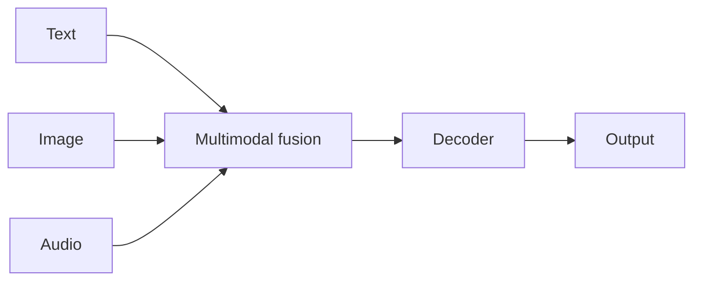

# Case study: Gemini

## 定义

Gemini 是谷歌的 [LLMs](/docs/llms) 系列，具有**原生多模态**支持：在一个模型中处理文本、图像、音频和视频。它继承了谷歌早期模型（例如编码器-解码器路线中的 [BART](/docs/case-studies/bart)），并提供多种规模级别（Nano、Pro、Ultra），适用于不同的延迟和能力权衡。

Gemini 在谷歌产品（搜索、Workspace、Vertex AI、Android）中训练和部署。使用场景：聊天、[多模态](/docs/multimodal-ai)理解和生成、编程，以及类[智能体](/docs/agents)的工具使用。

## 工作原理

**多模态输入**（文本、图像、音频、视频）在统一的 [transformer](/docs/transformers) 技术栈中被编码和融合。**解码器**以所有模态为条件生成文本（或结构化输出）。**规模级别**：较小的模型（例如 Nano）用于[边缘](/docs/edge-reasoning)和设备端；较大的（Pro、Ultra）在云端提供最大能力。**集成**：相同的模型为搜索、Workspace 和 Vertex AI API 中的 Gemini 提供支持。[提示词工程](/docs/prompt-engineering)和 [RAG](/docs/rag) 或工具扩展了在应用程序中的使用。

## 应用场景

Gemini 适合需要多模态理解或生成，以及与谷歌技术栈进行可选集成的情况。

- 具有图像、文档或视频理解能力的聊天和助手
- 多模态搜索、摘要和内容生成
- 通过 API 或谷歌产品进行编程和推理

## 外部文档

- [Google AI – Gemini](https://ai.google.dev/gemini-api) — API 和概述
- [Google – Gemini models](https://deepmind.google/technologies/gemini/) — 模型级别和能力

## 另请参阅

- [LLMs](/docs/llms)
- [多模态 AI](/docs/multimodal-ai)
- [BART](/docs/case-studies/bart) — 编码器-解码器路线的前身
