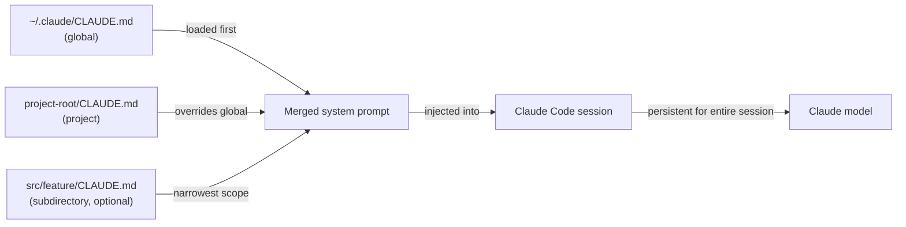

# CLAUDE.md 配置

## 定义

`CLAUDE.md` 是 Claude Code 在每次会话开始时自动读取的 Markdown 文件。其内容被注入到系统提示中，为模型提供持久的、项目感知的指令，而无需开发者在每次对话中重复它们。可以将其理解为每次会话都会收到的"入职文档"：它告诉 Claude 项目是什么、结构如何、要遵循哪些规范以及要避免哪些行为。

该文件特意使用纯 Markdown 而非专有格式编写，这意味着它是人类可读的、可版本控制的，并且可以由团队中的任何开发者编辑。因为它与代码一起存放在代码库中，所以随项目一起演进：当技术栈变化、采用新规范或新开发者加入需要入职时，`CLAUDE.md` 是 Claude 在该代码库中应如何表现的单一真相来源。

`CLAUDE.md` 文件有两个不同的作用域。**项目级**文件位于代码库根目录（或任何子目录）中，仅适用于该项目。**全局**文件位于 `~/.claude/CLAUDE.md`，适用于所有 Claude Code 会话，无论项目如何。这两个作用域是叠加的：两者同时加载，当与全局指令冲突时，项目级指令优先。

## 工作原理

### 文件发现和加载顺序

当 Claude Code 启动会话时，它从当前工作目录向上遍历目录树，寻找 `CLAUDE.md` 文件。在父目录中找到的文件首先加载（最广泛的范围），然后是在当前目录及其子目录中找到的文件（最窄的范围）。`~/.claude/CLAUDE.md` 处的全局文件始终首先加载，提供项目文件可以覆盖的基准。这种分层加载意味着 monorepo 可以有一个根级别的 `CLAUDE.md` 用于共享规范，以及针对特定包规则的每包 `CLAUDE.md` 文件——在会话期间两者同时适用。

### 注入到系统提示中

所有发现的 `CLAUDE.md` 文件的内容在任何对话轮次之前被串联并预置到系统提示中。这意味着 Claude 在每个单独的请求中都可以访问这些指令，而不仅仅是第一个。因为这些指令是系统提示的一部分而非用户消息，所以它们不会消耗本可用于代码和工具结果的对话上下文。这些指令在整个会话期间持续存在，不会被上下文管理系统汇总或压缩。

### CLAUDE.md 中应该包含什么

编写良好的 `CLAUDE.md` 回答了新团队成员在接触代码库之前会提出的问题：这个项目是什么？使用了什么语言和框架？代码是如何组织的？测试和格式规范是什么？有什么需要遵循的模式或要避免的反模式？有哪些命令 Claude 应该或不应该运行？文件应该足够具体以便可操作，但也足够简洁以便模型能够内化全部内容。避免用 Claude 已知的信息填充它（例如解释 TypeScript 是什么），而是专注于项目特定的事实。

### 保持 CLAUDE.md 更新

因为 `CLAUDE.md` 在每个请求上都被注入，过时的指令会积极损害性能——Claude 可能会遵循过时的规范或使用已弃用的模式。推荐的做法是将 `CLAUDE.md` 更新视为正常开发的一部分：当重大重构改变项目结构时，在同一次提交中更新文件。代码审查应该像对待任何其他配置更改一样包含 `CLAUDE.md` 更改。使用 CI 管道的团队可以对文件进行检查（例如，检查引用的路径是否仍然存在）以尽早发现过期条目。



## 何时使用 / 何时不使用

| 使用场景 | 避免场景 |
|---|---|
| 希望 Claude 始终遵循特定编码规范（如使用 `const` 而非 `let`，偏好函数组件） | 指令因任务而频繁变化——对一次性请求使用会话内提示 |
| 需要提供否则需要重新解释的技术栈上下文（如"我们使用 Zod 进行模式验证，而非 Yup"） | 文件会包含机密或凭据——对这些使用环境变量 |
| 希望防止 Claude 运行危险命令（如"永远不要运行 `DROP TABLE` 或 `rm -rf`"） | 指令是 Claude 已默认遵循的通用最佳实践 |
| 项目有影响代码编写方式的非显而易见的架构决策 | 项目是没有值得记录的共享规范的一次性脚本 |
| 在多个项目中工作，希望在全局 `~/.claude/CLAUDE.md` 中有个人基准风格 | 不同团队成员有冲突的偏好——先在代码审查中解决 |

## 代码示例

```markdown
# CLAUDE.md — my-app project instructions

## Project overview
This is a full-stack web app: React + TypeScript frontend, Node.js + Express backend,
PostgreSQL database managed with Prisma ORM. The monorepo is structured as:

- `packages/web/` — React frontend (Vite, React Router v6, Tailwind CSS)
- `packages/api/` — Express REST API (TypeScript, Zod for request validation)
- `packages/shared/` — Shared TypeScript types used by both packages

## Tech stack conventions

### Frontend (packages/web)
- Use functional components with hooks only — no class components
- Prefer named exports over default exports for components
- State management: Zustand for global state, React Query for server state
- Styling: Tailwind utility classes; no inline styles or CSS modules
- Use `zod` schemas imported from `packages/shared` to validate API responses

### Backend (packages/api)
- All route handlers live in `src/routes/`; use Express Router, one file per resource
- Validate all request bodies and query params with Zod before accessing them
- Use Prisma's generated client — never write raw SQL unless Prisma cannot express the query
- Return errors as `{ error: string, code: string }` JSON objects, never as HTML

## Code style
- TypeScript strict mode is enabled — never use `any` or `// @ts-ignore`
- Use `const` by default; only use `let` when reassignment is required
- Prefer early returns over nested conditionals
- All async functions must handle errors with try/catch or `.catch()`
- Do not import from `../../..` more than two levels deep — use path aliases (`@web/`, `@api/`, `@shared/`)

## Testing
- Tests live alongside source files as `*.test.ts` — not in a separate `tests/` directory
- Use Vitest for all tests (not Jest)
- Write unit tests for all utility functions; integration tests for all API routes
- Run tests with: `pnpm test` (runs all packages) or `pnpm --filter @app/api test` (single package)

## Git conventions
- Use conventional commits: `feat:`, `fix:`, `chore:`, `docs:`, `refactor:`, `test:`
- One logical change per commit — do not bundle unrelated changes
- Branch names: `feat/description`, `fix/description`, `chore/description`

## Commands you may run freely
- `pnpm install`, `pnpm build`, `pnpm test`, `pnpm lint`, `pnpm format`
- `prisma generate`, `prisma migrate dev`, `prisma studio`
- `git status`, `git diff`, `git log`

## Commands to NEVER run without explicit user confirmation
- Any `prisma migrate reset` or `prisma db push --force-reset` — these destroy data
- Any `DROP TABLE`, `DELETE FROM` without a WHERE clause
- `rm -rf` on any directory other than `node_modules` or build artifacts
```

```bash
# Global CLAUDE.md at ~/.claude/CLAUDE.md (applies to all projects)
# Good for personal style preferences and safety rules that span every project

# Example global instructions:
cat ~/.claude/CLAUDE.md
```

```markdown
# Global Claude Code instructions (all projects)

## My personal defaults
- I prefer TypeScript over JavaScript in all new files
- Use single quotes for strings in JavaScript/TypeScript
- Explain what you are going to do before making large changes (more than 3 files)
- When writing commit messages, always use conventional commits format

## Safety rules (all projects)
- Never commit directly to `main` or `master` — always create a feature branch first
- Never run database migration commands without showing me the migration file first
- Ask before installing new dependencies — I want to review package size and license
```

## 实用资源

- [Claude Code 文档——CLAUDE.md](https://docs.anthropic.com/en/docs/claude-code/memory) — CLAUDE.md 文件位置、加载顺序和最佳实践的官方指南。
- [Claude Code 设置参考](https://docs.anthropic.com/en/docs/claude-code/settings) — 包括 CLAUDE.md 旁边所有配置选项的完整设置参考。
- [Claude Code 快速入门](https://docs.anthropic.com/en/docs/claude-code/quickstart) — 涵盖初始 CLAUDE.md 设置的入门指南。

## 另请参阅

- [Claude Code 概述](/docs/claude-code)
- [Claude Code 技能](/docs/claude-code/skills)
- [上下文管理](/docs/claude-code/context-management)
