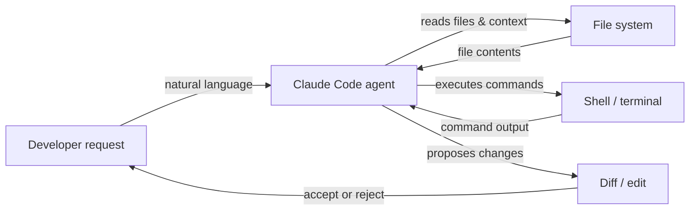

# Claude Code

## 定义

Claude Code 是 Anthropic 的 AI 驱动编码代理——一个专门构建的工具，将 Claude 的推理能力直接带入开发者工作流程。与以聊天为导向的 AI 工具不同，Claude Code 专为**代理式操作**设计：它可以自主规划和执行多步骤任务、导航大型代码库、运行 shell 命令、编辑文件、管理 git 操作，并在无需每步人工引导的情况下迭代自身输出。

它可在多种环境中使用：作为可在任何终端运行的**命令行界面（CLI）**，作为内联编辑和可视化差异的 **VS Code** 和 **JetBrains** IDE 扩展，以及通过 claude.ai/code 的**网络应用**进行基于浏览器的会话。这种多环境存在意味着开发者可以在已有的工作环境中使用 Claude Code，而无需切换到专用的工具编辑器。

核心能力集涵盖完整的编码生命周期：**代码生成**（创建新文件、编写函数、生成测试）、**重构**（在保留行为的同时重构现有代码）、**调试**（在完整上下文中诊断错误）、**git 操作**（暂存、提交、读取差异、解释历史记录）和**文件管理**（读取、写入、搜索和组织项目文件）。因为 Claude Code 拥有对整个项目目录树和终端的访问权限，它自然能够处理需要跨文件理解和顺序工具使用的任务。

## 工作原理

### 安装和身份验证

Claude Code 以 npm 包形式安装（`npm install -g @anthropic-ai/claude-code`），需要 Claude 订阅（Pro、Teams 或 Enterprise）或通过 Amazon Bedrock 或 Google Vertex AI 的 API 访问。在终端运行 `claude` 后，通过存储在本地配置中的 OAuth 或 API 密钥处理身份验证。CLI 读取项目目录，定位任何 `CLAUDE.md` 指令文件，并进入用户输入自然语言请求的交互式会话。

### 代理任务执行循环

接到任务后，Claude Code 遵循内部的计划-执行-观察循环。它首先读取相关文件以构建上下文，然后按顺序发出工具调用（文件读取、shell 命令、代码编辑），观察每个结果，并相应调整计划。此循环自主持续，直到任务完成或 Claude 确定需要澄清。代理在所有轮次中维护完整的对话历史，因此可以引用先前的发现并避免冗余操作。

### IDE 集成

在 VS Code 和 JetBrains 中，Claude Code 显示为带有聊天界面和内联差异视图的集成面板。当 Claude 提出代码更改时，它们以并排差异形式显示，开发者可以接受、拒绝或部分应用。该扩展与 CLI 具有相同的文件系统和终端访问权限，因此功能等同——差异在于人体工程学，而非功能。内联编辑快捷键（通过键盘快捷键触发）让开发者无需切换到聊天面板即可请求目标性编辑。

### 上下文和工具使用

Claude Code 使用一套内置工具：`Read`、`Edit`、`Write`、`Bash`、`Glob` 和 `Grep`。这些工具直接映射到开发者在调查和修改代码库时会采取的操作。每个工具调用对用户在会话中可见，使代理的推理可追溯。文件上下文按需加载而非预加载，有助于高效管理上下文窗口。`CLAUDE.md` 文件中的项目级指令自动注入到系统提示中以指导行为。



## 何时使用 / 何时不使用

| 使用场景 | 避免场景 |
|---|---|
| 需要代理自主执行多步骤任务（如"为所有列表端点添加分页"） | 只需要单个自动补全建议——更简单的内联工具更快 |
| 希望通过自然语言问题探索不熟悉的代码库 | 代码库包含不应被外部 AI 读取的敏感机密 |
| 需要 git 感知操作：总结差异、写提交信息、审查 PR | 项目需要无 API 访问的离线或气隙开发 |
| 希望 IDE 集成提供可视化差异和内联编辑 | 更偏好无云依赖的完全本地/开源 AI |
| 从终端运行任务并希望 CLI 原生 AI 辅助 | 需要在免费层进行细粒度的每 token 成本跟踪 |

## 比较

| 标准 | Claude Code | Cursor | GitHub Copilot |
|---|---|---|---|
| **自主级别** | 高——具有多步骤规划和执行的完整代理循环 | 中——具有代理模式的 AI 驱动编辑器，但主要以编辑器为中心 | 低到中——内联补全和聊天；Copilot Workspace 增加规划 |
| **IDE 支持** | VS Code、JetBrains，加独立 CLI 和网络 | 仅专有 VS Code 分支 | VS Code、Visual Studio、JetBrains、Neovim 等 |
| **定价模式** | 包含在 Claude Pro/Teams 订阅中或通过 API 按 token 计费 | 订阅（$20/月爱好者、$40/月专业版）；无免费层（除试用期） | 个人免费；$10/月专业版；Teams 和 Enterprise 层 |
| **代理能力** | 原生：运行 shell 命令、编辑文件、使用 git、自主循环 | 增长中：代理模式可用，运行终端命令 | 有限：Copilot Workspace 用于规划；标准模式是响应式的 |
| **上下文处理** | 基于工具的显式文件加载；支持 `CLAUDE.md` 持久指令 | Cursor Rules（`.cursorrules`）+ 具有嵌入的代码库索引 | Copilot 上下文来自打开的文件和选定的代码；无持久项目规则 |

另请参阅专题文章：[Cursor](/docs/tools/cursor) 和 [GitHub Copilot](/docs/tools/github-copilot)。

## 代码示例

```bash
# Install Claude Code globally
npm install -g @anthropic-ai/claude-code

# Start an interactive session in your project directory
cd ~/projects/my-app
claude

# --- Inside the Claude Code CLI session ---

# Ask a question about the codebase
> How is authentication handled in this project?

# Ask Claude to make a targeted change
> Add input validation to the POST /users endpoint in src/routes/users.ts

# Ask Claude to fix a bug with context
> The test in tests/auth.test.ts is failing with "Cannot read property 'id' of undefined". Fix it.

# Ask Claude to perform a cross-file refactor
> Rename the UserProfile component to ProfileCard across all files that import it

# Use git-aware operations
> Write a conventional commit message for the changes currently staged in git

# Run a slash command to clear conversation context
> /clear

# Run a multi-step agentic task
> Create a new Express route for GET /health that returns server uptime and version from package.json, add a unit test for it, and stage both files

# Exit the session
> /exit
```

## 实用资源

- [Claude Code 文档——Anthropic](https://docs.anthropic.com/en/docs/claude-code) — 涵盖安装、CLI 使用、IDE 集成和配置的官方文档。
- [Claude Code 快速入门](https://docs.anthropic.com/en/docs/claude-code/quickstart) — 安装、身份验证和运行第一个会话的分步指南。
- [Claude Code GitHub 仓库](https://github.com/anthropics/claude-code) — CLI 和扩展的源码、问题跟踪器和发布说明。
- [Anthropic Claude Code 产品页面](https://www.anthropic.com/claude-code) — Anthropic 的高级概述和用例示例。
- [技能仓库](https://github.com/EmersonBraun/skills) — Claude Code 和其他 AI 编码助手的可复用 AI 技能精选集合

## 另请参阅

- [CLAUDE.md 配置](/docs/claude-code/claude-md)
- [Claude Code 技能](/docs/claude-code/skills)
- [Cursor](/docs/tools/cursor)
- [GitHub Copilot](/docs/tools/github-copilot)
