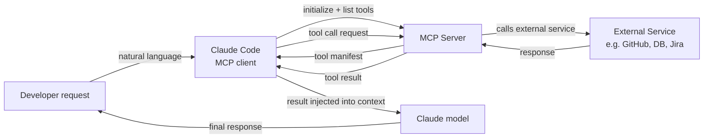

# MCP 插件和集成

## 定义

模型上下文协议（MCP）是 Anthropic 开发的开放标准，定义了 AI 模型如何与外部数据源和工具通信。在 Claude Code 的上下文中，MCP 服务器是扩展 Claude 可用工具集（超越其内置能力：文件系统访问、shell 命令、git）的插件。通过 MCP，Claude 可以查询数据库、调用外部 API、浏览网页、读取 Jira 工单、查询 Grafana 仪表板、与 GitHub 交互，以及 MCP 服务器实现的任何其他功能——所有这些都通过与内置工具相同的自然语言界面进行。

MCP 遵循客户端-服务器架构。Claude Code 充当 **MCP 客户端**：它从配置中发现可用的 MCP 服务器，在会话开始时连接到它们，并查询它们获取其暴露的工具列表。每个 MCP 服务器暴露一组**工具**（具有 JSON Schema 输入定义的函数，与内置工具结构相同）、可选的**资源**（只读数据源，如文档或数据库模式）以及可选的**提示**（可重用的提示模板）。当 Claude 决定调用 MCP 工具时，Claude Code 将调用路由到适当的服务器，执行操作，并将结果作为工具结果返回给模型。

MCP 相对于临时工具集成的核心优势是标准化。在 MCP 之前，每个 AI 助手都有自己的专有插件格式。MCP 定义了一个通用协议，使得编写一次的 MCP 服务器可以与任何兼容 MCP 的客户端配合使用——Claude Code、Claude Desktop 或任何其他 MCP 客户端。这意味着可用集成的生态系统正在迅速增长，构建新的集成不需要了解 Claude 特定的内部机制。

## 工作原理

### MCP 服务器类型和传输

MCP 服务器有两种传输类型。**stdio 服务器**作为本地子进程运行：Claude Code 在会话开始时生成服务器进程，并通过 stdin/stdout 使用 JSON-RPC 进行通信。stdio 服务器是本地工具（数据库客户端、文件处理器、专业代码分析）最常见的类型。**SSE（服务器发送事件）服务器**作为持久 HTTP 服务器运行，并通过网络连接进行通信。SSE 服务器更适合远程服务、共享团队基础设施，或需要在多个客户端连接之间维护状态的服务器。

### 配置和发现

MCP 服务器在 Claude Code 的设置文件中配置，通常在 `~/.claude/settings.json`（全局配置）或 `.claude/settings.json`（项目特定服务器）。每个服务器条目指定名称、传输类型以及启动或连接所需的命令（用于 stdio）或 URL（用于 SSE）。Claude Code 在会话开始时读取此配置，初始化到所有已配置服务器的连接，并获取其工具清单。所有已连接 MCP 服务器的工具与内置工具一起出现在模型的工具列表中——从模型的角度来看，没有区别。

### 工具调用流程

当 Claude 决定调用 MCP 工具时，Claude Code 充当中间人：它将工具调用参数序列化为 JSON，通过配置的传输向 MCP 服务器发送 `tools/call` 请求，等待响应，反序列化结果，并将其作为 `tool_result` 块返回给模型。整个往返对模型来说是透明的——它只是看到一个工具结果，就像内置工具调用一样。MCP 服务器可以返回文本、图像或结构化数据，Claude Code 都会将它们适当地转发给模型。

### 身份验证和安全性

MCP 服务器处理自己的身份验证。例如，GitHub MCP 服务器从服务器条目的 `env` 字段中配置的环境变量读取 GitHub 个人访问令牌。Claude Code 将配置的环境传递给子进程，但本身不管理机密——MCP 服务器负责向外部服务进行身份验证。由于 MCP 服务器以本地用户的权限执行代码，使用第三方 MCP 服务器时应谨慎：在将其添加到配置之前，请审查服务器的代码或信任发布者。



## 何时使用 / 何时不使用

| 使用场景 | 避免场景 |
|---|---|
| 需要 Claude 与外部服务（GitHub、Jira、Slack、数据库）交互 | 任务可以用内置工具（文件系统、shell）完成——无需增加复杂性 |
| 您的团队共享一组通用工具，并希望标准化集成层 | 您处于安全敏感环境，需要严格控制外部工具访问 |
| 您希望让 Claude 访问私有数据源（内部 API、专有数据库） | 您需要快速的一次性集成——通过 Bash 工具调用的 shell 脚本更简单 |
| 您正在构建应该跨多个 AI 客户端工作的可重用工具 | 您想要使用的 MCP 服务器来自不受信任的来源——先审查其代码 |
| 您希望 Claude 实时访问系统状态（指标、日志、错误跟踪） | 外部服务有速率限制，可能被 Claude 的自主工具调用超出 |

## 代码示例

```json
// ~/.claude/settings.json — MCP server configuration
{
  "mcpServers": {
    // GitHub MCP server — gives Claude access to repos, issues, PRs
    "github": {
      "command": "npx",
      "args": ["-y", "@modelcontextprotocol/server-github"],
      "env": {
        "GITHUB_PERSONAL_ACCESS_TOKEN": "${GITHUB_TOKEN}"
      }
    },

    // PostgreSQL MCP server — gives Claude read access to your database schema and query capability
    "postgres": {
      "command": "npx",
      "args": ["-y", "@modelcontextprotocol/server-postgres", "postgresql://localhost/mydb"],
      "env": {
        "PGPASSWORD": "${DB_PASSWORD}"
      }
    },

    // Filesystem MCP server (extended) — gives Claude access to directories beyond the project root
    "filesystem": {
      "command": "npx",
      "args": [
        "-y",
        "@modelcontextprotocol/server-filesystem",
        "/Users/me/projects",
        "/Users/me/documents/specs"
      ]
    },

    // Custom internal MCP server (stdio, local binary)
    "internal-tools": {
      "command": "/usr/local/bin/my-mcp-server",
      "args": ["--config", "/etc/my-mcp/config.json"],
      "env": {
        "INTERNAL_API_KEY": "${INTERNAL_API_KEY}"
      }
    },

    // Remote SSE server — shared team infrastructure
    "team-server": {
      "url": "https://mcp.internal.mycompany.com/sse",
      "headers": {
        "Authorization": "Bearer ${TEAM_MCP_TOKEN}"
      }
    }
  }
}
```

```typescript
// Custom MCP server — TypeScript implementation using the official MCP SDK
// This example creates an MCP server that wraps an internal metrics API

import { McpServer } from "@modelcontextprotocol/sdk/server/mcp.js";
import { StdioServerTransport } from "@modelcontextprotocol/sdk/server/stdio.js";
import { z } from "zod";

// Initialize the MCP server with a name and version
const server = new McpServer({
  name: "metrics-server",
  version: "1.0.0",
});

// Define a tool: get_error_rate
// The description is critical — Claude uses it to decide when to call this tool
server.tool(
  "get_error_rate",
  "Get the error rate for a service over a specified time window. Use this when the user asks about errors, reliability, or service health.",
  {
    // Zod schema — the SDK converts this to JSON Schema automatically
    service: z.string().describe("The service name, e.g. 'api', 'frontend', 'worker'"),
    window: z
      .enum(["1h", "6h", "24h", "7d"])
      .describe("Time window for the metric. Defaults to 1h."),
  },
  async ({ service, window }) => {
    // In production, this would call your metrics API (Prometheus, Datadog, etc.)
    const response = await fetch(
      `https://metrics.internal.mycompany.com/api/error-rate?service=${service}&window=${window}`,
      { headers: { Authorization: `Bearer ${process.env.METRICS_API_KEY}` } }
    );

    if (!response.ok) {
      return {
        content: [{ type: "text", text: `Error fetching metrics: ${response.statusText}` }],
        isError: true,
      };
    }

    const data = await response.json();
    return {
      content: [
        {
          type: "text",
          text: JSON.stringify({
            service,
            window,
            error_rate: data.errorRate,
            total_requests: data.totalRequests,
            error_count: data.errorCount,
            timestamp: new Date().toISOString(),
          }, null, 2),
        },
      ],
    };
  }
);

// Define a tool: list_services
server.tool(
  "list_services",
  "List all services that have metrics available for monitoring.",
  {},
  async () => {
    const response = await fetch("https://metrics.internal.mycompany.com/api/services", {
      headers: { Authorization: `Bearer ${process.env.METRICS_API_KEY}` },
    });
    const services = await response.json();
    return {
      content: [{ type: "text", text: JSON.stringify(services, null, 2) }],
    };
  }
);

// Start the server with stdio transport (for local subprocess use)
const transport = new StdioServerTransport();
await server.connect(transport);
```

```bash
# Install the MCP SDK for building custom servers
npm install @modelcontextprotocol/sdk zod

# Compile and run the custom server locally for testing
npx ts-node metrics-server.ts

# Add the custom server to your Claude Code configuration
cat >> ~/.claude/settings.json << 'EOF'
# (add to the mcpServers object in your existing settings.json)
"metrics": {
  "command": "node",
  "args": ["/path/to/metrics-server.js"],
  "env": {
    "METRICS_API_KEY": "your-api-key-here"
  }
}
EOF

# Inside a Claude Code session, use the MCP tools naturally:
claude
> What is the current error rate for the api service?
> List all services and show me the error rates for any that exceed 1% in the last hour
> Compare error rates across all services for the past 24 hours
```

## 实用资源

- [MCP 文档——Anthropic](https://docs.anthropic.com/en/docs/mcp) — 官方 MCP 规范、协议概述和客户端/服务器架构。
- [MCP TypeScript SDK](https://github.com/modelcontextprotocol/typescript-sdk) — 用于在 TypeScript/JavaScript 中构建 MCP 服务器和客户端的官方 SDK。
- [MCP 服务器仓库](https://github.com/modelcontextprotocol/servers) — 官方参考 MCP 服务器集合：文件系统、GitHub、PostgreSQL、Google Drive、Slack 等。
- [Claude Code MCP 集成指南](https://docs.anthropic.com/en/docs/claude-code/mcp) — 在会话中配置和使用 MCP 服务器的 Claude Code 专用指南。
- [MCP 规范](https://spec.modelcontextprotocol.io) — 实现自定义客户端或服务器的完整协议规范。

## 另请参阅

- [Claude Code 概述](/docs/claude-code)
- [Claude Code Skills](/docs/claude-code/skills)
- [Anthropic 工具使用](/docs/agents/anthropic-tool-use)
