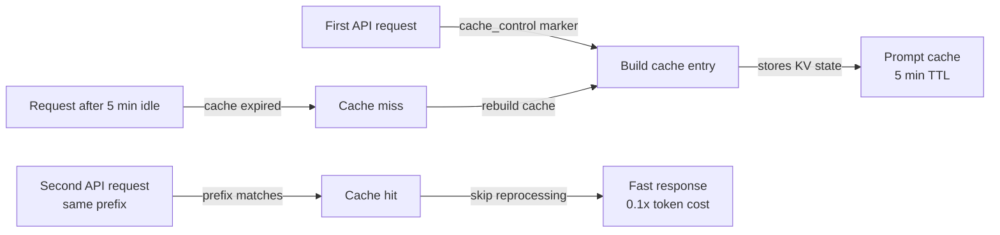

# 提示缓存

## 定义

提示缓存是 Claude API 的一项功能，允许提示中重复出现的部分——系统提示、工具定义、文档上下文或长对话前缀——被处理一次并在多次后续 API 调用中复用。模型从缓存读取这些内容，而不是在每次请求时重新处理相同的 token 序列，从而降低延迟并降低缓存 token 的成本。在 Claude Code 中，提示缓存在后台自动运行，使长会话和重复工具使用更快、更经济。

提示缓存背后的核心洞察是，编码会话中 API 调用之间变化的内容大多数是很小的：一条新的用户消息、一个新的工具结果或一个更新的文件。大而稳定的部分——包含项目指令的系统提示、所有可用工具的定义以及累积的对话历史——在大多数轮次中保持不变。在每次请求时冗余地处理这些稳定部分是一种浪费。提示缓存通过存储已处理的键值状态，并在提示前缀匹配时复用它们来消除这种浪费。

从开发者的角度来看，提示缓存在 Claude Code 会话中基本上是透明的——它自动发生，无需配置。当直接在 Claude API 上构建应用、设计长期运行的代理循环或排查意外的高延迟或成本时，理解它最为重要。在这些情况下，了解如何为最佳缓存利用率构建提示可以带来可观的节省：缓存输入 token 的计费价格是常规输入 token 的一小部分，缓存命中完全消除了缓存部分的处理延迟。

## 工作原理

### 缓存控制标记

提示缓存使用显式的 `cache_control` 注解来标记提示中应创建缓存检查点的位置。当 API 处理在内容块上带有 `{"type": "ephemeral"}` 缓存控制的请求时，它会存储直到并包括该块的所有 token 的已处理状态。对于具有相同前缀的后续请求，API 检测到缓存命中并跳过对这些 token 的重新处理。一个提示最多可以同时有四个活跃的缓存检查点，允许开发者将系统提示与工具定义和对话历史分别缓存。

### 缓存生命周期和失效

临时缓存的生存时间约为五分钟的不活动时间。如果在该窗口内没有 API 调用引用缓存的前缀，缓存条目将被驱逐，并且必须在下一次请求时重新构建。这意味着提示缓存对高频用例最有效：请求每隔几秒就会到达的交互式编码会话、在快速连续中执行许多工具调用的代理循环，或处理带有共享系统提示的许多文档的批处理管道。对于请求之间间隔数分钟的低频工作流，缓存可能会过期，不能提供任何好处。

### 缓存什么

缓存价值最高的候选是大型、稳定且频繁复用的内容。系统提示是最明显的候选：在 Claude Code 中，它包含来自 CLAUDE.md 的项目指令、工具定义和行为准则——通常是数千个在每个轮次中相同的 token。工具定义（所有可用工具的 JSON Schema）是另一个有力候选。在 RAG 或文档密集型工作流中，在会话开始时加载的大型参考文档可以被缓存，这样关于这些文档的后续问题只会产生新问题的边际成本，而不是重新读取文档的成本。

### 缓存命中检测和使用报告

API 响应包含一个 `usage` 对象，用于区分常规输入 token、缓存创建 token 和缓存读取 token。缓存创建 token 以基础费率的 1.25 倍计费（写入缓存的一次性成本）。缓存读取 token 以基础费率的 0.1 倍计费——与常规输入 token 相比节省 90%。监控这些字段让开发者可以衡量实际缓存效率：缓存读取 token 与总输入 token 的比率表明了有多少提示是从缓存中提供的。



## 何时使用 / 何时不使用

| 使用场景 | 避免场景 |
|---|---|
| 您的系统提示很大（>1,000 token）且在许多请求中保持不变 | 您的提示在每次请求时都有显著变化——没有稳定的前缀可以缓存 |
| 您正在运行一个在单个会话中具有许多顺序工具调用的代理循环 | 请求不频繁（轮次之间>5 分钟）——缓存在可以被复用之前就会过期 |
| 您在会话开始时加载大型参考文档（规格、代码库） | 您的用例是没有重复上下文的单次请求 |
| 您希望降低交互式会话中第一个用户可见响应的延迟 | 您正在测试或调试，希望每次请求的 token 数量是确定性的 |
| 您正在优化高 API 调用量的生产系统的成本 | 在低量情况下，构建 cache_control 标记的开销超过了节省 |

## 代码示例

```python
import anthropic

client = anthropic.Anthropic()

# Example: caching a large system prompt and tool definitions
# The system prompt is the same on every request — mark it for caching

SYSTEM_PROMPT = """
You are a senior software engineer working on a large TypeScript monorepo.
The project uses React on the frontend, Node.js/Express on the backend, and PostgreSQL.
[... imagine 2000+ tokens of detailed project instructions here ...]
""" * 10  # simulating a large system prompt

# Tool definitions for the coding agent — stable across all requests
TOOLS = [
    {
        "name": "read_file",
        "description": "Read a file from the project directory",
        "input_schema": {
            "type": "object",
            "properties": {
                "path": {"type": "string", "description": "Relative file path"}
            },
            "required": ["path"]
        }
    },
    {
        "name": "write_file",
        "description": "Write content to a file",
        "input_schema": {
            "type": "object",
            "properties": {
                "path": {"type": "string"},
                "content": {"type": "string"}
            },
            "required": ["path", "content"]
        }
    },
    # ... more tools
]

def make_request(messages: list, turn_number: int) -> dict:
    """
    Make a Claude API request with prompt caching enabled.
    The system prompt and tools are marked with cache_control so they are
    processed once and reused on subsequent calls in the same session.
    """
    response = client.messages.create(
        model="claude-opus-4-5",
        max_tokens=4096,
        # Mark the system prompt for caching with cache_control
        system=[
            {
                "type": "text",
                "text": SYSTEM_PROMPT,
                # This tells the API to cache everything up to this point
                "cache_control": {"type": "ephemeral"}
            }
        ],
        # Mark tool definitions for caching too
        tools=[
            {**tool, "cache_control": {"type": "ephemeral"}} if i == len(TOOLS) - 1 else tool
            for i, tool in enumerate(TOOLS)
        ],
        messages=messages
    )

    # Inspect cache usage in the response
    usage = response.usage
    print(f"Turn {turn_number} token usage:")
    print(f"  Input tokens:        {usage.input_tokens:>8}")
    print(f"  Cache creation:      {usage.cache_creation_input_tokens:>8}  (1.25x cost)")
    print(f"  Cache read:          {usage.cache_read_input_tokens:>8}  (0.1x cost)")
    print(f"  Output tokens:       {usage.output_tokens:>8}")

    # Calculate effective cost savings
    if usage.cache_read_input_tokens > 0:
        savings_pct = (usage.cache_read_input_tokens / usage.input_tokens) * 100 * 0.9
        print(f"  Estimated savings:   {savings_pct:.1f}% on input tokens this turn")

    return response

# Simulate a multi-turn coding session
messages = []

# Turn 1 — cold start, cache is built
messages.append({"role": "user", "content": "What files exist in the src/ directory?"})
response1 = make_request(messages, turn_number=1)
# Output: cache_creation_input_tokens > 0, cache_read_input_tokens = 0
messages.append({"role": "assistant", "content": response1.content})

# Turn 2 — system prompt and tools are now cached
messages.append({"role": "user", "content": "Read the main entry point file"})
response2 = make_request(messages, turn_number=2)
# Output: cache_read_input_tokens > 0, significant cost savings

# Turn 3 — still cache-hitting on system prompt + tools
messages.append({"role": "user", "content": "Explain how the authentication middleware works"})
response3 = make_request(messages, turn_number=3)
# Output: continued cache hits, growing cache_read_input_tokens
```

```bash
# Observing prompt caching in Claude Code sessions
# Claude Code automatically applies caching — use verbose mode to see token counts

# Start a session with verbose output to inspect token usage
claude --verbose

# Inside the session, run several requests in sequence
> List all TypeScript files in src/
> Read src/index.ts
> Explain the main function

# With --verbose, Claude Code prints token usage per turn including cache statistics
# You'll see cache_creation_input_tokens spike on turn 1, then
# cache_read_input_tokens grow on subsequent turns
```

## 实用资源

- [提示缓存文档——Anthropic](https://docs.anthropic.com/en/docs/build-with-claude/prompt-caching) — 完整官方参考：缓存控制格式、token 定价、TTL 和支持的模型。
- [提示缓存 Cookbook](https://github.com/anthropics/anthropic-cookbook/blob/main/misc/prompt_caching.ipynb) — 包含工作示例的 Jupyter notebook，包括成本计算和缓存命中测量。
- [Claude API 定价](https://www.anthropic.com/pricing) — 所有模型的输入、缓存创建和缓存读取 token 的当前费率。
- [Anthropic 使用监控](https://console.anthropic.com/usage) — 用于按 API 密钥检查 token 使用情况的控制台仪表板。

## 另请参阅

- [Claude Code 概述](/docs/claude-code)
- [上下文管理](/docs/claude-code/context-management)
- [思考模式和努力程度](/docs/claude-code/thinking-modes)
