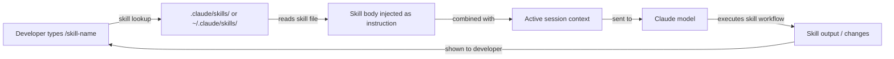

# Claude Code 技能

## 定义

技能是可复用、可调用的提示文件，可扩展 Claude Code 的行为超越其默认行为。技能是带有 YAML frontmatter 的 Markdown 文件，定义一个命名命令：当开发者在 Claude Code 会话中输入 `/skill-name` 时，技能的内容作为指令注入——有效地将常见的、复杂的或团队特定的工作流转变为单个斜杠命令。

其心智模型类似于 shell 别名或 Makefile 目标，但用于 AI 辅助的工作流。不必每次想让 Claude 遵循特定流程（代码审查清单、发布说明生成、架构文档、安全审计）时都重复冗长、精心制作的提示，你只需将其编写一次作为技能，提交到仓库，然后用简短命令调用。技能是版本控制的、可共享的，并且可以与 CLAUDE.md 指令组合使用。

技能与 CLAUDE.md 指令的重要区别在于：CLAUDE.md 始终处于活跃状态并应用于每次交互，而技能是可选的，需要显式调用。这使技能适合那些不应该在每次请求时运行的繁重或上下文特定的工作流，而 CLAUDE.md 更适合应始终生效的轻量级约定和限制。

## 工作原理

### 技能文件格式

技能文件是带有 YAML frontmatter 的 `.md` 文件。frontmatter 必须至少包含一个 `description` 字段，告诉 Claude 技能的功能。文件正文是调用技能时将注入的提示。文件名（不含 `.md`）成为斜杠命令名：名为 `code-review.md` 的文件以 `/code-review` 调用。技能名可以包含连字符但不能包含空格。

### 技能目录

Claude Code 在两个位置查找技能。**项目技能**位于相对于项目根目录的 `.claude/skills/`，仅在该项目中工作时可用。**全局技能**位于 `~/.claude/skills/`，在每个 Claude Code 会话中都可用。项目技能优先于同名的全局技能，允许团队用项目特定版本覆盖个人技能。你也可以通过配置将 Claude Code 指向自定义技能目录。

### 技能调用

在 Claude Code 会话中，输入 `/skill-name` 触发技能。Claude Code 找到对应的技能文件，读取其正文，并将内容作为用户指令注入到对话的那个时间点。技能可以引用会话中已存在的上下文（之前读取的文件、工具的早期输出），并可以发出自己的工具调用（读取文件、运行命令）以在生成输出之前收集额外信息。技能可以在命令名后接受内联参数：`/generate-test src/utils/format.ts` 将文件路径作为上下文传递。

### 将技能与 CLAUDE.md 组合

技能和 CLAUDE.md 协同工作。CLAUDE.md 建立项目基线（约定、禁止模式、技术栈），技能在该基线之上提供可调用的工作流。例如，`code-review` 技能可以指示 Claude "检查所有更改是否符合 CLAUDE.md 中的约定"——它不需要重复这些约定，因为它们已在系统提示中。这种关注点分离使每个文件保持专注并避免重复。



## 何时使用 / 何时不使用

| 使用场景 | 避免场景 |
|---|---|
| 您有定期重复的多步骤工作流（例如，编写变更日志、运行审查清单） | 任务是真正一次性的且不会重复——直接输入提示即可 |
| 您想要在团队中标准化复杂流程（例如，安全审查、PR 摘要格式） | 指令属于 CLAUDE.md，因为它们应用于每个会话，而不仅仅按需 |
| 工作流依赖上下文并从接受参数中受益（例如，`/document src/api/users.ts`） | 技能会重复 CLAUDE.md 中已存在的文档 |
| 您想通过全局技能目录跨项目共享提示最佳实践 | 工作流需要 Claude 内置工具之外的外部工具集成 |
| 您正在为团队构建技能库，并希望有版本控制、可审查的提示文件 | 您需要自动触发技能——技能是手动调用的，不是事件驱动的 |

## 代码示例

```markdown
<!-- File: .claude/skills/code-review.md -->
---
description: Perform a thorough code review on staged or recently changed files. Checks correctness, security, performance, test coverage, and project conventions.
---

You are conducting a code review. Follow these steps:

1. **Identify changed files**: Run `git diff --name-only HEAD` to list recently changed files.
   If there are staged changes, also run `git diff --cached --name-only`.

2. **Read each changed file** and the corresponding test file if it exists.

3. **Review for the following categories** (report findings under each heading):

   ### Correctness
   - Are there logic errors, off-by-one errors, or unhandled edge cases?
   - Does the code handle null/undefined inputs safely?

   ### Security
   - Is any user input used in SQL queries without parameterization? Flag immediately.
   - Are secrets or credentials hardcoded? Flag immediately.
   - Is authentication/authorization enforced on all new API routes?

   ### Performance
   - Are there N+1 query patterns in database access code?
   - Are expensive operations inside loops that could be moved outside?

   ### Test coverage
   - Do the tests cover the happy path, error paths, and edge cases?
   - Are there any new code paths with zero test coverage?

   ### Conventions
   - Does the code follow the project conventions in CLAUDE.md?
   - Are imports organized correctly? Are there unused imports?

4. **Summarize**: Provide an overall verdict (Approve / Request Changes / Needs Discussion)
   and a prioritized list of action items.
```

```markdown
<!-- File: .claude/skills/generate-changelog.md -->
---
description: Generate a changelog entry for changes since the last git tag. Follows Keep a Changelog format.
---

Generate a changelog entry for inclusion in CHANGELOG.md.

1. Run `git describe --tags --abbrev=0` to find the most recent tag.
2. Run `git log <tag>..HEAD --oneline` to list all commits since that tag.
3. Read the commit messages and group them into these categories:
   - **Added** — new features
   - **Changed** — changes to existing functionality
   - **Deprecated** — features that will be removed in a future release
   - **Removed** — features that were removed
   - **Fixed** — bug fixes
   - **Security** — security-related changes

4. Write the changelog entry in Keep a Changelog format:

   ## [Unreleased] - YYYY-MM-DD

   ### Added
   - ...

   ### Fixed
   - ...

Use concise, user-facing language. Omit chore/refactor/docs commits that don't affect users.
Output only the Markdown text — I will paste it into CHANGELOG.md manually.
```

```bash
# Invoke skills inside a Claude Code session

# Start a session
claude

# Trigger the code review skill (no arguments)
> /code-review

# Trigger the changelog skill
> /generate-changelog

# A skill that accepts an argument — document a specific file
> /document src/services/payment.ts

# List available skills (Claude will search .claude/skills/ and ~/.claude/skills/)
> /help

# Skills can be combined with regular instructions in the same turn
> /code-review and also check that the PR title follows conventional commits format
```

```markdown
<!-- File: ~/.claude/skills/explain-error.md (global skill, available in all projects) -->
---
description: Explain a compiler or runtime error in plain language and suggest fixes. Paste the error message after the command.
---

The user has provided an error message. Analyze it and respond with:

1. **Plain language explanation**: What does this error mean? Why does it occur?
2. **Most likely cause**: Given the error message and any stack trace, what is the most probable root cause?
3. **Suggested fixes**: Provide 2-3 concrete fixes, ranked by likelihood. Show code snippets where relevant.
4. **How to verify**: How can the developer confirm the fix worked?

If the error references a file path, read that file to provide more specific advice.
```

## 实用资源

- [Claude Code 内存和技能文档](https://docs.anthropic.com/en/docs/claude-code/memory) — 技能文件格式、目录和调用的官方参考。
- [Claude Code 设置](https://docs.anthropic.com/en/docs/claude-code/settings) — 配置选项，包括自定义技能目录路径。
- [Anthropic Claude Code GitHub](https://github.com/anthropics/claude-code) — 源代码和社区贡献的示例。
- [Claude Code 斜杠命令参考](https://docs.anthropic.com/en/docs/claude-code/cli-reference) — 内置斜杠命令和自定义技能系统的完整列表。
- [技能仓库](https://github.com/EmersonBraun/skills) — 为 Claude Code 和其他 AI 编码助手精心策划的可复用 AI 技能集合

## 另请参阅

- [Claude Code 概述](/docs/claude-code)
- [CLAUDE.md 配置](/docs/claude-code/claude-md)
- [MCP 插件和集成](/docs/claude-code/mcp-plugins)
