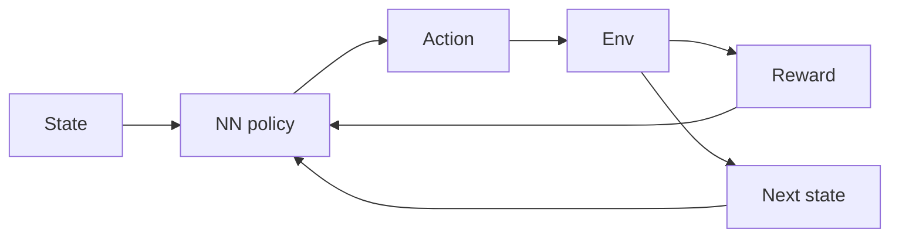

# 深度强化学习 (DRL)

## 定义

Deep RL combines reinforcement learning with deep neural networks to handle high-dimensional state and action spaces. Examples: DQN, A3C, PPO, SAC.

[Neural networks](/docs/neural-networks) 近似值函数和/或策略，使得 [RL](/docs/rl) can scale to raw pixels, high-D controls, and large discrete actions. Training is unstable without tricks (experience replay, target networks, advantage estimation); modern algorithms (PPO, SAC) are widely used in robotics and [LLM](/docs/llms) alignment (RLHF, DPO).

## 工作原理

The **state** (例如 image, vector) 被输入到一个 **neural network policy** (or value network) 输出 an **action**. The **env** returns **reward** and **next state**; the agent uses this experience to update the policy (例如 policy gradient or Q-learning with function approximation). **Experience replay** (store transitions, sample batches) and **target networks** (slow-moving copy of the network) stabilize training. **Advantage estimation** (例如 GAE) reduces variance in policy gradients. PPO and SAC are common for continuous control; DQN and variants for discrete actions.

## 应用场景

Deep RL 用于决策问题复杂且可以从试错中学习的情况 (simulation or real environment).

- High-dimensional control (例如 robotics, autonomous driving)
- Game AI and simulation (例如 DQN, PPO in complex environments)
- LLM alignment via policy optimization (例如 RLHF, DPO)

## 外部文档

- [Spinning Up in Deep RL (OpenAI)](https://spinningup.openai.com/)
- [Stable-Baselines3 – DRL algorithms](https://stable-baselines3.readthedocs.io/)

## 另请参阅

- [RL](/docs/rl)
- [Neural networks](/docs/neural-networks)
