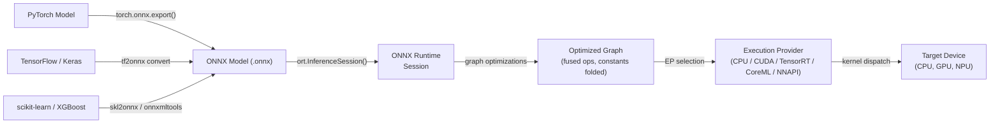

# ONNX Runtime

## 定义

ONNX Runtime（ORT）是由 Microsoft 开发的开源、跨平台推理和训练加速库。其主要目的是以高性能在各种硬件目标和操作系统上执行 **Open Neural Network Exchange（ONNX）** 格式的模型——一种与框架无关的机器学习模型中间表示。ORT 不与任何单一训练框架绑定：来自 PyTorch、TensorFlow、scikit-learn、LightGBM、XGBoost 等的模型都可以导出为 ONNX，并通过相同的 runtime API 执行，使其成为最具互操作性的推理解决方案之一。

在其核心，ORT 加载 ONNX 图，应用一系列广泛的图级优化（常量折叠、节点融合、布局转换），并将操作分发到当前硬件的最佳执行提供程序。**执行提供程序（EP）**抽象允许 ORT 将子图路由到 CPU、通过 CUDA 或 TensorRT 的 NVIDIA GPU、通过 ROCm 的 AMD GPU、通过 OpenVINO 的 Intel 硬件、通过 CoreML 的 Apple Silicon、通过 NNAPI 的 Android 以及通过 DirectML 的 Windows——所有这些都通过统一的 API 表面。这使 ORT 适合从云服务器到 Windows 笔记本电脑再到移动设备的部署范围。

ONNX Runtime 在企业和生产环境中尤其有价值，在那里单个部署管道必须服务于在不同框架中训练的模型。它是驱动 Azure ML 端点、Hugging Face Optimum 库、Windows ML 以及许多生产推荐和排名系统的推理后端。

## 工作原理



### ONNX 格式和模型互操作性

ONNX 将模型表示为有向无环计算图，其中节点是在 ONNX 算子规范中定义的标准化算子（例如 `Conv`、`MatMul`、`LayerNormalization`），边携带类型化张量。该格式是版本化的：每个 ONNX opset 版本（目前为 21）定义了支持的算子及其语义的完整集合。protobuf 序列化的 `.onnx` 文件包含图拓扑、算子名称、张量形状和常量权重值，使该格式自包含且可移植。

### 图优化

创建 `InferenceSession` 时，ORT 应用由 `GraphOptimizationLevel` 设置控制的三个级别的图优化。级别 1（基本）执行安全重写：常量折叠、冗余节点消除、形状推断和标识移除。级别 2（扩展）添加操作融合：`Conv + BatchNorm`、`Conv + Relu`、`Transpose + MatMul` 等模式被融合成单个内核以消除中间内存分配和内核启动开销。级别 3（布局优化）重构张量内存布局以匹配执行提供程序的偏好。

### 执行提供程序

执行提供程序机制是 ORT 的主要可扩展性和性能杠杆。**CPU EP** 使用 MLAS（Microsoft 线性代数子程序），这是一个手工向量化的 BLAS 实现，支持 AVX-512 和 NEON。**CUDA EP** 将卷积和 GEMM 卸载到 cuDNN 和 cuBLAS。**TensorRT EP** 为 NVIDIA GPU 应用 TensorRT 的层融合和 FP16、INT8 精度校准。**CoreML EP** 在 macOS 和 iOS 上委托给 Apple 的 Neural Engine。**DirectML EP** 支持在 Windows 上任何兼容 DirectX 12 的 GPU 上进行硬件加速推理。

### ONNX Runtime 中的量化

ORT 通过 **QDQ（Quantize-Dequantize）** 节点模式支持 INT8 推理：ONNX 图包含表示精度边界的显式 `QuantizeLinear` 和 `DequantizeLinear` 节点。静态量化需要校准数据集来计算输入/输出缩放；`onnxruntime.quantization` Python 包提供 `quantize_static` 和 `quantize_dynamic` 函数。

### 移动和边缘部署

ORT Mobile 是 ONNX Runtime 的精简版本，用于 Android 和 iOS，移除了未使用的算子和 EP 库，将二进制大小压缩到约 1-3 MB。在 Android 上，NNAPI EP 委托给硬件加速器。在 iOS 和 macOS 上，CoreML EP 使用 Apple Neural Engine。

## 何时使用 / 何时不使用

| 使用场景 | 避免场景 |
|---|---|
| 您需要与框架无关的推理——通过一个运行时服务来自 PyTorch、TF 和 scikit-learn 的模型 | 您的部署目标是 RAM \<256 KB 的微控制器（TFLM 更适合这种情况） |
| 您正在 Windows/Azure 上构建企业 ML 管道，其中 Microsoft 工具已经就位 | 您今天需要具有成熟工具的深度 Android 硬件委托（TFLite 对 Android 更经过实战检验） |
| 您需要 NVIDIA TensorRT 加速而无需直接管理 TensorRT API | 您的模型使用没有 ONNX 等效项且难以注册的自定义算子 |
| 您希望为在服务器端运行的相同模型进行浏览器/WASM 推理 | 您的团队是 PyTorch 原生的，想要从训练到移动端最紧密的循环 |
| 跨平台可移植性是头等关注点（相同模型在 Windows、Linux、macOS、Android、iOS 上运行） | 您需要在边缘进行实时训练或在线学习 |

## 比较

ONNX Runtime 与 TFLite 和 PyTorch Mobile 在边缘和跨平台部署方面的比较。

| 标准 | ONNX Runtime | TensorFlow Lite | PyTorch Mobile |
|---|---|---|---|
| 平台支持 | Windows、Linux、macOS、Android、iOS、WASM、云——最广泛的覆盖 | Android、iOS、嵌入式 Linux、微控制器（TFLM） | Android、iOS；ExecuTorch 增加嵌入式和裸机 |
| 模型转换 | 任何框架 → ONNX 导出（最具互操作性的路径，多个转换器） | TF/Keras → TFLite Converter（成熟，仅 TF 生态系统） | PyTorch → TorchScript 或 ExecuTorch（PyTorch 原生，PT 用户摩擦更少） |
| 设备上性能 | 带 MLAS 的 CPU EP 具有竞争力；TensorRT/CUDA EP 在 GPU 上领先；CoreML/NNAPI EP 用于移动端 | 在 Android 上通过 NNAPI/GPU 委托表现出色；微控制器类别中最佳 | ARM CPU 上的 XNNPACK；Vulkan GPU；ExecuTorch NPU 委托 |
| 生态系统 | 框架无关；Hugging Face Optimum；Windows ML；Azure ML；强大的企业采用 | 成熟：MediaPipe、TF Hub、Model Garden；最大的移动 ML 社区 | 研究中强大；Hugging Face；ExecuTorch 社区增长中 |
| 量化支持 | 通过 QDQ 节点的 INT8；动态和静态 PTQ；QAT；通过 EP 的硬件 INT8 | 全面：动态范围、INT8、FP16、QAT 与完整 INT8 路径 | 通过 torch.ao.quantization 的 PTQ（动态 + 静态 INT8）和 QAT |

## 优缺点

| 优点 | 缺点 |
|---|---|
| 框架无关：任何可导出 ONNX 的模型都可以与同一运行时配合使用 | 对于具有不支持或自定义算子的模型，ONNX 导出可能会失败 |
| 最广泛的执行提供程序覆盖：CPU、CUDA、TensorRT、DirectML、CoreML、NNAPI、OpenVINO | 调试 ONNX 图比原生框架调试更困难 |
| 强大的 Windows 和 Azure 集成；Microsoft ML 堆栈中的一等公民 | 对于纯 Android/iOS 场景，操作复杂度比 TFLite 更高 |
| Hugging Face Optimum 为 transformer 提供高级量化和优化 | ONNX opset 版本控制可能在导出器和 ORT 版本之间造成兼容性摩擦 |
| 通过 MLAS 的具有 AVX-512 和 NEON 向量化的竞争性 CPU 性能 | 当包含所有 EP 时，移动端二进制大小比 TFLite 大 |

## 代码示例

```python
import numpy as np
import torch
import torch.nn as nn
import onnxruntime as ort

# ── 1. Define a simple model in PyTorch ───────────────────────────────────────
class SimpleClassifier(nn.Module):
    """Minimal classifier for demonstration."""

    def __init__(self, input_dim: int = 784, num_classes: int = 10):
        super().__init__()
        self.net = nn.Sequential(
            nn.Linear(input_dim, 128),
            nn.ReLU(),
            nn.Linear(128, 64),
            nn.ReLU(),
            nn.Linear(64, num_classes),
        )

    def forward(self, x: torch.Tensor) -> torch.Tensor:
        return self.net(x)


model = SimpleClassifier()
# Switch to inference mode: disables dropout, BatchNorm uses running statistics
model.train(False)

# ── 2. Export PyTorch model to ONNX ──────────────────────────────────────────
dummy_input = torch.randn(1, 784)  # batch=1, flattened 28x28 image

torch.onnx.export(
    model,
    dummy_input,
    "model.onnx",
    opset_version=17,                         # target ONNX opset
    input_names=["input"],
    output_names=["logits"],
    dynamic_axes={
        "input":  {0: "batch_size"},          # allow variable batch size
        "logits": {0: "batch_size"},
    },
    do_constant_folding=True,                 # fold constant sub-expressions during export
)
print("Exported model.onnx")

# ── 3. Apply INT8 post-training dynamic quantization ─────────────────────────
from onnxruntime.quantization import quantize_dynamic, QuantType

quantize_dynamic(
    "model.onnx",
    "model_int8.onnx",
    weight_type=QuantType.QInt8,              # quantize weights to INT8
)
print("Quantized model saved as model_int8.onnx")

# ── 4. Run inference with ONNX Runtime ───────────────────────────────────────
# SessionOptions allow controlling graph optimization level and thread counts
sess_options = ort.SessionOptions()
sess_options.graph_optimization_level = ort.GraphOptimizationLevel.ORT_ENABLE_ALL

# Providers list is checked in order; falls back to CPU if GPU is unavailable
providers = ["CUDAExecutionProvider", "CPUExecutionProvider"]
session = ort.InferenceSession("model_int8.onnx", sess_options, providers=providers)

print(f"Active execution provider: {session.get_providers()[0]}")

# Prepare a batch of random inputs as float32 numpy arrays
batch = np.random.randn(4, 784).astype(np.float32)
input_name = session.get_inputs()[0].name
output_name = session.get_outputs()[0].name

outputs = session.run([output_name], {input_name: batch})
logits = outputs[0]                          # shape (4, 10)
predicted_classes = np.argmax(logits, axis=1)
print(f"Batch predictions: {predicted_classes}")
```

## 实用资源

- [ONNX Runtime 文档](https://onnxruntime.ai/docs/) — 官方参考，涵盖安装、执行提供程序、图优化、量化以及所有支持平台的移动部署。
- [ONNX Runtime Python API 参考](https://onnxruntime.ai/docs/api/python/api_summary.html) — `InferenceSession`、`SessionOptions`、执行提供程序和量化子包的详细 API 文档。
- [Hugging Face Optimum](https://huggingface.co/docs/optimum/onnxruntime/overview) — 为 transformer 模型优化包装 ORT 的高级库，提供 `ORTModelForXxx` 类和 `ORTQuantizer`。
- [ONNX Model Zoo](https://github.com/onnx/models) — 涵盖计算机视觉、NLP、语音和经典 ML 的预训练 ONNX 模型精心策划存储库。
- [ONNX Runtime 移动部署指南](https://onnxruntime.ai/docs/tutorials/mobile/) — 构建最小 ORT Android 或 iOS 应用的分步教程。

## 另请参阅

- [TensorFlow Lite](/docs/edge-ai/tflite)
- [PyTorch Mobile](/docs/edge-ai/pytorch-mobile)
- [PyTorch](/docs/frameworks/pytorch)
- [TensorFlow](/docs/frameworks/tensorflow)
