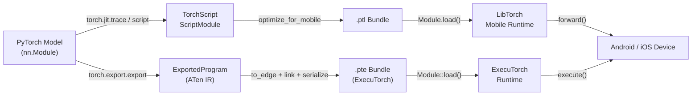

# PyTorch Mobile

## 定义

PyTorch Mobile 是将 PyTorch 训练的模型带到 Android 和 iOS 设备而无需服务器或云连接的工具和运行时系列。它保留了 PyTorch 的开发体验——研究人员和工程师在熟悉的 eager 模式 Python API 中进行训练，然后通过 **TorchScript** 或更新的 **ExecuTorch** 路径导出模型进行设备端部署。这种训练和部署环境之间的紧密耦合减少了在框架切换时经常出现的数值差异错误的表面积。

历史部署路径以 TorchScript 为中心，这是一个静态类型的 Python 子集，可以编译并序列化为平台无关格式（移动端的 `.ptl`）。TorchScript 支持两种编译模式：**追踪（tracing）**，其中示例输入通过模型传递并记录执行路径；以及**脚本化（scripting）**，其中 Python 控制流被静态分析。两者都产生一个可以被嵌入到移动 SDK 中的 LibTorch C++ 运行时加载的 `ScriptModule`。

Google 和 Meta 共同开发了 **ExecuTorch** 作为在边缘运行 PyTorch 模型的下一代框架。ExecuTorch 引入了便携的执行格式（`.pte`）、最小 C++ 运行时（简单模型下不到 50 KB），以及对委托到硬件后端的一等支持，包括高通 AI Engine、Apple Neural Engine、Arm Ethos NPU 和 Cadence DSP。ExecuTorch 为生产使用而设计，对于需要广泛硬件可移植性和最小二进制大小的新项目，它取代了原始的 PyTorch Mobile 运行时。

## 工作原理



### TorchScript 追踪和脚本化

追踪（`torch.jit.trace`）通过模型运行示例输入并记录张量操作序列，产生静态计算图。追踪简单且覆盖大多数标准架构，但它只捕获给定输入的执行路径——数据依赖的控制流（if 语句、随输入值变化的循环）将被静默固化。脚本化（`torch.jit.script`）使用 TorchScript 类型检查器分析 Python 源码并保留控制流，对于具有分支逻辑的模型是正确的。实际上，混合方法很常见：脚本化顶层模块，同时追踪没有动态控制流的内部子模块。

### ExecuTorch 导出管道

ExecuTorch 使用 `torch.export.export` 在 ATen IR 中捕获模型的严格、无副作用的表示——一组保证具有明确语义的 PyTorch 规范运算符。导出的程序随后通过 `to_edge` 降低到 **Edge IR**，这执行后端特定的图处理（运算符分解、布局传播）。后端（委托目标）可以在 `to_backend` 步骤期间声明子图，用硬件特定的实现替换它们。最终工件被序列化为 `.pte` 平缓缓冲区，由不需要在推理期间动态内存分配的 ExecuTorch C++ 运行时加载。

### 优化：量化和剪枝

PyTorch 通过 `torch.quantization`（旧版）和更新的 `torch.ao.quantization` 命名空间提供训练后静态和动态量化。静态 INT8 量化需要代表性的校准数据集，将模型大小减少约 4 倍，在 ARM CPU 上延迟提高 2-3 倍。量化感知训练（QAT）在微调期间将 `FakeQuantize` 节点插入到前向图中，允许模型将其权重适配到 INT8 精度。剪枝（`torch.nn.utils.prune`）根据量级或结构化标准删除单个权重或整个通道，在量化之前减少有效计算负载。两种技术可以结合：先剪枝以减少通道，然后量化以降低精度。

### 移动运行时和平台集成

`optimize_for_mobile` 生成的 `.ptl` 包包含算子融合优化，并从算子注册表中剥离未使用的算子，减少二进制占用。Android SDK（`pytorch_android`）发布到 Maven Central，并公开了 Kotlin/Java API。iOS SDK 以 CocoaPod 或 Swift Package 形式分发，提供 Objective-C 和 Swift 绑定。两个 SDK 都包装了相同的 LibTorch C++ 核心。ExecuTorch 面向相同的平台，但公开了更精简的 C API，也支持裸机嵌入式目标。`torch::executor::Module` 类提供了一个最小的 `execute()` API，直接在预分配的 `EValue` 张量上操作，避免 JNI 式的开销。

### GPU 和 NPU 加速

PyTorch Mobile 的 Android GPU 委托通过 Vulkan 后端（`torch.backends.vulkan`）工作，将卷积和矩阵乘法卸载到 GPU。ExecuTorch 的 XNNPACK 后端通过 NEON SIMD 指令加速 ARM CPU 上的浮点和 INT8 操作，是 CPU 加速的推荐默认选择。高通 AI Engine Direct 后端和 Apple Core ML 后端通过 ExecuTorch 的委托 API 提供 NPU 级加速，对于标准视觉和 NLP 模型通常比参考 CPU 路径快 5-15 倍。

## 何时使用 / 何时不使用

| 使用场景 | 避免场景 |
|---|---|
| 训练代码库是 PyTorch 且希望最小的转换摩擦 | 模型源自 TensorFlow/Keras 且转换开销是问题 |
| 需要使用 Python 友好的工作流部署到 Android 或 iOS | 需要 RAM \<256 KB 的微控制器目标（TFLM 更适合） |
| 希望 ExecuTorch 实现下一代硬件 NPU 委托（高通、Apple ANE） | 模型使用 TorchScript 无法通过追踪捕获的 Python 级动态控制流 |
| 快速迭代：为训练和移动推理复用相同的模型类 | 需要目前具有广泛硬件委托覆盖的成熟生产工具（TFLite 更成熟） |
| 在 Hugging Face 生态系统之上构建（许多模型通过 TorchScript 导出） | 二进制大小极度受限且 LibTorch 运行时占用（约 3-8 MB 压缩）太大 |

## 比较

PyTorch Mobile 与 TFLite 和 ONNX Runtime 的边缘部署场景比较。

| 标准 | PyTorch Mobile | TensorFlow Lite | ONNX Runtime |
|---|---|---|---|
| 平台支持 | Android、iOS；ExecuTorch 扩展到嵌入式和裸机 | Android、iOS、嵌入式 Linux、微控制器（TFLM） | Windows、Linux、macOS、Android、iOS、WebAssembly |
| 模型转换 | torch.jit.trace/script（PyTorch 原生）或 torch.export（ExecuTorch） | TFLite Converter 从 TF/Keras SavedModel | 任何框架 → ONNX 导出（最具互操作性） |
| 设备端性能 | ARM CPU 上的 XNNPACK；Vulkan GPU；ExecuTorch NPU 委托 | 通过 NNAPI/GPU 委托在 Android 上出色；微控制器上最优 | 竞争力强的 CPU EP；CUDA/TensorRT EP 在支持 GPU 的边缘设备上表现突出 |
| 生态系统 | 研究中强大；Hugging Face 集成；不断增长的 ExecuTorch 社区 | 成熟：MediaPipe、TF Hub、Model Garden；最大的移动 ML 社区 | 广泛的企业支持；框架无关；强大的 Microsoft/Azure 集成 |
| 量化支持 | 通过 torch.ao.quantization 的 PTQ（动态 + 静态 INT8）和 QAT；ExecuTorch 后端特定量化 | 全面：动态范围、INT8、FP16、具有完整 INT8 路径的 QAT | 通过 QDQ 节点的 INT8；硬件 INT8 取决于执行提供程序 |

## 优缺点

| 优点 | 缺点 |
|------|------|
| 对 PyTorch 用户的无缝工作流——相同的模型类进行训练和部署 | LibTorch 移动二进制向应用大小添加约 3-8 MB（压缩） |
| ExecuTorch 为 NPU 委托提供了现代、可扩展的架构 | TorchScript 追踪静默遗漏数据依赖的控制流 |
| 强大的 Hugging Face 生态系统集成 | 对于生产 Android/iOS 部署，不如 TFLite 成熟 |
| QAT 与标准训练循环良好集成 | Vulkan GPU 委托覆盖比 TFLite 的 GPU 委托更窄 |
| 活跃的开发，有 Meta 和社区的强力支持 | ONNX 互操作性需要通过 ONNX 导出器的额外转换步骤 |

## 代码示例

```python
import torch
import torch.nn as nn

# ── 1. Define a simple convolutional model ────────────────────────────────────
class SmallCNN(nn.Module):
    """Minimal CNN for demonstration. Replace with your real model."""

    def __init__(self, num_classes: int = 10):
        super().__init__()
        self.features = nn.Sequential(
            nn.Conv2d(1, 16, kernel_size=3, padding=1),
            nn.ReLU(inplace=True),
            nn.MaxPool2d(2),
            nn.Conv2d(16, 32, kernel_size=3, padding=1),
            nn.ReLU(inplace=True),
            nn.AdaptiveAvgPool2d(1),
        )
        self.classifier = nn.Linear(32, num_classes)

    def forward(self, x: torch.Tensor) -> torch.Tensor:
        x = self.features(x)
        x = x.flatten(1)
        return self.classifier(x)


model = SmallCNN(num_classes=10)
model.eval()

# ── 2. Export with TorchScript tracing ───────────────────────────────────────
example_input = torch.rand(1, 1, 28, 28)

scripted_model = torch.jit.trace(model, example_input)

from torch.utils.mobile_optimizer import optimize_for_mobile

optimized_model = optimize_for_mobile(scripted_model)
optimized_model._save_for_lite_interpreter("model.ptl")
print("Saved model.ptl")

# ── 3. Apply post-training dynamic quantization ───────────────────────────────
quantized_model = torch.quantization.quantize_dynamic(
    model,
    qconfig_spec={nn.Linear, nn.Conv2d},
    dtype=torch.qint8,
)
quantized_model.eval()

with torch.no_grad():
    output = quantized_model(example_input)
print(f"Output shape: {output.shape}, predicted class: {output.argmax(dim=1).item()}")

# ── 4. Load .ptl on Python (mirrors Android/iOS Module.load() behavior) ───────
loaded = torch.jit.load("model.ptl")
loaded.eval()
with torch.no_grad():
    result = loaded(example_input)
print(f"Loaded mobile model predicted class: {result.argmax(dim=1).item()}")
```

## 实用资源

- [PyTorch Mobile 文档](https://pytorch.org/mobile/home/) — 涵盖 TorchScript 导出、Android 和 iOS SDK、模型优化以及设备性能分析的官方指南。
- [ExecuTorch 文档](https://pytorch.org/executorch/) — 下一代边缘运行时文档，涵盖导出管道、后端委托以及高通、Apple 和 ARM 目标的硬件集成指南。
- [torch.ao.quantization 指南](https://pytorch.org/docs/stable/quantization.html) — PyTorch 量化 API 的全面参考，涵盖 PTQ、QAT 和 ExecuTorch 工作流中使用的新 `torch.ao` 命名空间。
- [PyTorch Android 演示应用](https://github.com/pytorch/android-demo-app) — 使用 PyTorch Mobile 演示图像分类、目标检测、语音识别和 NLP 的开源 Android 应用；用作集成模板很有用。
- [ExecuTorch 教程](https://pytorch.org/executorch/stable/tutorials/export-to-executorch-tutorial.html) — 通过 ExecuTorch 管道导出模型并使用 C++ 运行时运行它们的分步教程。

## 另请参阅

- [TensorFlow Lite](/docs/edge-ai/tflite)
- [ONNX Runtime](/docs/edge-ai/onnx)
- [PyTorch](/docs/frameworks/pytorch)
- [量化](/docs/quantization)
