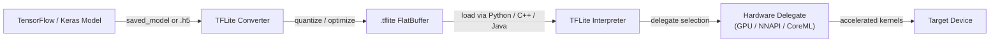

# TensorFlow Lite

## 定义

TensorFlow Lite（TFLite）是 Google 的开源框架，用于在资源受限设备上运行机器学习模型——手机、平板电脑、嵌入式系统和微控制器。TFLite 不是训练框架，而是专为推理设计的**推理运行时**：模型使用完整的 TensorFlow 训练，转换为紧凑的 `.tflite` 格式，然后在设备上执行，无需服务器连接。这种设计允许应用程序完全离线且低延迟地执行机器学习任务——图像分类、目标检测、语音识别、自然语言理解。

TFLite 的核心是一种平面缓冲区模型格式，可最大程度减少内存分配开销，并避免需要复杂的运行时图解释器。该格式去除了训练时的构造（梯度、优化器状态），只保留前向推理所需的操作。这使得模型文件通常比完整 TensorFlow 版本小一个数量级，即使对于使用计量连接的用户来说，通过应用商店分发也是实际可行的。

TFLite 针对异常广泛的硬件范围。在高端设备上，它在 Android 和 iOS 设备上运行，并通过其**委托（delegate）**API 利用硬件加速器。在低端设备上，TensorFlow Lite for Microcontrollers（TFLM）变体完全消除了动态内存分配，可以适配数十千字节的闪存，支持在裸机 Cortex-M 芯片和类似的极限受限目标上部署。

## 工作原理



### 模型转换

TFLite 转换器（`tf.lite.TFLiteConverter`）接受 SavedModel 目录、Keras `.h5` 文件或具体的 TensorFlow 函数，并生成 `.tflite` 平面缓冲区。在转换过程中，图被冻结（变量变为常量），未使用的操作被剪除，操作融合（例如 Conv + ReLU → 融合 ConvReLU）降低了内核调度开销。转换器通过**select TF ops** 机制支持越来越多的 TensorFlow 操作，回退到保证在每个目标上运行的受限 TFLite 内置操作集。训练后量化可以在此阶段应用，缩小模型并解锁仅整数推理路径。

### 量化

TFLite 支持四种量化模式：动态范围量化（仅权重，激活值在运行时量化）、全整数量化（权重和激活值，需要代表性数据集进行校准）、float16 量化（适合 GPU 委托）和量化感知训练（QAT，在训练期间插入伪量化节点，使模型学会对精度降低具有鲁棒性）。全 INT8 量化通常将模型大小减少 4 倍，在支持 SIMD 的 CPU 上延迟减少 2-3 倍。量化对缺乏快速 FP32 执行路径的移动芯片组特别有效。

### 解释器和操作内核

TFLite 解释器加载 `.tflite` 文件，分配张量内存（全部在单个 arena 中以避免碎片化），并按拓扑顺序执行操作。每个操作由在操作解析器中注册的内核实现；MutableOpResolver 允许应用程序只包含所需的操作，显著减小二进制大小。解释器暴露了最小的 C++ API（`AllocateTensors`、`Invoke`、`typed_input_tensor`、`typed_output_tensor`），并存在适用于 Java/Kotlin（Android）、Swift/ObjC（iOS）和 Python 的更高级包装器。Python 解释器主要用于在部署本机二进制文件之前进行验证和基准测试。

### 委托

委托是 TFLite 的硬件加速插件接口。当委托应用于解释器时，它检查模型图并声明可以加速的子图，用优化的实现替换 TFLite 的参考 CPU 内核。**GPU 委托**将卷积和矩阵乘法卸载到 OpenGL ES 或 Metal，在典型视觉模型上产生 2-7 倍的加速。**NNAPI 委托**通过 Android 的神经网络 API 将操作路由到任何供应商提供的加速器（DSP、NPU）。**CoreML 委托**在 iOS 上使用 Apple 的 CoreML。**Hexagon 委托**直接针对高通 DSP。委托会优雅地降级：不支持的操作会自动回退到 CPU。

### 面向微控制器的 TFLite

TFLM 分支删除了标准 C++ 分配器、文件 I/O 和动态调度。模型被编译为 C 字节数组嵌入固件，推理使用固定大小的临时缓冲区从 SRAM 运行。支持的目标包括 STM32、Arduino Nano 33 BLE Sense、SparkFun Edge 和 Sony Spresense。TFLM 支持足以用于关键词检测、手势识别和在亚毫瓦功耗预算下运行简单视觉任务的操作子集。

## 何时使用 / 何时不使用

| 使用场景 | 避免场景 |
|---|---|
| 在 Android 或 iOS 上部署而不依赖云服务 | 模型使用 TFLite 操作集尚不支持的操作 |
| 需要移动端实时推理的低于 100ms 延迟 | 需要在静态 TFLite 图中无法表达的动态形状或控制流 |
| 在嵌入式 Linux 板上运行（树莓派、Coral Edge TPU） | 团队主要使用 PyTorch，模型转换摩擦是阻碍 |
| 二进制大小很重要且需要最小推理运行时 | 需要高级服务功能：批处理、模型版本控制、A/B 路由 |
| 希望通过委托 API 实现广泛硬件加速 | 模型架构在实验过程中频繁变化 |

## 比较

TFLite 与 PyTorch Mobile 和 ONNX Runtime 的边缘部署场景比较。

| 标准 | TensorFlow Lite | PyTorch Mobile | ONNX Runtime |
|---|---|---|---|
| 平台支持 | Android、iOS、嵌入式 Linux、微控制器 | Android、iOS（有限嵌入式支持） | Windows、Linux、macOS、Android、iOS、WebAssembly |
| 模型转换 | TF/Keras → TFLite Converter（成熟、文档完善） | PyTorch → TorchScript 或 ExecuTorch（对 PyTorch 用户更少摩擦） | 任意框架 → ONNX 导出 → ORT（最具互操作性） |
| 设备端性能 | 通过 NNAPI/GPU 委托在 Android 上出色；微控制器上最优 | 移动端性能良好；ExecuTorch 带来更好的性能和可移植性 | CPU EP 有竞争力；CUDA/TensorRT EP 在云/边缘 GPU 场景中出色 |
| 生态系统 | 庞大：TensorFlow Hub 模型、Model Garden、MediaPipe 集成 | 不断增长：研究领域强大，torchvision 模型，Hugging Face 集成 | 广泛：任何 ONNX 兼容框架；在企业和 Microsoft 技术栈中强大 |
| 量化支持 | 全面：动态范围、INT8、FP16、QAT | 通过 torch.quantization 的 PTQ 和 QAT；ExecuTorch 增加更多后端 | 通过 QDQ 节点支持 INT8；依赖执行提供程序实现硬件 INT8 |

## 优缺点

| 优点 | 缺点 |
|------|------|
| 成熟的生态系统，具有丰富的移动工具和文档 | 需要转换步骤；不是所有 TensorFlow 操作都受支持 |
| 通过 TFLM 提供出色的微控制器支持 | 调试已转换的模型比在 eager 模式 TensorFlow 中更难 |
| 硬件委托 API 覆盖主要移动加速器 | ONNX 互操作性需要中间转换步骤 |
| 平面缓冲区格式无需解析即可即时加载 | 对于动态模型架构不如完整 TF 灵活 |
| 强大的社区、Google 支持和 MediaPipe 集成 | PyTorch 用户面临比 TFLite 原生 TF 工作流程更多的摩擦 |

## 代码示例

```python
import numpy as np
import tensorflow as tf

# ── 1. Build and train a simple Keras model ──────────────────────────────────
model = tf.keras.Sequential([
    tf.keras.layers.InputLayer(input_shape=(28, 28, 1)),
    tf.keras.layers.Conv2D(8, (3, 3), activation="relu"),
    tf.keras.layers.MaxPooling2D(),
    tf.keras.layers.Flatten(),
    tf.keras.layers.Dense(10, activation="softmax"),
])
model.compile(optimizer="adam", loss="sparse_categorical_crossentropy", metrics=["accuracy"])

# Dummy training data — replace with real dataset (e.g. MNIST)
x_train = np.random.rand(128, 28, 28, 1).astype(np.float32)
y_train = np.random.randint(0, 10, 128).astype(np.int32)
model.fit(x_train, y_train, epochs=1, verbose=0)

# ── 2. Convert to TFLite with full INT8 quantization ─────────────────────────
def representative_dataset():
    """Yields small batches from training data for calibration."""
    for i in range(0, len(x_train), 8):
        yield [x_train[i : i + 8]]

converter = tf.lite.TFLiteConverter.from_keras_model(model)
converter.optimizations = [tf.lite.Optimize.DEFAULT]
converter.representative_dataset = representative_dataset
converter.target_spec.supported_ops = [tf.lite.OpsSet.TFLITE_BUILTINS_INT8]
converter.inference_input_type = tf.int8
converter.inference_output_type = tf.int8

tflite_model = converter.convert()

# Persist the .tflite file
with open("model.tflite", "wb") as f:
    f.write(tflite_model)
print(f"Model size: {len(tflite_model) / 1024:.1f} KB")

# ── 3. Run inference with the TFLite Interpreter ─────────────────────────────
interpreter = tf.lite.Interpreter(model_content=tflite_model)
interpreter.allocate_tensors()

input_details = interpreter.get_input_details()
output_details = interpreter.get_output_details()

# Quantize a float32 input to INT8 using the input tensor's scale and zero-point
scale, zero_point = input_details[0]["quantization"]
sample = x_train[:1]  # shape (1, 28, 28, 1)
sample_int8 = (sample / scale + zero_point).astype(np.int8)

interpreter.set_tensor(input_details[0]["index"], sample_int8)
interpreter.invoke()

output = interpreter.get_tensor(output_details[0]["index"])
# Dequantize output
out_scale, out_zero = output_details[0]["quantization"]
probabilities = (output.astype(np.float32) - out_zero) * out_scale
predicted_class = np.argmax(probabilities)
print(f"Predicted class: {predicted_class}")
```

## 实用资源

- [TensorFlow Lite 官方指南](https://www.tensorflow.org/lite/guide) — 全面的文档，涵盖模型转换、优化、委托以及适用于 Android、iOS 和嵌入式 Linux 的平台特定部署指南。
- [TFLite Model Maker](https://www.tensorflow.org/lite/models/modify/model_maker) — 用于迁移学习的高级 API，直接输出 `.tflite` 模型，适合使用自定义数据集快速原型开发。
- [面向微控制器的 TFLite](https://www.tensorflow.org/lite/microcontrollers) — TFLM 指南，解释如何在无操作系统依赖的 Cortex-M 板上部署；包括关键词检测和手势识别示例。
- [MediaPipe Solutions](https://developers.google.com/mediapipe/solutions) — Google 基于 TFLite 构建的生产就绪管道（人脸检测、手部追踪、姿态估计）；可作为将 TFLite 集成到实际应用程序的参考。
- [TFLite 性能基准测试](https://www.tensorflow.org/lite/performance/benchmarks) — 跨移动芯片组的常见视觉模型官方延迟和精度基准测试，有助于硬件选型决策。

## 另请参阅

- [PyTorch Mobile](/docs/edge-ai/pytorch-mobile)
- [ONNX Runtime](/docs/edge-ai/onnx)
- [基础设施](/docs/infrastructure)
- [模型压缩](/docs/model-compression)
