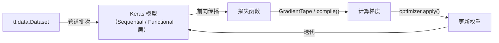

# TensorFlow

## 定义

TensorFlow 是 Google Brain 开发的开源深度学习框架。它提供了一个全面的生态系统，用于在规模上构建、训练和部署机器学习模型——从研究实验到高吞吐量生产服务器、移动设备和边缘硬件。

高级 API **Keras**（集成为 `tf.keras`）是推荐的入口点：它提供可组合的层、模型编译和类似 scikit-learn 接口的训练循环。低级 API 允许访问张量操作、自定义计算图和分布式执行。`tf.function` 将 Python 函数编译为静态 TensorFlow 图以提高生产性能。

TensorFlow 生态系统包括：**TF Serving** 用于生产模型服务，**TFLite** 用于移动/边缘设备推理，**TFX** 用于端到端生产 ML 管道，**TF Hub** 用于共享和重用模型模块。

## 工作原理



### Keras 作为高级 API

**`tf.keras.Sequential`** 线性地链接层。**Functional** API 支持更复杂的拓扑（多输入/输出、跳跃连接）。**子类化** API 通过 `call()` 允许完全自定义。使用 `model.compile()` 指定优化器、损失和指标，然后使用 `model.fit()` 进行训练。

### tf.data 高效管道

**`tf.data.Dataset`** 提供高效的惰性预处理管道：`map`、`filter`、`batch`、`prefetch` 等变换被链接并并行执行。`prefetch` 将 CPU 预处理与 GPU 训练重叠以最大化利用率。

### tf.function 和图

用 `@tf.function` 装饰 Python 函数，TensorFlow 就会追踪执行以构建静态图。这显著提高了生产推理和分布式训练的吞吐量。

## 何时使用 / 何时不使用

| 场景 | 使用 TensorFlow | 不使用 TensorFlow |
|------|---------------|-----------------|
| 使用 TF Serving 的大规模生产部署 | 是——成熟的 TFX 生态系统 | |
| 使用 TFLite 的移动/边缘部署 | 是——一流的 TFLite 支持 | |
| 与 Google Cloud 生态系统集成 | 是——与 Vertex AI 原生集成 | |
| 使用自定义模型的前沿 ML 研究 | | PyTorch 有更丰富的研究生态系统 |
| 微调基于 HuggingFace 的 LLM | | 大多数 HF 模型基于 PyTorch |
| 偏好可调试性的初学者 | | PyTorch 通常更容易调试 |

## 对比

| 功能 | TensorFlow / Keras | PyTorch |
|------|-------------------|---------|
| 计算图 | 静态（通过 tf.function）+ eager 模式 | 动态（定义即运行） |
| 高级 API | Keras（集成） | torch.nn（更显式） |
| 移动部署 | TFLite（成熟） | ExecuTorch（较新） |
| 生产部署 | TF Serving、TFX | TorchServe、ONNX |
| 研究生态系统 | 近期论文中较少 | 主导地位 |
| 学习曲线 | 使用 Keras 适中 | 低到中等 |

## 优缺点

| 优点 | 缺点 |
|------|------|
| 成熟的生产生态系统（TFServing、TFLite、TFX） | 与 PyTorch 相比研究采用率较低 |
| 通过 TFLite 出色支持移动/边缘 | 历史 API 可能令人困惑（TF1 vs TF2） |
| 与 Google Cloud 服务深度集成 | tf.function 可能使图中的错误调试更难 |
| Keras 提供清晰的高级 API | 与 HuggingFace 相比预训练模型较少 |

## 代码示例

```python
import tensorflow as tf
from tensorflow import keras

# Build and train a simple neural network with Keras
model = keras.Sequential([
    keras.layers.Dense(64, activation="relu", input_shape=(10,)),
    keras.layers.Dense(32, activation="relu"),
    keras.layers.Dense(1,  activation="sigmoid"),
])

model.compile(
    optimizer="adam",
    loss="binary_crossentropy",
    metrics=["accuracy"],
)

# Synthetic data
import numpy as np
X_train = np.random.randn(500, 10).astype("float32")
y_train = (X_train[:, 0] > 0).astype("float32")

history = model.fit(X_train, y_train, epochs=5, batch_size=32, validation_split=0.2)
print("最终验证准确率:", history.history["val_accuracy"][-1])
```

## 实用资源

- [TensorFlow 文档](https://www.tensorflow.org/api_docs) — 所有 TF 版本的完整 API 参考
- [Keras 指南](https://keras.io/guides/) — 训练、部署和自定义的深度示例
- [TensorFlow Lite](https://www.tensorflow.org/lite) — 移动、微控制器和边缘推理
- [TFX（TensorFlow Extended）](https://www.tensorflow.org/tfx) — 端到端生产 ML 管道

## 另请参阅

- [PyTorch](/docs/frameworks/pytorch)
- [神经网络](/docs/neural-networks)
- [深度学习](/docs/fundamentals/deep-learning)
