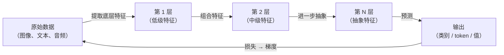

# 深度学习

## 定义

深度学习是[机器学习](/docs/fundamentals/machine-learning)的一个子领域，使用**具有多层的神经网络**（"深度"网络）来学习数据的层次表示。深度网络不需要手工设计特征，而是自动从原始数据中学习表示——像素、token 或波形——通过叠加逐渐抽象的变换。

深度学习革命由三个因素推动：**大型数据集**（ImageNet、Common Crawl）、**硬件**（具有大规模并行张量操作的 GPU）以及**新算法技术**（ReLU、批归一化、Dropout、注意力机制）。[神经网络](/docs/neural-networks)自 20 世纪 80 年代就已存在，但只有在这些因素的组合下才在规模上变得实用。

深度学习架构涵盖用于视觉的 CNN、用于序列的 RNN、用于文本和音频的 [Transformer](/docs/transformers)，以及用于生成的 GAN/扩散模型。"深度"指层数——现代模型可以有数十到数百层。预训练模型（在大量数据上训练，再针对特定任务微调）使深度学习无需专业硬件或数据就可获得。

## 工作原理



### 表示学习

**早期层**捕获低级特征：图像中的边缘、文本中的子词。**中间层**将这些组合成部件：形状、短语。**深层**形成概念：面孔、语义意图。这种层次结构从数据中学习，而不是手工编码。

### 训练

训练使用**反向传播**和**随机梯度下降**（SGD）或自适应变体（Adam、AdamW）。**损失函数**衡量模型输出与目标之间的差异。梯度向后流经各层，权重按减少损失的方向小步更新。**Dropout**（随机置零神经元）、**批归一化**和**权重衰减**等正则化技术防止过拟合。

### 硬件

GPU 通过数量级加速张量操作，使深度学习比 CPU 快得多。现代训练工作流使用**混合精度**（float16 + float32）和**数据并行**将小批量分布到多个 GPU 上。

## 何时使用 / 何时不使用

| 场景 | 使用深度学习 | 不使用 |
|------|------------|-------|
| 高维非结构化数据（图像、文本、音频） | 是——DL 在此优于手工特征 | |
| 具有 \>100k 样本的大型数据集 | 是——DL 随数据扩展良好 | |
| 结构化表格数据，\<50k 行 | 谨慎 | 梯度提升（XGBoost）通常获胜 |
| 可解释性至关重要时 | 谨慎 | 更简单、可解释的模型更受青睐 |
| 硬件有限 / 推理预算有限 | 谨慎 | 传统模型推理成本低得多 |

## 对比

| 方面 | 深度学习 | 经典机器学习 |
|------|---------|------------|
| 特征工程 | 自动（学习） | 手工（专家） |
| 所需数据 | 大量 | 中等到少量 |
| 计算能力 | 高（GPU/TPU） | 低到中等 |
| 可解释性 | 低 | 高到中等 |
| 最适合 | 图像、文本、音频、游戏 | 表格、结构化数据 |

## 优缺点

| 优点 | 缺点 |
|------|------|
| 自动从原始数据中学习特征 | 需要大量标注数据 |
| 在视觉、文本、语音上达到最先进水平 | 训练计算成本高 |
| 预训练模型减少所需数据/计算 | 难以解释和调试 |
| 可扩展到非常复杂的任务 | 对超参数选择敏感 |

## 代码示例

```python
import torch
import torch.nn as nn
import torch.optim as optim

# Minimal deep network for binary classification
class DeepNet(nn.Module):
    def __init__(self):
        super().__init__()
        self.net = nn.Sequential(
            nn.Linear(20, 128), nn.ReLU(), nn.Dropout(0.3),
            nn.Linear(128, 64), nn.ReLU(), nn.Dropout(0.3),
            nn.Linear(64,  32), nn.ReLU(),
            nn.Linear(32,   1),
        )

    def forward(self, x):
        return self.net(x).squeeze(1)

model     = DeepNet()
optimizer = optim.AdamW(model.parameters(), lr=1e-3, weight_decay=1e-4)
criterion = nn.BCEWithLogitsLoss()

# One training step
X = torch.randn(32, 20)
y = torch.randint(0, 2, (32,)).float()

optimizer.zero_grad()
loss = criterion(model(X), y)
loss.backward()
optimizer.step()
print(f"损失: {loss.item():.4f}")
```

## 实用资源

- [深度学习（Goodfellow、Bengio、Courville）](https://www.deeplearningbook.org/) — 免费在线教材：深度学习的经典著作
- [fast.ai — 深度学习实战课程](https://course.fast.ai/) — 基于 PyTorch 的自上而下方法，专注于实际应用
- [cs231n: 用于视觉识别的 CNN（斯坦福）](https://cs231n.github.io/) — 详细介绍反向传播和 CNN 架构的课程笔记

## 另请参阅

- [机器学习](/docs/fundamentals/machine-learning)
- [神经网络](/docs/neural-networks)
- [Transformers](/docs/transformers)
- [LLMs](/docs/llms)
