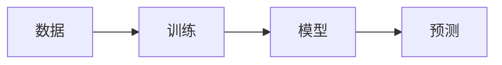

# 机器学习

## 定义

机器学习（ML）研究通过经验（数据）改进的算法。主要范式包括**监督学习**（从标注样本中学习）、**无监督学习**（在没有标签的情况下发现结构）和**强化学习**（从奖励中学习）。

当问题太复杂而无法显式指定，或数据充足时，ML 比手工编码规则更受青睐。它介于经典 AI（符号规则）和[深度学习](/docs/fundamentals/deep-learning)（大型神经网络）之间；许多实际系统将 ML 模型与管道和业务逻辑相结合。

## 工作原理

**训练：**选择一种表示（如线性模型、树或神经网络）和一个目标（监督/无监督的损失，RL 的奖励）。优化器（如梯度下降）更新模型参数以最小化损失或最大化训练数据上的奖励。**模型：**结果是一个拟合的模型（权重、结构），捕获数据中的模式。**预测：**在推理时，将新输入送入模型以获得输出（标签、分数或动作）。评估使用训练/验证/测试划分来估计泛化能力并避免过拟合。

## 应用场景

经典 ML 在结构化或表格数据以及明确的标签或目标方面表现出色。

- 垃圾邮件分类、欺诈检测和其他监督分类任务
- 推荐系统和协同过滤
- 预测和时间序列预测

## 外部文档

- [Google ML 速成课程](https://developers.google.com/machine-learning/crash-course)
- [Scikit-learn – 用户指南](https://scikit-learn.org/stable/user_guide.html) — 实践中的经典 ML

## 另请参阅

- [深度学习](/docs/fundamentals/deep-learning)
- [强化学习](/docs/rl)
- [评估指标](/docs/evaluation-metrics)
