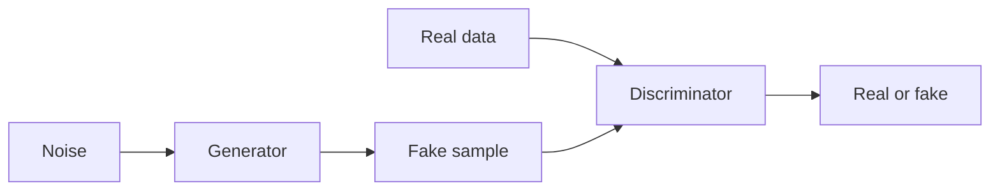

# 生成对抗网络 (GAN)

## 定义

GANs 在博弈中训练生成器和判别器：生成器产生样本；判别器尝试区分guish them from real data. Training pushes the generator toward realistic outputs.

They 是之前主流的生成方法 [diffusion models](/docs/diffusion-models). Compared to [VAEs](/docs/vaes), GANs often produce sharper images but training can be unstable (mode collapse, discriminator/generator balance). Still used for style transfer, data augmentation, and some image editing.

## 工作原理

**Generator:** Takes **noise** (随机向量) and outputs a **fake sample** (例如 image). **Discriminator:** Receives **real data** and **fake sample**, outputs **real or fake** (or a score). Training is a **min-max game**: the generator tries to maximize the discriminator’s loss (fool it), the discriminator tries to minimize it (tell real from fake). In practice you alternate gradient steps. Variants (DCGAN, StyleGAN, etc.) use better architectures and training tricks (例如 spectral norm, progressive growing) for stability and quality.

## 应用场景

GANs are used for generative and discriminative tasks when you want adversarial training and sharp samples (images, audio, data aug).

- Image generation and editing (例如 StyleGAN, face synthesis)
- Data augmentation and synthetic data for training
- Domain adaptation and style transfer

## 外部文档

- [Generative Adversarial Networks (Goodfellow et al.)](https://arxiv.org/abs/1406.2661)
- [PyTorch – DCGAN tutorial](https://pytorch.org/tutorials/beginner/dcgan_faces_tutorial.html)

## 另请参阅

- [Diffusion models](/docs/diffusion-models)
- [VAEs](/docs/vaes)
