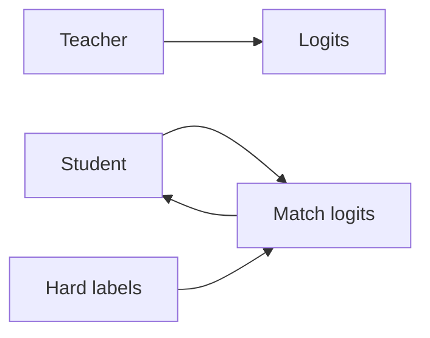

# 知识蒸馏

## 定义

Knowledge distillation 训练一个较小的学生模型来匹配输出 (and sometimes intermediate representations) 来自较大教师模型的. The student gains from the teacher’s soft labels and can run with less compute.

它是 a [model compression](/docs/model-compression) technique that preserves more of the teacher’s behavior than training the student on hard labels alone. Used for BERT → DistilBERT, large [LLMs](/docs/llms) → smaller variants, and [transfer learning](/docs/transfer-learning) from ensembles.

## 工作原理

**教师**（大模型）在训练数据上产生 **logits**（或嵌入）。**学生**（较小模型）被训rained to **match** the teacher’s logits (例如 KL divergence with temperature scaling) in addition to or instead of **hard labels** (ground truth). Temperature softens the teacher distribution so the student learns from dark knowledge (relative scores across classes). Optionally, intermediate layers or attention can be matched. The student is trained with a mix of distillation loss and task loss; after training it runs with the student’s capacity and latency.

## 应用场景

Knowledge distillation fits when you want a small, fast student that approximates a large teacher for deployment.

- Training smaller, faster models that approximate large ones (例如 BERT → DistilBERT)
- Enabling deployment when the teacher is too heavy for production
- Transferring knowledge from ensembles or from multiple teachers

## 外部文档

- [Distilling the Knowledge in a Neural Network (Hinton et al.)](https://arxiv.org/abs/1503.02531)
- [Hugging Face – Distillation](https://huggingface.co/docs/transformers/tasks/distillation)

## 另请参阅

- [Model compression](/docs/model-compression)
- [Transfer learning](/docs/transfer-learning)
