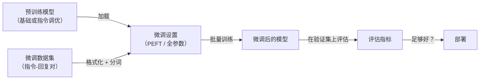

# 微调

## 定义

微调是在较小的特定任务数据集上继续训练预训练模型，以适配其行为的过程。对于 [LLM](/docs/llms)，这意味着从基础（或经过指令调优的）模型开始，在展示你特定用例期望输出的示例上进行训练。

微调解决了提示工程的局限性：它可以教导模型采用一致的语气或格式，减少特定领域的幻觉，压缩原本需要冗长复杂提示的行为，或通过缩短提示长度来优化延迟。当你有不应进入 API 上下文的专有数据时，或当基础模型的零样本性能不足时，微调尤为有价值。

**参数高效微调（PEFT）**——特别是 **LoRA**（低秩适配）和 **QLoRA**（量化版本）——使在消费级硬件上微调 LLM 成为可能。LoRA 不是更新所有数十亿参数，而是在 Transformer 层中注入小型可训练低秩矩阵，冻结原始模型。这将可训练参数减少了 100-1000 倍，同时保留了大部分性能提升。

## 工作原理



### 微调方法

**全参数微调** — 更新所有模型参数。需要大量硬件（通常是多 GPU）。**LoRA** — 冻结原始权重，训练注入的低秩矩阵。只训练约 0.1–1% 的参数。**QLoRA** — 以 4 位（NF4）加载基础模型，以 float16 训练 LoRA 适配器。允许在单块 24GB GPU 上微调 7B+ 模型。

### 数据格式

监督微调数据通常是格式化为聊天模板的**指令-回复对**。质量胜过数量：1,000 个高质量示例通常优于 100,000 个低质量示例。保留单独的验证集以检测过拟合。

### 关键超参数

**学习率** — LoRA 通常为 1e-4 到 1e-5，全参数微调更小。**批量大小** — 越大越好（如有必要使用梯度累积）。**轮次** — 通常 1–3；LLM 微调倾向于快速过拟合。**LoRA 秩（r）** — 较大的值（16–64）捕获更多容量但使用更多内存。

## 何时使用 / 何时不使用

| 场景 | 使用微调 | 不使用微调 |
|------|--------|---------|
| 建立一致的语气 / 风格 / 格式 | 是——微调直接编码这些 | |
| 适配到特定领域术语 | 是——尤其是专业领域 | |
| 减少生产提示长度 | 是——将少样本示例转移到模型中 | |
| 添加新事实知识 | 谨慎 | RAG 更可控和可审计 |
| 修复单种模型错误类型 | 谨慎 | 提示工程可能更快 |
| 训练示例很少（\<50–100）| | 数据不足；使用提示工程 |

## 对比

| 方法 | 微调 | RAG | 提示工程 |
|------|------|-----|--------|
| 成本 | 中到高（训练） | 低（检索） | 极低 |
| 行为 | 编码风格/能力 | 用事实增强 | 引导现有模型 |
| 所需数据 | 数百到数千个示例 | 任意文档语料库 | 无 |
| 可解释性 | 低 | 中等（可追溯来源） | 中等 |
| 最适合 | 风格、格式、领域适配 | 事实访问、知识更新 | 快速变更、测试 |

## 优缺点

| 优点 | 缺点 |
|------|------|
| 模型行为变得一致可靠 | 需要高质量标注数据 |
| 可通过更短提示降低 API 成本 | 过拟合或灾难性遗忘的风险 |
| PEFT/LoRA 使有限硬件下成为可能 | 反馈循环比提示工程慢 |
| 模型高效编码专业领域 | 难以增量更新训练数据 |

## 代码示例

```python
# QLoRA fine-tuning with Hugging Face + PEFT
from transformers import AutoModelForCausalLM, AutoTokenizer, BitsAndBytesConfig, TrainingArguments, Trainer
from peft import get_peft_model, LoraConfig, TaskType
import torch

model_id  = "meta-llama/Llama-3.2-1B"
bnb_config = BitsAndBytesConfig(
    load_in_4bit=True, bnb_4bit_quant_type="nf4",
    bnb_4bit_compute_dtype=torch.float16,
)

tokenizer = AutoTokenizer.from_pretrained(model_id)
model     = AutoModelForCausalLM.from_pretrained(model_id, quantization_config=bnb_config)

lora_cfg  = LoraConfig(task_type=TaskType.CAUSAL_LM, r=16, lora_alpha=32, lora_dropout=0.05)
model     = get_peft_model(model, lora_cfg)
model.print_trainable_parameters()   # ~0.1% of total params

# TrainingArguments + Trainer would follow (omitted for brevity)
```

## 实用资源

- [Hugging Face PEFT 文档](https://huggingface.co/docs/peft) — 带代码示例的 LoRA、QLoRA 和其他方法
- [QLoRA: 量化 LLM 的高效微调（论文）](https://arxiv.org/abs/2305.14314) — 描述 QLoRA 的原始论文
- [TRL（Transformers 强化学习）](https://github.com/huggingface/trl) — 用于 SFT、DPO 和 RLHF 训练的 HuggingFace 库

## 另请参阅

- [LLMs](/docs/llms)
- [Hugging Face](/docs/tools/huggingface)
- [提示工程](/docs/prompt-engineering)
- [RAG](/docs/rag)
