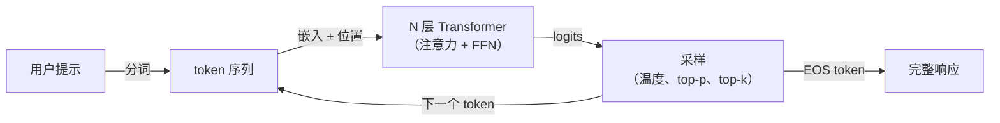

# 大语言模型（LLM）

## 定义

大语言模型是具有数十亿参数的解码器 [Transformer](/docs/transformers) 模型，在大量文本语料库上训练以预测下一个 token。在足够大的规模下，它们发展出涌现能力：推理、代码生成、算术和指令遵循——无需特定任务的监督。

LLM 经历三个主要训练阶段：在万亿 token 原始文本上进行**预训练**（学习世界知识），在高质量指令遵循示例上进行**监督微调**（学习如何有用），以及 **RLHF** 或其他对齐形式（学习安全可靠）。结果是一个可以通过自然语言提示进行对话、编写代码、总结文档等的模型。

GPT-4（OpenAI）、Claude（Anthropic）、Gemini（Google）和 Llama（Meta）等模型在规模、训练流程和部署策略（API 与开源）上有所不同。它们都共享同一核心思想：在足够规模上预测下一个 token 产生具有单一提示界面的有能力模型。

## 工作原理

### 预训练

模型在大规模网页文本、书籍和代码数据上学习预测下一个 token。这提供了广泛的世界知识，包括编程语言、数学推理和事实知识。

### 监督微调（SFT）

在基础模型上，SFT 在高质量的人类指令和期望回复示例上进行训练。这将下一个 token 预测器转变为响应式助手。

### 对齐（RLHF、DPO）

RLHF（人类反馈强化学习）根据人类偏好训练奖励模型，并使用 RL 优化 LLM。DPO（直接偏好优化）是一种更新更简单的替代方案，直接优化偏好。

## 何时使用 / 何时不使用

| 场景 | 使用 LLM | 不使用 LLM |
|------|---------|---------|
| 自由文本生成、摘要、问答 | 是——天然适合 | |
| 指令遵循和聊天机器人 | 是——LLM 为此而微调 | |
| 代码理解和生成 | 是——LLM 在代码上训练 | |
| 数值时间序列预测 | | 使用专用统计/ML 模型 |
| 需要 \>99% 精度的固定标签分类 | | 微调分类器更可靠 |
| 延迟敏感推理（\<10ms）| | LLM 比小模型慢 |

## 对比

| 方面 | LLM | 经典 ML 模型 |
|------|-----|------------|
| 训练 | 在大量数据上预训练 | 在特定任务数据集上训练 |
| 适配 | 提示或轻量微调 | 在新数据上重新训练 |
| 任务灵活性 | 非常高（通过提示的多任务） | 低（特定于单个任务） |
| 推理延迟 | 高（数百毫秒到秒） | 低（毫秒） |
| 推理成本 | 高 | 低 |
| 可解释性 | 低 | 中等到高 |

## 优缺点

| 优点 | 缺点 |
|------|------|
| 通过简单的提示变化实现多任务 | 容易产生幻觉——生成合理但错误的文本 |
| 零样本和少样本能力无需重新训练 | 计算和 API 成本高 |
| 简单 API——不需要 ML 管道 | 非确定性输出——难以进行单元测试 |
| 开源模型可用于本地使用 | 上下文窗口有限（虽然在扩展） |

## 实用资源

- [Anthropic API 文档](https://docs.anthropic.com/) — Claude 的完整参考，包含示例和指南
- [OpenAI API 文档](https://platform.openai.com/docs/) — GPT-4、嵌入模型和微调的参考
- [Hugging Face Hub](https://huggingface.co/models?pipeline_tag=text-generation) — 开源文本生成模型
- [LLM 排行榜（LMSYS）](https://chat.lmsys.org/?leaderboard) — 热门 LLM 的竞技场比较排名

## 另请参阅

- [Transformers](/docs/transformers)
- [微调](/docs/llms/fine-tuning)
- [流式输出](/docs/llms/streaming)
- [提示工程](/docs/prompt-engineering)
- [RAG](/docs/rag)
