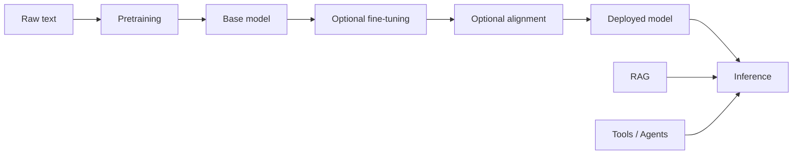

# 大语言模型 (LLM)

## 定义

大语言模型是基于 Transformer 的模型，在大规模文本（有时是多模态）数据上训练。 They exhibit emergent abilities: few-shot learning, 推理, and tool use when scaled and aligned (例如 via RLHF).

一个有用的心智模型：**预训练**在巨大的语料库上学习下一个 token 预测，赋予模型广泛的知识and language ability. **Instruction tuning** (and similar) trains the model to follow user instructions and formats. **Alignment** (例如 RLHF, DPO) shapes behavior to be helpful, honest, and safe. At inference time you can use the model zero-shot, few-shot, or augment it with 检索 (RAG) or tools (agents).

## 工作原理

**Pretraining** learns 下一个 token 预测 on large corpora and produces a base model. **Optional fine-tuning** (例如 [fine-tuning](/docs/llms/fine-tuning)) adapts it to tasks or instruction formats; **alignment** (例如 RLHF, DPO) optimizes human preference and safety. The **deployed model** is then used at **inference** time. You can call it zero-shot (no examples), few-shot (with [prompt engineering](/docs/llms/prompt-engineering)), or augment it with [RAG](/docs/rag) (检索 as context) or [agents](/docs/agents) (tools and loops). The diagram summarizes the training pipeline and the two main inference augmentations.

## 应用场景

LLMs are used wherever you need flexible language understanding or generation, from chat to code to analysis.

- Chat, summarization, and translation
- Code assistance and generation
- Question answering and research assistance (often with RAG or tools)

## 优缺点

| Pros | Cons |
|------|------|
| Flexible, one model for many tasks | Cost and latency |
| Strong few-shot performance | Hallucination, bias |
| Enables agents and tool use | Requires careful evaluation |

## 外部文档

- [OpenAI – Models overview](https://platform.openai.com/docs/models) — GPT and capabilities
- [Google AI for Developers](https://ai.google.dev/) — Gemini and APIs
- [Anthropic – Models](https://www.anthropic.com/product) — Claude and documentation
- [Hugging Face – NLP course](https://huggingface.co/learn/nlp-course/) — From transformers to LLMs

## 另请参阅

- [Fine-tuning](/docs/llms/fine-tuning)
- [Prompt engineering](/docs/llms/prompt-engineering)
- [RAG](/docs/rag)
- [Agents](/docs/agents)
