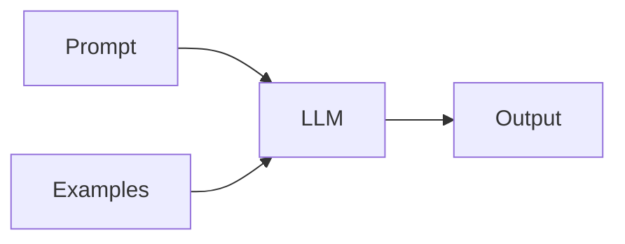

# 提示工程

## 定义

提示工程是设计输入文本（提示）以从 LLM 获得期望行为的实践: task format, few-shot examples, chain-of-thought, role-playing, and constraints.

它是 the primary way to steer [LLMs](/docs/llms) without [fine-tuning](/docs/llms/fine-tuning): you control context, format, and examples in the prompt. Combined with [RAG](/docs/rag), prompts often include retrieved passages; with [agents](/docs/agents), they define tool use and 推理 style.

## 工作原理

你编写一个**提示**（系统消息、任务描述、约束）并可选地添加**示例**（few-shot）。**LLM** takes this as input and produces an **output**. **Zero-shot** uses only instructions; **few-shot** adds example input-output pairs so the model infers the task. **Chain-of-thought** (see [CoT](/docs/reasoning-patterns/cot)) asks the model to “think 逐步” to improve 推理. **Structured output** (例如 “respond in JSON”) can be enforced via parsing or API options. Iterate on prompt wording and examples, and evaluate on a dev set to improve reliability.

## 应用场景

Prompt engineering matters whenever you call an LLM: it shapes behavior, format, and 推理 without changing weights.

- Steering chat and task completion (role, format, examples)
- Eliciting 推理 (chain-of-thought) for math or logic
- Constraining outputs (JSON, length, tone) for APIs or UX

## 外部文档

- [OpenAI – Prompt engineering guide](https://platform.openai.com/docs/guides/prompt-engineering)
- [Anthropic – Prompt 设计](https://docs.anthropic.com/en/docs/build-with-claude/prompt-engineering/overview)

## 另请参阅

- [LLMs](/docs/llms)
- [Chain-of-thought](/docs/reasoning-patterns/cot)
- [RAG](/docs/rag)
