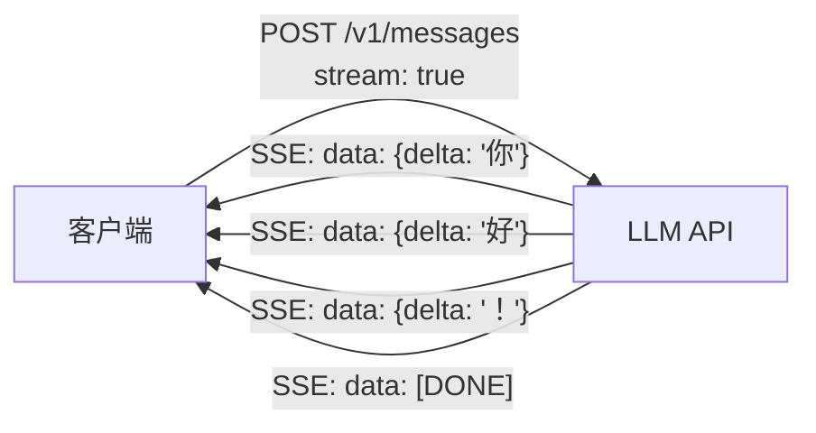

# Streaming（LLMs）

## 定义

Streaming 是在 LLM 生成 token 时立即将其发送给客户端的技术，而不是等待整个响应完成。由于 LLM 以自回归方式逐个生成 token，流式输出减少了感知到的首字节时间（TTFB）——用户立刻就能看到文字出现，而不是在空白屏幕前等待数秒。

没有流式输出，一个 500 token 的输出提示可能需要 10 多秒才能一次性显示出来。有了流式输出，用户在不到 1 秒内就能看到第一个 token，文字在生成时持续显示——这就是 ChatGPT 和 Claude 等产品那种熟悉的"打字"体验。对于生产用例，流式输出还让客户端可以更早开始处理（例如在文字还在传输时就开始语音合成）。

LLM API 通过**服务器发送事件（SSE）**或带分块主体的 HTTP 响应来实现流式输出。客户端遍历流事件，每个事件包含一个增量（新 token 内容）。流以 `[DONE]` 事件或类似的结束信号终止。

## 工作原理



### 服务器发送事件（SSE）

SSE 是一种简单的单向 HTTP 协议，服务器通过长连接 HTTP 连接向客户端推送事件。每个事件是以 `\n\n` 分隔的 `data: {json}` 行。客户端使用浏览器的 `EventSource` API 或 `httpx`、`fetch` 等库中的手动流式迭代。

### 流的生命周期

1. 客户端发送带 `"stream": true`（OpenAI/Anthropic）或等效的请求。
2. 服务器以 `Content-Type: text/event-stream` 响应。
3. 每个 token 或 token 组作为带增量字段的 SSE 事件发送。
4. 完成后，终止事件（`[DONE]` 或 `message_stop`）表示流结束。
5. 客户端关闭连接。

### 流中的错误处理

流中途可能发生错误。客户端应处理连接异常、检测 SSE 错误事件，并为关键会话实现重连逻辑。

## 何时使用 / 何时不使用

| 场景 | 使用 Streaming | 不使用 Streaming |
|------|-------------|----------------|
| 面向用户的聊天 UI | 是——打字体验降低感知延迟 | |
| 长响应（\>100 token） | 是——流式输出提供明显优势 | |
| 实时文本到语音合成 | 是——在完成前就开始合成 | |
| 离线批量处理 | | 流式输出增加复杂性而没有 UX 收益 |
| 短响应（\<20 token） | | 流式输出开销可能大于收益 |
| 需要在采取行动前处理完整响应 | | 先完成再处理 |

## 代码示例

```python
import anthropic

client = anthropic.Anthropic()

# Stream a response from Claude
with client.messages.stream(
    model="claude-opus-4-5",
    max_tokens=1024,
    messages=[{"role": "user", "content": "Write a short poem about streaming data."}],
) as stream:
    for text in stream.text_stream:
        print(text, end="", flush=True)

print()  # newline after stream ends

# --- OpenAI equivalent ---
from openai import OpenAI

oai = OpenAI()
stream = oai.chat.completions.create(
    model="gpt-4o-mini",
    messages=[{"role": "user", "content": "Write a haiku about tokens."}],
    stream=True,
)
for chunk in stream:
    delta = chunk.choices[0].delta
    if delta.content:
        print(delta.content, end="", flush=True)
print()
```

## 实用资源

- [Anthropic Streaming 文档](https://docs.anthropic.com/claude/reference/messages-streaming) — Claude 的 SSE 协议规范和事件类型
- [OpenAI Streaming 文档](https://platform.openai.com/docs/api-reference/streaming) — 聊天补全流式输出参考指南
- [MDN – 服务器发送事件](https://developer.mozilla.org/en-US/docs/Web/API/Server-sent_events) — 客户端实现的 SSE 协议规范

## 另请参阅

- [LLMs](/docs/llms)
- [提示工程](/docs/prompt-engineering)
