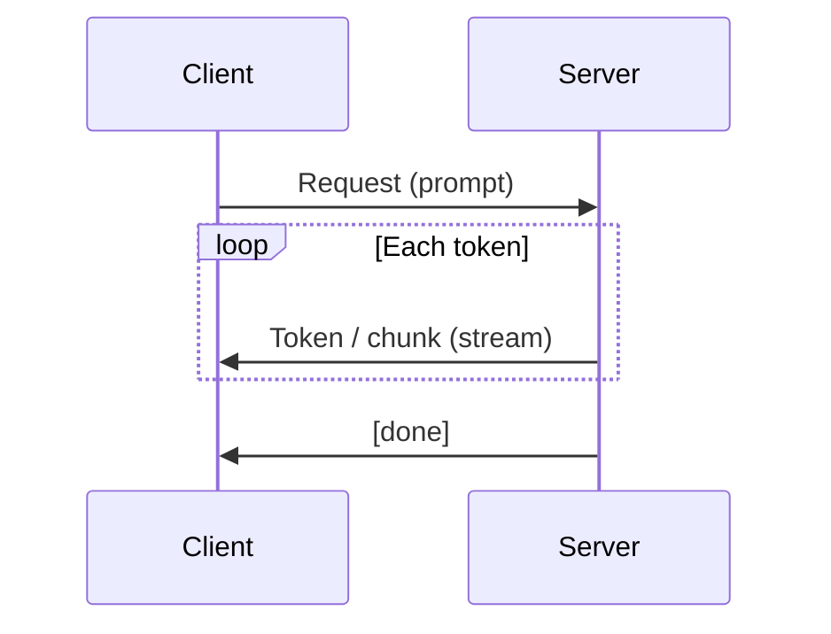

# Streaming (LLMs)

## 定义

流式传输意味着返回 [LLM](/docs/llms) output **token by token** (or chunk by chunk) as it is generated, instead of waiting for the full response. Users see text appear incrementally, which lowers **perceived latency** and improves chat and assistant [use cases](/docs/llms).

它是 supported by most LLM APIs (OpenAI, Anthropic, Gemini, open-source servers like vLLM) via Server-Sent Events (SSE) or similar protocols. The same [prompt engineering](/docs/llms/prompt-engineering) and [RAG](/docs/rag) or [agents](/docs/agents) patterns apply; only the response delivery is incremental.

## 工作原理

**客户端**发送带有提示的请求（以及可选的 [RAG](/docs/rag) 上下文或工具结果）。**服务器**uns the model autoregressively and, instead of buffering the full output, **pushes** each new token (or a small chunk of tokens) to the client as soon as it is generated. The client **renders** tokens as they arrive (例如 in a chat UI). Connection stays open until the model emits an end-of-sequence token or the client stops the stream.

## 应用场景

Streaming is the default for chat and any interactive use where users expect to see progress immediately.

- Chat UIs and assistants where text should appear as it is generated
- Long-form generation (summaries, code) to show progress and allow early cancellation
- Reducing perceived latency when full response would take several seconds

## 外部文档

- [OpenAI – Streaming](https://platform.openai.com/docs/api-reference/streaming)
- [Anthropic – Streaming](https://docs.anthropic.com/en/api/streaming)
- [vLLM – Streaming](https://docs.vllm.ai/en/latest/serving/openai_compatible_server.html#streaming)

## 另请参阅

- [LLMs](/docs/llms)
- [Prompt engineering](/docs/llms/prompt-engineering)
- [Local inference](/docs/local-inference)
