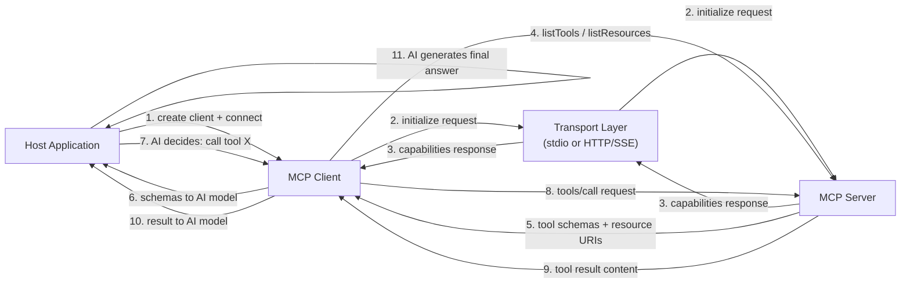

# 构建 MCP 客户端

## 定义

**MCP 客户端**是主机应用程序内部管理与单个 MCP 服务器连接并将 AI 模型意图转化为协议级请求的组件。主机应用程序——聊天界面、编码助手、自主代理——为其想要连接的每个服务器创建一个客户端。客户端处理整个协议生命周期：建立传输连接、完成初始化握手、发现服务器能力、代表 AI 调用工具、读取资源和获取提示。从主机应用程序的角度来看，客户端是服务器世界的 API 接口。

客户端在主机应用程序中的角色是智能中介。它不决定调用哪些工具——那是 AI 模型的责任。相反，客户端为 AI 提供结构化的能力描述（工具 schema、资源 URI、提示定义），然后忠实地执行 AI 请求的任何内容，以 AI 可以推理的格式返回结果。构建良好的客户端将所有协议复杂性与主机应用程序隔离：主机只需询问"这个服务器能做什么？"和"用这些参数调用这个工具"，客户端处理所有其他事情。

能力发现是客户端最重要的职责之一。初始化握手后，客户端通过调用 `tools/list`、`resources/list` 和 `prompts/list` 查询服务器以获取其完整的能力清单。这些响应包含名称、描述、输入 schema 和 URI 模板——AI 模型理解如何以及何时使用每种能力所需的一切。在动态环境中（在运行时更改其工具集的服务器），客户端可以监听 `notifications/tools/list_changed` 事件并按需重新查询清单，确保 AI 始终以最新的可用能力视图运行。

## 工作原理

### 客户端初始化和握手

创建 MCP 客户端需要两件事：客户端身份（名称和版本）和能力声明。能力声明告诉服务器客户端支持哪些协议扩展——例如，是否可以处理资源订阅或提示参数验证。实例化后，客户端连接到传输，这会触发 `initialize` 请求。服务器响应其自身的身份、协议版本和能力。然后客户端发送 `initialized` 通知以确认握手完成。只有在这个序列之后，客户端才能发出能力或调用请求。当您调用 `client.connect(transport)` 时，SDK 会自动处理所有这些。

### 能力发现

连接后，客户端发现服务器提供的内容。`client.listTools()` 返回所有工具定义，包括其名称、描述和 JSON Schema 输入规范。`client.listResources()` 返回静态资源 URI 和元数据。`client.listResourceTemplates()` 返回动态资源的 URI 模板。`client.listPrompts()` 返回提示名称及其参数定义。在典型的 AI 应用程序中，发现在会话开始时发生一次，结果作为上下文提供给 AI 模型——要么注入到系统提示中，要么作为结构化数据传递给函数调用 API。`listTools()` 返回的工具 schema 直接映射到大多数 LLM 函数调用 API 使用的 JSON Schema 格式，这使将发现的 MCP 工具转换为 LLM 工具定义变得简单。

### 工具调用

调用工具需要工具名称和满足工具输入 schema 的参数对象。`client.callTool({ name, arguments })` 向服务器发送 `tools/call` 请求，并返回包含内容块 `content` 数组的响应。每个块都有一个 `type` 字段（`text`、`image` 或 `resource`）和相应的数据。文本块包含字符串结果；图像块包含带有 MIME 类型的 base64 编码图像数据；资源块内联嵌入资源。客户端的工作是将这些内容块传回 AI 模型——通常作为对话轮次中的工具结果消息。如果响应的 `isError: true`，客户端应该清晰地显示这一点，使 AI 能够处理错误（重试、回退或向用户报告）。

### 资源读取

资源通过 `client.readResource({ uri })` 读取，返回包含资源内容项的 `contents` 数组。每个项都有 URI、MIME 类型，以及 `text` 字段（用于文本资源）或 `blob` 字段（用于二进制资源）。资源用于为 AI 提供大型结构化上下文——文件内容、数据库记录、API 响应——而无需经历工具调用往返。客户端可以订阅资源更新（`client.subscribeResource({ uri })`），并在服务器确定资源内容已更改时接收 `notifications/resources/updated` 事件，支持实时上下文刷新。

### 传输选择

传输选择取决于服务器运行的位置。**stdio 传输**（`StdioClientTransport`）在服务器作为本地子进程运行时使用——客户端直接生成服务器进程并通过其 stdin/stdout 进行通信。这是零配置的，非常适合开发工具、本地文件系统服务器以及应该限于单个用户会话的任何服务器。**SSE 传输**（客户端侧的 `SSEServerTransport`）用于远程服务器——客户端连接到 HTTP 端点并使用服务器发送事件进行流式响应。这适合共享组织服务器、云托管能力以及多个客户端实例需要共享同一服务器的生产部署。传输选择对能力发现和调用 API 完全透明；您可以切换传输而无需更改任何其他客户端代码。



## 何时使用 / 何时不使用

| 场景 | 构建 MCP 客户端 | 考虑替代方案 |
|---|---|---|
| 将 AI 应用程序连接到一个或多个 MCP 服务器 | 必需——这是预期的用例 | 如果服务器不使用 MCP，则使用直接 API 调用 |
| 构建应该支持社区 MCP 服务器的通用 AI 助手 | 最佳选择——任何 MCP 服务器自动工作 | 如果工具集固定且小，使用自定义工具集成 |
| 将 AI 集成到已有服务依赖的应用程序中 | 每个服务的 MCP 客户端提供统一的工具访问 | 如果锁定到一个 LLM 提供商，使用特定提供商的函数调用 |
| 开发在用户机器上本地运行的工具 | stdio 传输需要 MCP 客户端 | 如果不涉及 AI，使用 shell 脚本或直接库调用 |
| 从多个专业服务器聚合能力 | 每个服务器一个客户端，主机管理所有客户端 | 如果所有工具在一个地方，使用单一整体工具列表 |
| 使用 HTTP/SSE 进行远程访问的服务器 | SSE 传输客户端原生处理此问题 | 如果服务器使用非 MCP 协议，使用 WebSocket 或 REST 客户端 |

## 代码示例

### 完整的 MCP 客户端——连接、发现、调用、读取

```typescript
import { Client } from "@modelcontextprotocol/sdk/client/index.js";
import { StdioClientTransport } from "@modelcontextprotocol/sdk/client/stdio.js";

async function main() {
  // -----------------------------------------------------------------------
  // 1. Create transport — spawns the server as a child process
  // -----------------------------------------------------------------------
  const transport = new StdioClientTransport({
    command: "node",
    args: ["./file-and-weather-server.js"], // Path to your MCP server
  });

  // -----------------------------------------------------------------------
  // 2. Create client and connect (triggers the initialize handshake)
  // -----------------------------------------------------------------------
  const client = new Client(
    { name: "demo-client", version: "1.0.0" },
    {
      capabilities: {
        // Declare which protocol extensions this client supports
        roots: { listChanged: true },
      },
    }
  );

  await client.connect(transport);
  console.log("Connected to MCP server");

  // -----------------------------------------------------------------------
  // 3. Discover capabilities
  // -----------------------------------------------------------------------
  const { tools } = await client.listTools();
  console.log(
    "\nAvailable tools:",
    tools.map((t) => `${t.name}: ${t.description}`)
  );

  const { resources } = await client.listResources();
  console.log(
    "\nAvailable resources:",
    resources.map((r) => r.uri)
  );

  const { prompts } = await client.listPrompts();
  console.log(
    "\nAvailable prompts:",
    prompts.map((p) => p.name)
  );

  // -----------------------------------------------------------------------
  // 4. Invoke a tool
  // -----------------------------------------------------------------------
  console.log("\n--- Calling get_weather tool ---");
  const weatherResult = await client.callTool({
    name: "get_weather",
    arguments: { city: "Tokyo", units: "celsius" },
  });

  // weatherResult.content is an array of content blocks
  if (!weatherResult.isError) {
    for (const block of weatherResult.content) {
      if (block.type === "text") {
        console.log("Weather result:", block.text);
      }
    }
  } else {
    console.error("Tool returned an error:", weatherResult.content);
  }

  // -----------------------------------------------------------------------
  // 5. Invoke another tool
  // -----------------------------------------------------------------------
  console.log("\n--- Calling list_directory tool ---");
  const dirResult = await client.callTool({
    name: "list_directory",
    arguments: { dir_path: "/tmp" },
  });

  if (!dirResult.isError) {
    const textBlock = dirResult.content.find((b) => b.type === "text");
    if (textBlock && textBlock.type === "text") {
      console.log("Directory listing:", textBlock.text);
    }
  }

  // -----------------------------------------------------------------------
  // 6. Read a resource
  // -----------------------------------------------------------------------
  console.log("\n--- Reading a resource ---");
  try {
    const resourceResult = await client.readResource({
      uri: "file:///etc/hostname",
    });

    for (const item of resourceResult.contents) {
      console.log(`Resource [${item.uri}]:`, "text" in item ? item.text : "(binary)");
    }
  } catch (err) {
    console.error("Resource read failed:", (err as Error).message);
  }

  // -----------------------------------------------------------------------
  // 7. Fetch a prompt
  // -----------------------------------------------------------------------
  console.log("\n--- Fetching a prompt ---");
  try {
    const promptResult = await client.getPrompt({
      name: "analyze_file",
      arguments: {
        file_path: "/tmp/example.txt",
        focus: "structure and formatting",
      },
    });

    console.log("Prompt messages:");
    for (const msg of promptResult.messages) {
      console.log(`  [${msg.role}]:`, JSON.stringify(msg.content).slice(0, 120) + "...");
    }
  } catch (err) {
    console.error("Prompt fetch failed:", (err as Error).message);
  }

  // -----------------------------------------------------------------------
  // 8. Clean up
  // -----------------------------------------------------------------------
  await client.close();
  console.log("\nClient disconnected.");
}

main().catch((err) => {
  console.error("Client error:", err);
  process.exit(1);
});
```

### 通过 SSE 传输连接到远程服务器

```typescript
import { Client } from "@modelcontextprotocol/sdk/client/index.js";
import { SSEClientTransport } from "@modelcontextprotocol/sdk/client/sse.js";

async function connectRemote() {
  // Point to the SSE endpoint of your remote MCP server
  const transport = new SSEClientTransport(
    new URL("http://localhost:3000/sse")
  );

  const client = new Client(
    { name: "remote-client", version: "1.0.0" },
    { capabilities: {} }
  );

  await client.connect(transport);

  // From here, the API is identical to the stdio client example
  const { tools } = await client.listTools();
  console.log("Remote tools:", tools.map((t) => t.name));

  // Call a tool on the remote server
  const result = await client.callTool({
    name: "get_weather",
    arguments: { city: "Berlin" },
  });
  console.log(result.content);

  await client.close();
}

connectRemote().catch(console.error);
```

### 将发现的 MCP 工具转换为 LLM 函数调用 schema

```typescript
import { Client } from "@modelcontextprotocol/sdk/client/index.js";
import { StdioClientTransport } from "@modelcontextprotocol/sdk/client/stdio.js";
import type { Tool } from "@modelcontextprotocol/sdk/types.js";

// Convert an MCP tool definition to OpenAI function-calling format
function mcpToolToOpenAIFunction(tool: Tool) {
  return {
    type: "function" as const,
    function: {
      name: tool.name,
      description: tool.description ?? "",
      parameters: tool.inputSchema,
    },
  };
}

async function getToolsForLLM(serverCommand: string, serverArgs: string[]) {
  const transport = new StdioClientTransport({
    command: serverCommand,
    args: serverArgs,
  });

  const client = new Client(
    { name: "llm-bridge", version: "1.0.0" },
    { capabilities: {} }
  );

  await client.connect(transport);

  const { tools } = await client.listTools();

  // Convert to OpenAI format — these can be passed directly to the Chat Completions API
  const openAITools = tools.map(mcpToolToOpenAIFunction);

  return { client, openAITools };
}

// Usage:
// const { client, openAITools } = await getToolsForLLM("node", ["./my-server.js"]);
// Pass openAITools to openai.chat.completions.create({ tools: openAITools, ... })
// When the LLM returns a tool call, use: client.callTool({ name, arguments })
```

## 实用资源

- [MCP TypeScript SDK——客户端 API 参考](https://github.com/modelcontextprotocol/typescript-sdk/tree/main/src/client) — `Client`、所有传输类和客户端侧类型的源码和内联文档。
- [MCP 客户端示例和集成](https://modelcontextprotocol.io/clients) — 跨编辑器、AI 平台和开发者工具的现有 MCP 客户端集成精选列表。
- [MCP 协议规范——客户端行为](https://spec.modelcontextprotocol.io/specification/client/) — 客户端职责的权威参考，包括初始化、能力协商和请求生命周期。
- [MCP 集成指南](https://modelcontextprotocol.io/docs/concepts/architecture) — 客户端、服务器和主机应用程序如何关联的概念概述，配有图表和决策指导。

## 另请参阅

- [模型上下文协议概述](/docs/mcp)
- [构建 MCP 服务器](/docs/mcp/building-servers)
- [AI 代理](/docs/agents)
