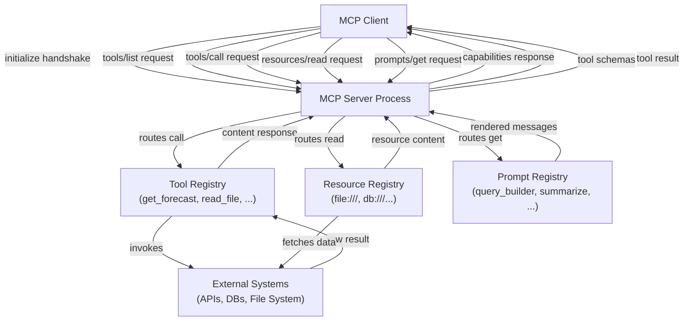

# 构建 MCP 服务器

## 定义

**MCP 服务器**是通过模型上下文协议向 MCP 兼容的 AI 应用程序公开能力的进程。它充当 AI 模型与某些外部系统——文件系统、REST API、数据库、代码运行器——之间的桥梁，将该系统的功能包装在定义良好的、可发现的接口中。服务器拥有实现细节；客户端只需要了解协议。任何 MCP 兼容的客户端都可以连接到任何 MCP 服务器，并立即发现和使用其能力，无需自定义集成工作。

MCP 服务器可以公开三类能力。**工具**是接受结构化输入并返回输出的可调用函数——AI 调用它们来执行操作或检索动态信息。**资源**是 AI 可以读取作为上下文的只读、URI 寻址的数据源——文件、数据库记录、API 快照。**提示**是存储在服务器上的可复用、参数化的提示模板，客户端可以向用户呈现或注入到对话中。单个服务器可以提供这些的任意组合；许多服务器只公开工具。

**服务器生命周期**遵循可预测的模式：服务器启动并绑定到传输（stdio 或 HTTP/SSE），等待客户端连接，完成 `initialize` 握手以协商协议版本和能力，然后进入主循环响应请求。当客户端断开连接或发送关闭信号时，服务器执行清理并退出。因为协议在会话中是有状态的，服务器可以维护每连接状态——例如，在会话期间缓存昂贵的 API 响应。

## 工作原理

### 服务器设置和初始化

设置 MCP 服务器从创建带有名称和版本的 `McpServer` 实例（来自高级 SDK）或 `Server` 实例（来自低级 SDK）开始。名称和版本在 `initialize` 握手期间发送给客户端，有助于调试和日志记录。创建服务器后，在连接到传输之前注册能力——工具、资源、提示。连接步骤（`server.connect(transport)`）启动事件循环并阻塞直到会话结束。SDK 的高级 `McpServer` 类提供人体工程学的 `server.tool()`、`server.resource()` 和 `server.prompt()` 方法，内部处理请求路由和 schema 验证。

### 定义工具

工具是最常用的 MCP 能力。每个工具都有三个必需元素：**名称**（在 `tools/call` 请求中使用的简短小写标识符）、**描述**（AI 用于决定何时以及如何调用工具的自然语言解释）和**输入 schema**（TypeScript SDK 中的 Zod schema，转换为协议的 JSON Schema）。当客户端调用工具时，SDK 在调用您的处理函数之前根据 schema 验证传入的参数，因此您接收的是类型安全、经过验证的输入。处理函数返回内容块 `content` 数组——文本、图像或嵌入资源——客户端将其传回 AI 模型。工具也可以在响应中设置 `isError: true` 以表示可恢复的错误，允许 AI 优雅地重试或回退。

### 定义资源

资源公开 AI 可以读取作为上下文的类文件数据。资源由 URI 标识（如 `file:///path/to/data.json` 或 `postgres://mydb/users/123`），并具有告诉客户端如何处理内容的 MIME 类型。资源通过 `resources/list` 发现，通过 `resources/read` 读取。SDK 支持**静态资源**（以固定 URI 和内容注册）和**动态资源**（以 URI 模板模式注册，在读取时解析）。资源模板使用 RFC 6570 URI 模板语法——例如，`file:///{path}` 匹配任何文件路径。当客户端读取匹配模板的资源 URI 时，您的处理函数接收提取的模板变量并返回内容。资源应该用于 AI 需要读取但不修改的数据；对于写入操作，使用工具。

### 定义提示

提示是可复用的交互模板。提示有名称、描述和可选的参数列表（名称、描述、是否必需）。当客户端通过 `prompts/get` 请求提示时，您的处理函数接收参数值并返回消息列表——通常是 `user` 和 `assistant` 角色消息的混合——客户端将其注入对话。提示使服务器作者能够编码关于如何与服务器能力交互的领域知识。例如，数据库服务器可能公开一个 `query_builder` 提示，接受查询的自然语言描述并返回指导 AI 生成安全、参数化 SQL 的结构化提示。

### 传输配置

传输层决定服务器如何与客户端通信。**stdio 传输**（`StdioServerTransport`）从 `process.stdin` 读取并写入 `process.stdout`。这是本地工具服务器的默认选择——主机应用程序将服务器作为子进程生成并通过进程流进行通信。不需要网络配置，服务器的 stderr 可用于日志记录而不干扰协议。**HTTP 与 SSE 传输**（`SSEServerTransport`）接受客户端到服务器消息的 HTTP POST 请求，并通过 `/sse` 服务器发送事件端点流式传输服务器到客户端的消息。这适合多个客户端可以同时连接的共享服务器，或需要作为长期服务而非按需进程运行的服务器。



## 何时使用 / 何时不使用

| 场景 | 构建 MCP 服务器 | 考虑替代方案 |
|---|---|---|
| 向多个 AI 应用程序公开现有 API 或服务 | 最佳选择——一个服务器，任何客户端都可以使用 | 如果只有一个提供商和应用很重要，使用直接函数调用 |
| 为 AI 上下文包装文件系统、数据库或内部数据源 | 最佳选择——资源和工具自然映射 | 如果语义检索是主要需求，使用自定义 RAG 管道 |
| 为 AI 用户提供特定领域的提示模板 | 提示能力专为此目的构建 | 如果模板简单且静态，使用系统提示注入 |
| 为具有一个提供商的单个内部 AI 应用程序构建工具 | MCP 添加了有用的结构，但可能过度设计 | 进程内工具函数更简单 |
| 公开需要实时流式结果的工具 | 通过 SSE 传输支持 | 如果协议开销很重要，使用 WebSockets 或自定义流式 |
| 需要在会话间维护每用户长期状态的工具 | 需要仔细的服务器设计——会话是 1:1 的 | 带薄 MCP 包装的有状态后端服务 |

## 代码示例

### 带工具、资源和提示的完整 MCP 服务器

```typescript
import { McpServer, ResourceTemplate } from "@modelcontextprotocol/sdk/server/mcp.js";
import { StdioServerTransport } from "@modelcontextprotocol/sdk/server/stdio.js";
import { z } from "zod";
import * as fs from "fs/promises";
import * as path from "path";

const server = new McpServer({
  name: "file-and-weather-server",
  version: "1.0.0",
});

// -----------------------------------------------------------------------
// Tool 1: Get weather forecast (mock — replace with a real weather API)
// -----------------------------------------------------------------------
server.tool(
  "get_weather",
  "Fetches the current weather forecast for a given city. Returns temperature, conditions, and humidity.",
  {
    city: z.string().describe("The city name, e.g. 'Tokyo' or 'Berlin'"),
    units: z
      .enum(["celsius", "fahrenheit"])
      .default("celsius")
      .describe("Temperature units"),
  },
  async ({ city, units }) => {
    // In production, call a real weather API here (e.g. Open-Meteo, WeatherAPI)
    const mockData = {
      city,
      temperature: units === "celsius" ? 18 : 64,
      units,
      condition: "Partly cloudy",
      humidity_percent: 72,
      forecast: "Light rain expected in the evening",
    };

    return {
      content: [
        {
          type: "text",
          text: JSON.stringify(mockData, null, 2),
        },
      ],
    };
  }
);

// -----------------------------------------------------------------------
// Tool 2: List directory contents
// -----------------------------------------------------------------------
server.tool(
  "list_directory",
  "Lists the files and subdirectories in a given directory path. Use this to explore file system structure.",
  {
    dir_path: z
      .string()
      .describe("Absolute path to the directory to list"),
  },
  async ({ dir_path }) => {
    try {
      const entries = await fs.readdir(dir_path, { withFileTypes: true });
      const listing = entries.map((e) => ({
        name: e.name,
        type: e.isDirectory() ? "directory" : "file",
      }));

      return {
        content: [
          {
            type: "text",
            text: JSON.stringify(listing, null, 2),
          },
        ],
      };
    } catch (err) {
      return {
        isError: true,
        content: [
          {
            type: "text",
            text: `Error listing directory: ${(err as Error).message}`,
          },
        ],
      };
    }
  }
);

// -----------------------------------------------------------------------
// Resource: Read any text file by path (URI template)
// -----------------------------------------------------------------------
server.resource(
  "text-file",
  new ResourceTemplate("file:///{file_path}", { list: undefined }),
  async (uri, { file_path }) => {
    const resolvedPath = path.resolve(String(file_path));

    try {
      const content = await fs.readFile(resolvedPath, "utf-8");
      return {
        contents: [
          {
            uri: uri.href,
            mimeType: "text/plain",
            text: content,
          },
        ],
      };
    } catch (err) {
      throw new Error(`Cannot read file at ${resolvedPath}: ${(err as Error).message}`);
    }
  }
);

// -----------------------------------------------------------------------
// Prompt: Guided file analysis template
// -----------------------------------------------------------------------
server.prompt(
  "analyze_file",
  "Generates a structured prompt that guides the AI to analyze a text file for issues, patterns, or summaries.",
  {
    file_path: z.string().describe("Path to the file to analyze"),
    focus: z
      .string()
      .optional()
      .describe("Optional: specific aspect to focus on, e.g. 'security issues' or 'performance'"),
  },
  async ({ file_path, focus }) => {
    const focusInstruction = focus
      ? `Focus specifically on: ${focus}.`
      : "Provide a general analysis.";

    return {
      messages: [
        {
          role: "user",
          content: {
            type: "text",
            text: `Please analyze the file at \`${file_path}\`.

${focusInstruction}

Use the \`read_file\` resource (URI: file:///${file_path}) to read its contents, then provide:
1. A brief summary of what the file contains
2. Key observations or findings
3. Any recommendations or concerns

Be concise and structured.`,
          },
        },
      ],
    };
  }
);

// -----------------------------------------------------------------------
// Start the server
// -----------------------------------------------------------------------
async function main() {
  const transport = new StdioServerTransport();
  await server.connect(transport);
  // Log to stderr so it doesn't interfere with the stdio protocol
  console.error("file-and-weather-server is running on stdio");
}

main().catch((err) => {
  console.error("Server failed to start:", err);
  process.exit(1);
});
```

### HTTP/SSE 传输（用于共享远程服务器）

```typescript
import { McpServer } from "@modelcontextprotocol/sdk/server/mcp.js";
import { SSEServerTransport } from "@modelcontextprotocol/sdk/server/sse.js";
import express from "express";

const app = express();
const server = new McpServer({ name: "remote-server", version: "1.0.0" });

// Register your tools, resources, and prompts here (same API as stdio)
// server.tool(...), server.resource(...), server.prompt(...)

// SSE endpoint: clients connect here to receive server-to-client messages
app.get("/sse", async (req, res) => {
  const transport = new SSEServerTransport("/messages", res);
  await server.connect(transport);
});

// POST endpoint: clients send messages here
app.post("/messages", express.json(), async (req, res) => {
  // The SSEServerTransport handles routing from the active session
  res.status(200).send("ok");
});

app.listen(3000, () => {
  console.log("MCP server listening on http://localhost:3000");
});
```

## 实用资源

- [MCP TypeScript SDK——服务器 API 参考](https://github.com/modelcontextprotocol/typescript-sdk/tree/main/src/server) — `McpServer`、传输和所有服务器侧类型的源码和内联文档。
- [官方 MCP 服务器示例](https://github.com/modelcontextprotocol/servers) — 参考实现，包括文件系统、GitHub、PostgreSQL、Slack 等——作为起点非常有价值。
- [MCP 传输文档](https://spec.modelcontextprotocol.io/specification/architecture/) — 深入涵盖 stdio、HTTP/SSE 和可流式 HTTP 传输的协议规范部分。
- [Zod 文档](https://zod.dev) — TypeScript SDK 用于输入验证的 schema 库；理解 Zod 类型直接映射到工具参数 schema。

## 另请参阅

- [模型上下文协议概述](/docs/mcp)
- [构建 MCP 客户端](/docs/mcp/building-clients)
- [代理工具和操作](/docs/agents/tools-actions)
