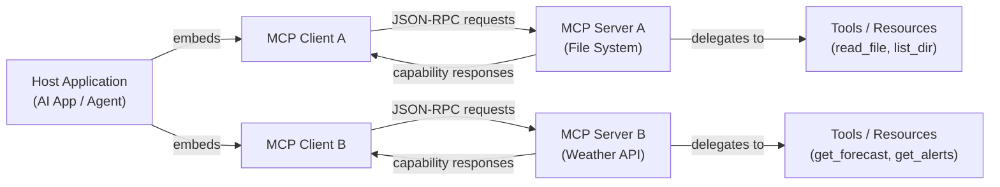

# 模型上下文协议（MCP）

## 定义

**模型上下文协议（MCP）**是一个开放标准，定义了 AI 应用程序连接外部工具、数据源和服务的统一方式。MCP 不是为每种 AI 模型和外部系统的组合构建一次性集成，而是提供了一种共享语言：主机应用程序通过定义良好的协议与 MCP 服务器通信，服务器公开任何合规 AI 客户端都可以发现和使用的能力（工具、资源、提示）。MCP 由 Anthropic 于 2024 年底引入，并立即作为开放标准发布，邀请更广泛的生态系统采用和扩展。

在 MCP 出现之前，AI 应用程序的工具集成是碎片化的。每个提供商都有自己的函数调用格式；每次集成都必须为每个新的 AI 后端重新实现。为一个模型编写的代码执行工具在切换提供商时需要重写，而新的数据源需要为每个想要访问它的 AI 应用程序定制管道。MCP 通过将"AI 如何与工具通信"（协议）与"哪个 AI"和"哪个工具"分开来解决这个问题，因此任何 MCP 兼容的客户端都可以使用任何 MCP 兼容的服务器，无需额外的胶水代码。

实际影响是显著的：开发者可以构建一次 MCP 服务器——用于数据库、文件系统、REST API、代码运行器——每个支持 MCP 的 AI 应用程序都可以访问它。该协议与传输无关（在本地进程中通过 stdio 运行或在远程服务中通过 HTTP/SSE 运行），支持双向通信，并包含能力协商握手，使客户端和服务器可以准确宣传其支持的内容。

## 工作原理

### 客户端-服务器架构

MCP 遵循严格的客户端-服务器模型，有三个不同的角色。**主机应用程序**是面向 AI 的应用程序（聊天 UI、编码助手、自主代理），它嵌入一个或多个 MCP 客户端。每个 **MCP 客户端**与单个 **MCP 服务器**保持 1:1 连接，充当主机与该服务器能力之间的中介。**MCP 服务器**是拥有和公开实际能力的进程——它知道如何调用天气 API、读取文件或查询数据库。这种分离意味着单个主机应用程序可以同时连接到许多服务器，每个服务器提供不同的工具集。



### 传输层

MCP 与传输无关：相同的 JSON-RPC 2.0 消息格式在两种内置传输上运行。**stdio 传输**用于本地服务器——主机将服务器作为子进程生成，并通过其标准输入和标准输出流进行通信。这是最简单的部署：没有网络、没有端口、没有身份验证开销。**HTTP 与 SSE（服务器发送事件）传输**用于远程或共享服务器：客户端以 HTTP POST 调用发送请求，并通过 SSE 端点接收流式响应。这支持多个客户端可以共享的集中托管服务器，并支持在云或容器环境中部署。协议规范中引入了第三种传输类型**可流式 HTTP**，作为更强大的 HTTP/SSE 双向流式传输的后继者。

### 能力：工具、资源和提示

MCP 服务器公开最多三种类型的能力。**工具**是可调用的函数——类似于 LLM API 中的函数调用——AI 可以调用它们来执行操作或检索信息。每个工具都有名称、描述和定义其输入参数的 JSON Schema。**资源**是 AI 可以访问的只读、类文件的数据源——本地文件、数据库记录、实时 API 快照——由 URI 标识。资源是 MCP 中的上下文注入等效物：它们让服务器向 AI 提供结构化数据，而无需工具调用往返。**提示**是存储在服务器上的可复用提示模板；它们允许服务器作者定义常见的交互模式（如"总结此文件"），客户端可以直接向用户展示。

### 能力协商和会话生命周期

当客户端连接到服务器时，协议以 `initialize` 握手开始。客户端发送其协议版本和支持的能力；服务器以其协议版本和提供的能力响应。这种协商确保具有不同功能集的客户端和服务器可以优雅地互操作——不支持提示的客户端将不会使用它们，即使服务器提供它们。初始化后，客户端调用 `tools/list`、`resources/list` 和 `prompts/list` 来发现服务器公开的内容。发现响应包括完整的 schema、描述和元数据。从那时起，客户端可以在会话中按需代表 AI 模型调用能力。

## 何时使用 / 何时不使用

| 场景 | MCP | 自定义 REST/API 集成 | 原生函数调用 |
|---|---|---|---|
| 构建应该跨多个 AI 提供商工作的工具 | 最佳选择——写一次，与任何 MCP 客户端使用 | 每个提供商需要自己的集成 | 锁定到单个提供商的 API 格式 |
| 在组织内的多个 AI 应用程序之间共享工具 | 最佳选择——一个服务器，多个客户端 | 需要在每个应用中复制集成代码 | 不适合跨应用共享 |
| 单一提供商应用中的简单一次性工具 | 过度设计——增加协议开销 | 简单情况适用 | 最简单的选项 |
| 将现有数据源（文件、数据库）作为 AI 上下文公开 | 资源能力专为此目的构建 | 需要自定义检索逻辑 | 没有等效概念 |
| 长时间运行操作的实时流式结果 | 通过 SSE 传输支持 | 需要自定义流式逻辑 | 支持有限 |
| 气隙或高度受限的环境 | stdio 传输不需要网络 | 完全控制 | 完全控制 |

## 比较

### MCP vs OpenAI 函数调用

OpenAI 函数调用和 MCP 都允许 AI 模型调用结构化工具，但它们在不同级别上运行。函数调用是一个 **API 级别功能**：工具 schema 在请求有效载荷中传递，工具实现存在于您的应用程序代码中，该模式特定于 OpenAI 的 API 格式。MCP 是一个**协议级标准**：工具存在于独立的服务器进程中，协议处理发现和调用，任何合规的客户端都可以使用任何合规的服务器，无论哪个 AI 提供商驱动客户端。函数调用是单一提供商应用程序中简单、进程内工具的正确选择；当您希望可移植、可复用的工具服务器跨提供商和应用程序工作时，MCP 是正确选择。

### MCP vs LangChain 工具

LangChain 工具是一个**框架抽象**：它们将 Python 可调用对象包装在 LangChain 代理运行时理解的标准化接口中。它们在 LangChain 生态系统内功能强大，但不定义进程间通信协议——LangChain 工具不能被非 LangChain 应用程序调用而无需额外管道。MCP 是一个**有线协议**：它准确定义了消息如何在进程之间序列化和传输。用 TypeScript 编写的 MCP 服务器可以被 Python MCP 客户端调用，无需共享框架依赖。两者并不互斥——LangChain 和其他框架可以实现 MCP 客户端来使用 MCP 服务器。

### MCP vs 直接 REST API 调用

直接 REST API 调用提供最大灵活性且没有协议开销，但每个新的 AI 应用程序必须为其调用的每个 API 重新实现相同的身份验证、错误处理和结果格式化。MCP 提供了一个统一的信封，抽象了这些差异：无论服务器是在调用天气 API、SQL 数据库还是 GitHub 仓库，AI 应用程序总是发出相同的 `tools/call` 请求。权衡是 MCP 需要服务器基础设施（运行的服务器进程），而直接 REST 调用只是一个 HTTP 请求。

## 代码示例

### 最小 MCP 服务器

```typescript
import { McpServer } from "@modelcontextprotocol/sdk/server/mcp.js";
import { StdioServerTransport } from "@modelcontextprotocol/sdk/server/stdio.js";
import { z } from "zod";

// Create the server instance with a name and version
const server = new McpServer({
  name: "demo-server",
  version: "1.0.0",
});

// Register a tool — the AI can call this to get the current time
server.tool(
  "get_current_time",
  "Returns the current UTC time in ISO 8601 format.",
  {}, // No input parameters required
  async () => ({
    content: [
      {
        type: "text",
        text: new Date().toISOString(),
      },
    ],
  })
);

// Register a tool with input parameters
server.tool(
  "add_numbers",
  "Adds two numbers together and returns the result.",
  {
    a: z.number().describe("The first number"),
    b: z.number().describe("The second number"),
  },
  async ({ a, b }) => ({
    content: [
      {
        type: "text",
        text: String(a + b),
      },
    ],
  })
);

// Start the server using stdio transport (runs as a child process)
const transport = new StdioServerTransport();
await server.connect(transport);
console.error("Demo MCP server running on stdio");
```

### 最小 MCP 客户端

```typescript
import { Client } from "@modelcontextprotocol/sdk/client/index.js";
import { StdioClientTransport } from "@modelcontextprotocol/sdk/client/stdio.js";

// Create a transport that spawns the server as a child process
const transport = new StdioClientTransport({
  command: "node",
  args: ["./demo-server.js"],
});

// Create and connect the client
const client = new Client(
  { name: "demo-client", version: "1.0.0" },
  { capabilities: {} }
);

await client.connect(transport);

// Discover available tools
const { tools } = await client.listTools();
console.log("Available tools:", tools.map((t) => t.name));

// Call a tool
const result = await client.callTool({
  name: "add_numbers",
  arguments: { a: 21, b: 21 },
});

console.log("Result:", result.content);
// Output: [{ type: 'text', text: '42' }]

await client.close();
```

## 实用资源

- [模型上下文协议规范](https://spec.modelcontextprotocol.io) — 权威协议规范，涵盖所有消息类型、传输和能力定义。
- [MCP TypeScript SDK](https://github.com/modelcontextprotocol/typescript-sdk) — 用于构建 MCP 服务器和客户端的官方 TypeScript/JavaScript SDK，由 Anthropic 维护。
- [modelcontextprotocol.io](https://modelcontextprotocol.io) — 官方 MCP 网站，包含快速入门指南、概念文档和社区构建服务器注册表。
- [MCP 服务器示例仓库](https://github.com/modelcontextprotocol/servers) — 涵盖数据库、文件系统、网络搜索等的精选参考 MCP 服务器实现集合。

## 另请参阅

- [构建 MCP 服务器](/docs/mcp/building-servers)
- [构建 MCP 客户端](/docs/mcp/building-clients)
- [AI 代理](/docs/agents)
- [结构化输出](/docs/prompt-engineering/structured-outputs)
