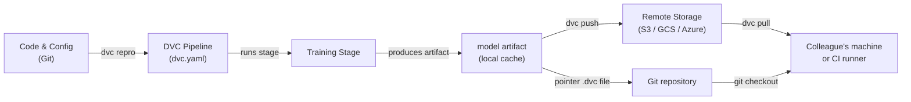

# 数据版本控制（DVC）

## 定义

数据版本控制（Data Version Control，DVC）是一个开源工具，它扩展了 Git 以追踪无法高效存储在 Git 仓库中的大型文件、数据集和模型制品。Git 记录源代码的每次变更，而 DVC 在仓库中存储一个小的指针文件（`.dvc`），并将实际数据字节推送到可配置的远程存储后端——S3、GCS、Azure Blob、SSH，甚至是本地目录。这使仓库保持轻量，同时保留完整的可重现性。

DVC 不仅仅是简单的文件版本化。它引入了**管道**的概念——一个在 `dvc.yaml` 文件中定义的有向无环图（DAG）。每个阶段指定其命令、输入（依赖项）和输出，因此 DVC 可以确定当输入发生变化时需要重新运行哪些阶段。结果是一个用于 ML 的构建系统：可重现的、增量的，并与产生它的代码一起进行版本控制。

DVC 与 Git 工作流紧密集成。提交到 Git 的 `dvc.lock` 文件，捕获了管道运行时每个输入和输出的精确内容哈希，因此检出历史 Git 提交并运行 `dvc pull` 可以恢复该历史时间点存在的精确数据集和模型制品。

## 工作原理



### 初始化 DVC 仓库

在 Git 仓库中运行 `dvc init` 会创建一个 `.dvc/` 目录，其中保存 DVC 的配置和本地缓存。DVC 为缓存文件夹注册一个 `.gitignore` 条目，并添加一些必须提交到 Git 的小型追踪文件。从这时起，`dvc add <file>` 为任何大型文件创建一个 `.dvc` 指针文件——实际字节进入本地缓存，永远不会提交到 Git。这种双层方法意味着仓库克隆速度快，而 DVC 单独管理重型资产。

### 定义和运行管道

`dvc.yaml` 文件用其命令、输入依赖项和输出制品声明每个管道阶段。当你运行 `dvc repro` 时，DVC 检查依赖图，将所有输入的内容哈希与 `dvc.lock` 快照进行比较，并仅重新运行输入已发生变化的阶段。这类似于 `make`，但基于内容寻址而非时间戳，因此即使在机器和 CI 运行器之间也是确定性的。管道可以通过 `params.yaml` 文件参数化，DVC 记录每次运行使用了哪些参数值。

### 远程存储与协作

DVC 远程是用 `dvc remote add` 配置的存储位置。团队通常配置一个共享的云存储桶，以便所有成员拉取相同的数据。`dvc push` 将新的或更改的制品上传到远程，`dvc pull` 精确下载当前 Git 提交的 `dvc.lock` 引用的版本。这种工作流意味着为项目加入新团队成员只需 `git clone` 然后 `dvc pull`——一个命令即可为该分支实例化正确的数据集和模型制品。

### 实验

`dvc exp run` 和 `dvc exp show` 在管道之上提供了一个轻量级实验追踪层。每个实验是参数变化和结果指标的临时 Git 存储，可以在表格中进行比较，如果有价值可以提升为完整分支。这不如 MLflow 或 W&B 等专用工具功能丰富，但优点是不需要任何额外基础设施——一切都存在于 Git 仓库中。

## 何时使用 / 何时不使用

| 适合使用 | 避免使用 |
|---|---|
| 数据集或模型文件太大，无法放入 Git（>100 MB） | 所有数据都能方便地放入 Git LFS 且不需要管道 |
| 需要与代码版本绑定的可重现 ML 管道 | 实验追踪需求超出了 DVC 的轻量级方法 |
| 团队使用 Git 并需要统一的版本控制工作流 | 需要完整的实验管理 UI（优先选 MLflow 或 W&B） |
| CI/CD 管道需要按分支拉取精确的数据制品 | 数据极度敏感，无法离开本地存储 |
| 想在不使用单独服务器的情况下比较实验结果 | 项目没有共享远程且协作不是关注点 |

## 比较

| 标准 | DVC | Git LFS | MLflow 追踪 |
|---|---|---|---|
| 主要目的 | 数据+管道版本化 | 大文件版本化 | 实验追踪+模型注册表 |
| 管道支持 | 是（dvc.yaml DAG） | 否 | 否（仅记录运行） |
| 实验比较 | 基础（dvc exp show） | 否 | 丰富（UI + API） |
| 远程后端 | S3、GCS、Azure、SSH、本地 | GitHub、GitLab LFS 服务器 | 本地、S3、Azure、SFTP |
| 需要服务器 | 否 | 否 | 可选（MLflow 服务器） |
| Git 集成 | 核心设计原则 | 核心设计原则 | 可选（通过 mlflow.log_param） |

## 优缺点

| 优点 | 缺点 |
|---|---|
| 不需要额外服务器——一切都在 Git + 对象存储中 | 不熟悉基于 DAG 的管道的团队有学习曲线 |
| 使用内容寻址缓存的可重现管道 | 在非常活跃的 monorepo 中，大型 dvc.lock 冲突可能很棘手 |
| 可与任何云存储或甚至本地目录配合使用 | 与 MLflow/W&B 相比，实验 UI 很简单 |
| 轻量级——DVC 只是一个 CLI 工具 | 不处理分布式训练编排 |
| 通过 CML 一流支持 CI/CD 集成 | 远程存储成本由团队负责管理 |

## 代码示例

```bash
# --- DVC setup and basic data tracking ---

# 1. Initialize DVC inside an existing Git repository
git init my-ml-project && cd my-ml-project
dvc init
git add .dvc .dvcignore
git commit -m "Initialize DVC"

# 2. Configure a remote storage backend (AWS S3 example)
dvc remote add -d myremote s3://my-bucket/dvc-store
git add .dvc/config
git commit -m "Add DVC remote"

# 3. Track a large dataset — DVC creates data/train.csv.dvc
dvc add data/train.csv
git add data/train.csv.dvc data/.gitignore
git commit -m "Track training dataset with DVC"

# 4. Push data to the remote
dvc push

# --- Collaborator workflow ---

# 5. Clone the repo and pull the data artifacts
git clone https://github.com/org/my-ml-project
cd my-ml-project
dvc pull   # downloads data/train.csv from the configured remote
```

```yaml
# dvc.yaml — Define a two-stage pipeline: featurize -> train

stages:
  featurize:
    cmd: python src/featurize.py --input data/train.csv --output data/features.parquet
    deps:
      - src/featurize.py
      - data/train.csv
    outs:
      - data/features.parquet

  train:
    cmd: python src/train.py --features data/features.parquet --output models/
    deps:
      - src/train.py
      - data/features.parquet
      - params.yaml        # parameter file changes trigger re-run
    outs:
      - models/
    metrics:
      - reports/metrics.json:
          cache: false     # small metrics file — commit it to Git
```

```python
# src/train.py — DVC-compatible training script using joblib for model serialization

import json
import argparse
from pathlib import Path

import yaml
import joblib
import numpy as np
import pandas as pd
from sklearn.ensemble import GradientBoostingClassifier
from sklearn.model_selection import train_test_split
from sklearn.metrics import accuracy_score


def main(features_path: str, output_dir: str) -> None:
    # Load parameters tracked by DVC from params.yaml
    params = yaml.safe_load(Path("params.yaml").read_text())["train"]

    # Load feature-engineered data produced by the featurize stage
    df = pd.read_parquet(features_path)
    X = df.drop(columns=["label"])
    y = df["label"]

    X_train, X_test, y_train, y_test = train_test_split(
        X, y, test_size=0.2, random_state=42
    )

    # Train with parameters sourced from params.yaml — DVC tracks these
    model = GradientBoostingClassifier(
        n_estimators=params["n_estimators"],
        max_depth=params["max_depth"],
        random_state=42,
    )
    model.fit(X_train, y_train)

    # Save the model artifact — DVC will cache and hash the output directory
    out = Path(output_dir)
    out.mkdir(parents=True, exist_ok=True)
    joblib.dump(model, out / "model.joblib")

    # Write metrics.json so DVC can track and compare across experiments
    accuracy = float(accuracy_score(y_test, model.predict(X_test)))
    Path("reports").mkdir(exist_ok=True)
    Path("reports/metrics.json").write_text(
        json.dumps({"accuracy": accuracy}, indent=2)
    )
    print(f"Accuracy: {accuracy:.4f}")


if __name__ == "__main__":
    parser = argparse.ArgumentParser()
    parser.add_argument("--features", required=True)
    parser.add_argument("--output", required=True)
    args = parser.parse_args()
    main(args.features, args.output)
```

## 实践资源

- [DVC 官方文档](https://dvc.org/doc) — 涵盖安装、管道、远程存储和实验的综合指南。
- [DVC 入门教程](https://dvc.org/doc/start) — 从零开始设置 DVC 项目的实践演练。
- [Iterative 博客：基于 Git 的 MLOps](https://iterative.ai/blog) — 结合 DVC、CML 和 MLEM 的 MLOps 工作流文章。
- [DVC GitHub 仓库](https://github.com/iterative/dvc) — 源代码和社区问题。

## 另请参阅

- [ML 的 CI/CD](/docs/mlops/cicd)
- [实验追踪（Experiment tracking）](/docs/mlops/experiment-tracking)
- [MLflow](/docs/mlops/mlflow)
