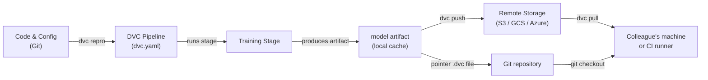

# 数据版本控制 (DVC)

## 定义

Data Version Control (DVC) 是一个开源工具，它扩展了 Git 以跟踪无法有效存储在 Git 仓库中的大型文件、数据集和模型制品。Git 记录源代码的每一个变更，而 DVC 在仓库中存储一个小的指针文件（`.dvc`），并将实际的数据字节推送到可配置的远程存储后端——S3、GCS、Azure Blob、SSH 或者甚至本地目录。这使仓库保持轻量，同时保留完整的可复现性。

DVC 超越了简单的文件版本控制。它引入了**流水线**的概念——在 `dvc.yaml` 文件中定义的 DAG（有向无环图）阶段。每个阶段指定其命令、输入（依赖项）和输出，以便 DVC 可以确定当输入发生变化时哪些阶段需要重新运行。结果是一个用于 ML 的构建系统：可复现、增量式，并与产生它的代码一起进行版本控制。

DVC 与 Git 工作流紧密集成。一个 `dvc.lock` 文件提交到 Git 后，会捕获流水线运行时每个输入和输出的精确内容哈希，因此检出一个历史 Git 提交并运行 `dvc pull` 会恢复该历史时刻存在的确切数据集和模型制品。

## 工作原理



### 初始化 DVC 仓库

在 Git 仓库内运行 `dvc init` 会创建一个 `.dvc/` 目录，其中包含 DVC 的配置和本地缓存。DVC 为缓存文件夹注册一个 `.gitignore` 条目，并添加一些必须提交到 Git 的小型跟踪文件。从此时起，`dvc add <file>` 会为任何大文件创建一个 `.dvc` 指针文件——实际的字节数据进入本地缓存，永远不会提交到 Git。这种两层方法意味着仓库克隆速度保持快速，而 DVC 单独管理重型资产。

### 定义和运行流水线

`dvc.yaml` 文件用其命令、输入依赖项和输出制品声明每个流水线阶段。当您运行 `dvc repro` 时，DVC 检查依赖关系图，将所有输入的内容哈希与 `dvc.lock` 快照进行比较，并仅重新运行输入已更改的阶段。这类似于 `make`，但基于内容寻址而非时间戳，因此即使跨机器和 CI runner 也是确定性的。流水线可以通过 `params.yaml` 文件参数化，DVC 会记录每次运行中使用了哪些参数值。

### 远程存储和协作

DVC 远程是用 `dvc remote add` 配置的存储位置。团队通常配置一个共享的云桶，以便所有成员拉取相同的数据。`dvc push` 将新的或更改的制品上传到远程，`dvc pull` 下载当前 Git 提交的 `dvc.lock` 引用的确切版本。这个工作流意味着将新团队成员加入项目只需 `git clone` 然后 `dvc pull`——一个命令就能为该 branch 实例化正确的数据集和模型制品。

### 实验

`dvc exp run` 和 `dvc exp show` 在流水线之上提供了一个轻量级的实验跟踪层。每个实验都是参数变更和结果指标的临时 Git stash，可以在表格中进行比较，如果有前景则可以提升为完整的 branch。这比 MLflow 或 W&B 等专用工具功能少，但具有不需要额外基础设施的优势——一切都在 Git 仓库中。

## 何时使用 / 何时不使用

| 使用时机 | 避免时机 |
|---|---|
| 您的数据集或模型文件对 Git 来说太大（>100 MB） | 所有数据都能轻松放入 Git LFS，并且不需要流水线 |
| 您需要与代码版本绑定的可复现 ML 流水线 | 您的实验跟踪需求超出了 DVC 的轻量级方法 |
| 您的团队使用 Git 并希望统一的版本控制工作流 | 您需要完整的 UI 来进行实验管理（推荐使用 MLflow 或 W&B） |
| CI/CD 流水线需要按 branch 提取精确的数据制品 | 数据极为敏感，无法离开本地存储 |
| 您想在没有单独服务器的情况下比较实验结果 | 项目没有共享远程，协作不是关注点 |

## 对比

| 标准 | DVC | Git LFS | MLflow Tracking |
|---|---|---|---|
| 主要目的 | 数据 + 流水线版本控制 | 大文件版本控制 | 实验跟踪 + 模型注册表 |
| 流水线支持 | 是（dvc.yaml DAG） | 否 | 否（仅记录运行） |
| 实验比较 | 基础（dvc exp show） | 否 | 丰富（UI + API） |
| 远程后端 | S3、GCS、Azure、SSH、本地 | GitHub、GitLab LFS 服务器 | 本地、S3、Azure、SFTP |
| 需要服务器 | 否 | 否 | 可选（MLflow 服务器） |
| Git 集成 | 核心设计原则 | 核心设计原则 | 可选（通过 mlflow.log_param） |

## 优缺点

| 优点 | 缺点 |
|---|---|
| 不需要额外服务器——一切都在 Git + 对象存储中 | 不熟悉基于 DAG 的流水线的团队有学习曲线 |
| 带有内容寻址缓存的可复现流水线 | 在非常活跃的 monorepo 中，大型 dvc.lock 冲突可能很棘手 |
| 适用于任何云存储甚至本地目录 | 与 MLflow / W&B 相比，实验 UI 很简陋 |
| 轻量——DVC 只是一个 CLI 工具 | 不处理分布式训练编排 |
| 通过 CML 实现一流的 CI/CD 集成 | 远程存储成本由团队负责管理 |

## 代码示例

```bash
# --- DVC setup and basic data tracking ---
git init my-ml-project && cd my-ml-project
dvc init
git add .dvc .dvcignore
git commit -m "Initialize DVC"

dvc remote add -d myremote s3://my-bucket/dvc-store
git add .dvc/config
git commit -m "Add DVC remote"

dvc add data/train.csv
git add data/train.csv.dvc data/.gitignore
git commit -m "Track training dataset with DVC"

dvc push

# --- Collaborator workflow ---
git clone https://github.com/org/my-ml-project
cd my-ml-project
dvc pull
```

```yaml
# dvc.yaml
stages:
  featurize:
    cmd: python src/featurize.py --input data/train.csv --output data/features.parquet
    deps:
      - src/featurize.py
      - data/train.csv
    outs:
      - data/features.parquet
  train:
    cmd: python src/train.py --features data/features.parquet --output models/
    deps:
      - src/train.py
      - data/features.parquet
      - params.yaml
    outs:
      - models/
    metrics:
      - reports/metrics.json:
          cache: false
```

```python
# src/train.py
import json
import argparse
from pathlib import Path
import yaml
import joblib
import pandas as pd
from sklearn.ensemble import GradientBoostingClassifier
from sklearn.model_selection import train_test_split
from sklearn.metrics import accuracy_score


def main(features_path: str, output_dir: str) -> None:
    params = yaml.safe_load(Path("params.yaml").read_text())["train"]
    df = pd.read_parquet(features_path)
    X = df.drop(columns=["label"])
    y = df["label"]
    X_train, X_test, y_train, y_test = train_test_split(X, y, test_size=0.2, random_state=42)
    model = GradientBoostingClassifier(
        n_estimators=params["n_estimators"],
        max_depth=params["max_depth"],
        random_state=42,
    )
    model.fit(X_train, y_train)
    out = Path(output_dir)
    out.mkdir(parents=True, exist_ok=True)
    joblib.dump(model, out / "model.joblib")
    accuracy = float(accuracy_score(y_test, model.predict(X_test)))
    Path("reports").mkdir(exist_ok=True)
    Path("reports/metrics.json").write_text(json.dumps({"accuracy": accuracy}, indent=2))
    print(f"Accuracy: {accuracy:.4f}")


if __name__ == "__main__":
    parser = argparse.ArgumentParser()
    parser.add_argument("--features", required=True)
    parser.add_argument("--output", required=True)
    args = parser.parse_args()
    main(args.features, args.output)
```

## 实用资源

- [DVC 官方文档](https://dvc.org/doc) — 涵盖安装、流水线、远程和实验的综合指南。
- [DVC 入门教程](https://dvc.org/doc/start) — 从头开始设置 DVC 项目的实践教程。
- [Iterative 博客：基于 Git 的 MLOps](https://iterative.ai/blog) — 关于结合 DVC、CML 和 MLEM 的 MLOps 工作流文章。
- [DVC GitHub 仓库](https://github.com/iterative/dvc) — 源代码和社区 issues。

## 另请参阅

- [ML 的 CI/CD](/docs/mlops/cicd)
- [实验跟踪](/docs/mlops/experiment-tracking)
- [MLflow](/docs/mlops/mlflow)
