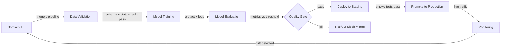

# ML 的 CI/CD

## 定义

持续集成与持续交付（CI/CD）是一种软件工程实践，用于在每次变更时自动构建、测试和部署代码。当应用于机器学习时，其范围超越了代码本身：数据质量、模型性能和制品版本化都成为管道中的一等公民。一个有问题的 ML CI/CD 管道可能会在没有任何应用代码更改的情况下，将一个会悄然退化的模型发布到生产环境。

传统 CI/CD 验证逻辑和 API 契约。ML CI/CD 还必须额外验证数据的统计属性（模式、分布、缺失值率）、模型质量阈值（准确率、延迟、公平性）以及可重现性——从完全相同的输入重新训练完全相同模型的能力。[DVC](/docs/mlops/cicd/dvc)（用于数据版本化）和 CML（Continuous Machine Learning，用于在拉取请求中报告指标）等工具使这一切成为可能。

最终目标是一条从代码或数据变更到安全部署模型的完全自动化路径，仅在真正能增加价值的地方设置人工关卡——例如在生产晋升之前审查模型卡片（model card）。

## 工作原理



### 数据验证

在训练开始之前，管道检查传入数据是否符合预期的模式和统计特征。Great Expectations 或 TensorFlow Data Validation (TFDV) 可以断言列类型正确、值范围合理，且缺失值没有意外激增。提前失败此关卡可以防止在损坏的批次上浪费计算资源。任何模式漂移都会作为拉取请求中的失败检查显示出来，阻止合并，直到问题被理解并修复或明确接受。这一步是 ML 中代码类型检查在运行测试之前的等价物。

### 模型训练

训练作为可重现的参数化作业执行——理想情况下容器化，以便精确的环境（CUDA 版本、库锁定）被捕获。好的 CI/CD 系统通过版本控制中追踪的配置文件传递超参数，而非硬编码到脚本中。[DVC](/docs/mlops/cicd/dvc) 等工具追踪哪个数据集版本和哪个配置产生了哪个模型制品，因此任何训练好的模型都可以追溯到其输入。训练运行被记录在实验追踪器（MLflow、W&B）中，以便与前一个冠军模型的比较是自动进行的。

### 模型评估

训练后，自动评估脚本计算留出测试集上的目标指标，并将其与定义的阈值或当前生产模型进行比较。来自 Iterative.ai 的 CML 可以直接在 GitHub 或 GitLab 拉取请求上发布带有指标表格和图表的 Markdown 报告，这样审查者无需离开代码审查工作流就能看到性能回归。评估还应涵盖受监管领域的基于切片（slice-based）的公平性指标。只有当新模型满足或超过阈值时，质量关卡才能通过。

### 部署与监控

通过质量关卡后，模型制品被注册到[模型注册表](/docs/mlops/cicd/model-registry)并部署到暂存环境，在那里针对实时（或代表性）流量运行冒烟测试。晋升到生产可以是手动的（在注册表 UI 中点击）或完全自动化的。一旦进入生产，[监控](/docs/mlops/monitoring)层追踪数据漂移、预测漂移和业务 KPI，并可以触发重训练运行——将反馈循环完整地回到提交步骤。

## 何时使用 / 何时不使用

| 适合使用 | 避免使用 |
|---|---|
| 多名数据科学家提交到共享的模型代码 | 独自在一次性笔记本实验上工作 |
| 模型在新数据上定期重训练 | 模型是静态的，只训练一次，永远不更新 |
| 生产故障代价高昂（欺诈、健康、安全） | 迭代速度比正确性更重要的原型阶段 |
| 团队需要可重现性和审计追踪 | 基础设施/DevOps 成熟度非常低 |
| 法规合规要求记录模型版本化 | 数据集很小，可以在单个笔记本中端到端处理 |

## 比较

| 标准 | 传统 CI/CD | ML CI/CD |
|---|---|---|
| 主要制品 | 二进制文件/Docker 镜像 | 模型制品 + 数据版本 |
| 测试类型 | 单元测试、集成测试、E2E | 单元测试 + 数据质量 + 模型质量 + 公平性 |
| 触发器 | 代码推送 | 代码推送 或 新数据 或 定时重训练 |
| 回滚 | 重新部署上一个镜像 | 从注册表重新部署上一个模型版本 |
| 可观测性 | 应用日志、追踪 | 数据漂移、预测漂移、业务指标 |

## 优缺点

| 优点 | 缺点 |
|---|---|
| 在回归到达生产之前捕获它 | 比传统 CI/CD 更高的设置成本 |
| 完整的数据+代码+模型版本审计追踪 | 数据验证需要领域专业知识才能正确定义 |
| 支持安全、频繁的模型更新 | 训练作业可能很慢，使 CI 反馈循环更长 |
| 减少数据科学和运维之间的手动交接 | 需要数据、ML 和平台团队之间的一致性 |
| PR 中的指标提高代码审查质量 | 阈值配置错误可能阻止有效改进 |

## 代码示例

```yaml
# .github/workflows/ml-pipeline.yml
# GitHub Actions workflow for a full ML CI/CD pipeline with CML reporting

name: ML Pipeline

on:
  push:
    branches: [main, "feat/**"]
  pull_request:
    branches: [main]

jobs:
  ml-pipeline:
    runs-on: ubuntu-latest

    steps:
      # 1. Check out the repository with full git history (needed for DVC)
      - name: Checkout code
        uses: actions/checkout@v4
        with:
          fetch-depth: 0

      # 2. Set up Python and install dependencies
      - name: Set up Python 3.11
        uses: actions/setup-python@v5
        with:
          python-version: "3.11"

      - name: Install dependencies
        run: pip install -r requirements.txt

      # 3. Pull data and model artifacts from DVC remote
      - name: Pull DVC artifacts
        env:
          AWS_ACCESS_KEY_ID: ${{ secrets.AWS_ACCESS_KEY_ID }}
          AWS_SECRET_ACCESS_KEY: ${{ secrets.AWS_SECRET_ACCESS_KEY }}
        run: dvc pull

      # 4. Validate data quality before training
      - name: Validate data
        run: python src/validate_data.py --data data/train.csv

      # 5. Train the model and save metrics to metrics.json
      - name: Train model
        run: python src/train.py --config configs/train.yaml

      # 6. Evaluate model and write report for CML
      - name: Evaluate model
        run: python src/evaluate.py --output reports/metrics.md

      # 7. Post CML report as a comment on the pull request
      - name: Post CML report
        uses: iterative/setup-cml@v2
        with:
          version: latest

      - name: Publish CML report
        env:
          REPO_TOKEN: ${{ secrets.GITHUB_TOKEN }}
        run: |
          # Append the confusion matrix image to the report
          echo "## Model evaluation report" >> reports/metrics.md
          cml comment create reports/metrics.md

      # 8. Push updated DVC artifacts (only on main)
      - name: Push DVC artifacts
        if: github.ref == 'refs/heads/main'
        env:
          AWS_ACCESS_KEY_ID: ${{ secrets.AWS_ACCESS_KEY_ID }}
          AWS_SECRET_ACCESS_KEY: ${{ secrets.AWS_SECRET_ACCESS_KEY }}
        run: dvc push
```

```python
# src/validate_data.py
# Simple data validation gate using pandas — replace with Great Expectations for production

import argparse
import sys
import pandas as pd

EXPECTED_COLUMNS = {"feature_a", "feature_b", "label"}
MAX_MISSING_RATE = 0.05  # 5% threshold


def validate(path: str) -> None:
    df = pd.read_csv(path)

    # Check that all required columns are present
    missing_cols = EXPECTED_COLUMNS - set(df.columns)
    if missing_cols:
        print(f"FAIL: Missing columns: {missing_cols}")
        sys.exit(1)

    # Check missing-value rates
    for col in EXPECTED_COLUMNS:
        rate = df[col].isna().mean()
        if rate > MAX_MISSING_RATE:
            print(f"FAIL: Column '{col}' has {rate:.1%} missing values (threshold: {MAX_MISSING_RATE:.0%})")
            sys.exit(1)

    print("Data validation passed.")


if __name__ == "__main__":
    parser = argparse.ArgumentParser()
    parser.add_argument("--data", required=True)
    args = parser.parse_args()
    validate(args.data)
```

## 实践资源

- [CML（Continuous Machine Learning）by Iterative](https://cml.dev/) — 直接在 GitHub/GitLab PR 中发布 ML 指标和图表的官方文档。
- [GitHub Actions for ML — Iterative 指南](https://iterative.ai/blog/github-actions-ml) — 使用 GitHub Actions 和 DVC 设置端到端 ML 管道的演练。
- [Google MLOps：ML 中的持续交付和自动化管道](https://cloud.google.com/architecture/mlops-continuous-delivery-and-automation-pipelines-in-machine-learning) — Google 描述三个 ML 自动化成熟度级别的参考架构。
- [Great Expectations 文档](https://docs.greatexpectations.io/) — ML 管道中数据验证和文档的框架。

## 另请参阅

- [数据版本控制（DVC）](/docs/mlops/cicd/dvc)
- [模型注册表](/docs/mlops/cicd/model-registry)
- [MLOps 概述](/docs/mlops)
