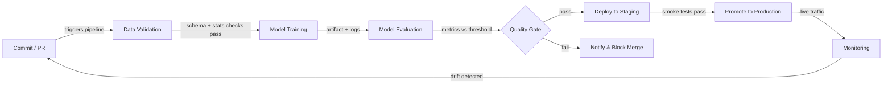

# 机器学习的 CI/CD

## 定义

持续集成与持续交付（CI/CD）是一种软件工程实践，可在每次变更时自动完成代码的构建、测试和部署。当应用于机器学习时，范围超越了代码本身：数据质量、模型性能和制品版本管理都成为流水线的一等公民。一条有缺陷的 ML CI/CD 流水线可能在不改变任何一行应用程序代码的情况下，悄无声息地将一个在生产环境中不断退化的模型发布出去。

传统 CI/CD 验证逻辑和 API 契约。ML CI/CD 还必须额外验证数据的统计属性（模式、分布、缺失值比率）、模型质量阈值（准确率、延迟、公平性）以及可复现性——即能够从相同输入重新训练出完全相同模型的能力。像 [DVC](/docs/mlops/cicd/dvc) 这样用于数据版本控制的工具以及用于在 Pull Request 中报告指标的 CML（Continuous Machine Learning）使这一切变得实际可行。

最终目标是建立一条从代码或数据变更到安全部署模型的全自动化路径，只在真正能带来价值的地方设置人工审核节点——例如在生产晋升之前审查模型卡片。

## 工作原理



### 数据验证

在训练开始之前，流水线会检查输入数据是否符合预期的模式和统计特征。Great Expectations 或 TensorFlow Data Validation（TFDV）可以断言列类型是否正确、值范围是否合理，以及是否存在意外的缺失值峰值。在这个关卡早期失败可以防止在损坏批次上浪费计算资源。任何模式漂移都会在 Pull Request 中显示为失败检查，从而阻止合并，直到问题被理解并修复或明确接受为止。这一步是 ML 中代码类型检查的等价物——在运行测试之前进行检查。

### 模型训练

训练作为可复现的参数化任务执行——理想情况下容器化，以便捕获确切的环境（CUDA 版本、库版本锁定）。一个良好的 CI/CD 系统通过版本控制中跟踪的配置文件传递超参数，而不是硬编码到脚本中。像 [DVC](/docs/mlops/cicd/dvc) 这样的工具跟踪哪个数据集版本和哪个配置生成了哪个模型制品，因此任何经过训练的模型都可以追溯到其输入。训练运行会记录在实验跟踪器（MLflow、W&B）中，以便与前一个冠军模型的比较是自动完成的。

### 模型评估

训练后，自动评估脚本会在保留的测试集上计算目标指标，并将其与定义的阈值或当前生产模型进行比较。CML（来自 Iterative.ai）可以直接在 GitHub 或 GitLab Pull Request 上发布包含指标表格和图表的 Markdown 报告，这样审查者无需离开代码审查工作流就能看到性能回归。评估还应涵盖受监管领域的基于切片的公平性指标。只有当新模型达到或超过阈值时，质量关卡才能通过。

### 部署与监控

通过质量关卡后，模型制品会被注册到[模型注册表](/docs/mlops/cicd/model-registry)中，并部署到预发布环境，在那里针对真实（或代表性）流量运行冒烟测试。向生产环境的晋升可以是手动的（在注册表 UI 中点击一下）或完全自动化的。一旦投入生产，[监控](/docs/mlops/monitoring)层就会跟踪数据漂移、预测漂移和业务 KPI，并可以触发重新训练运行——完成回到 Commit 步骤的反馈循环。

## 何时使用 / 何时不使用

| 使用时机 | 避免时机 |
|---|---|
| 多个数据科学家在共享模型代码上提交 | 独自处理一次性笔记本实验 |
| 模型定期在新数据上重新训练 | 模型是静态的，只训练一次，从不更新 |
| 生产故障代价高昂（欺诈、健康、安全） | 原型阶段，迭代速度比正确性更重要 |
| 团队需要可复现性和审计追踪 | 基础设施/DevOps 成熟度非常低 |
| 合规要求需要有文档记录的模型版本控制 | 数据集很小，适合单个笔记本端到端处理 |

## 对比

| 标准 | 传统 CI/CD | ML CI/CD |
|---|---|---|
| 主要制品 | 二进制文件/Docker 镜像 | 模型制品 + 数据版本 |
| 测试类型 | 单元测试、集成测试、E2E | 单元 + 数据质量 + 模型质量 + 公平性 |
| 触发器 | 代码推送 | 代码推送 或 新数据 或 计划重新训练 |
| 回滚 | 重新部署以前的镜像 | 从注册表重新部署以前的模型版本 |
| 可观测性 | 应用日志、追踪 | 数据漂移、预测漂移、业务指标 |

## 优缺点

| 优点 | 缺点 |
|---|---|
| 在到达生产之前捕获回归 | 比传统 CI/CD 配置成本更高 |
| 数据 + 代码 + 模型版本的完整审计追踪 | 数据验证需要领域专业知识才能正确定义 |
| 支持安全、频繁的模型更新 | 训练任务可能很慢，导致 CI 反馈循环变长 |
| 减少数据科学和运维之间的手动交接 | 需要数据、ML 和平台团队之间的协调 |
| PR 中的指标提高代码审查质量 | 配置错误的阈值可能阻止有效的改进 |

## 代码示例

```yaml
# .github/workflows/ml-pipeline.yml
name: ML Pipeline
on:
  push:
    branches: [main, "feat/**"]
  pull_request:
    branches: [main]
jobs:
  ml-pipeline:
    runs-on: ubuntu-latest
    steps:
      - name: Checkout code
        uses: actions/checkout@v4
        with:
          fetch-depth: 0
      - name: Set up Python 3.11
        uses: actions/setup-python@v5
        with:
          python-version: "3.11"
      - name: Install dependencies
        run: pip install -r requirements.txt
      - name: Pull DVC artifacts
        env:
          AWS_ACCESS_KEY_ID: ${{ secrets.AWS_ACCESS_KEY_ID }}
          AWS_SECRET_ACCESS_KEY: ${{ secrets.AWS_SECRET_ACCESS_KEY }}
        run: dvc pull
      - name: Validate data
        run: python src/validate_data.py --data data/train.csv
      - name: Train model
        run: python src/train.py --config configs/train.yaml
      - name: Evaluate model
        run: python src/evaluate.py --output reports/metrics.md
      - name: Post CML report
        uses: iterative/setup-cml@v2
        with:
          version: latest
      - name: Publish CML report
        env:
          REPO_TOKEN: ${{ secrets.GITHUB_TOKEN }}
        run: |
          echo "## Model evaluation report" >> reports/metrics.md
          cml comment create reports/metrics.md
      - name: Push DVC artifacts
        if: github.ref == 'refs/heads/main'
        env:
          AWS_ACCESS_KEY_ID: ${{ secrets.AWS_ACCESS_KEY_ID }}
          AWS_SECRET_ACCESS_KEY: ${{ secrets.AWS_SECRET_ACCESS_KEY }}
        run: dvc push
```

```python
# src/validate_data.py
import argparse
import sys
import pandas as pd

EXPECTED_COLUMNS = {"feature_a", "feature_b", "label"}
MAX_MISSING_RATE = 0.05

def validate(path: str) -> None:
    df = pd.read_csv(path)
    missing_cols = EXPECTED_COLUMNS - set(df.columns)
    if missing_cols:
        print(f"FAIL: Missing columns: {missing_cols}")
        sys.exit(1)
    for col in EXPECTED_COLUMNS:
        rate = df[col].isna().mean()
        if rate > MAX_MISSING_RATE:
            print(f"FAIL: Column '{col}' has {rate:.1%} missing values (threshold: {MAX_MISSING_RATE:.0%})")
            sys.exit(1)
    print("Data validation passed.")

if __name__ == "__main__":
    parser = argparse.ArgumentParser()
    parser.add_argument("--data", required=True)
    args = parser.parse_args()
    validate(args.data)
```

## 实用资源

- [CML (Continuous Machine Learning) by Iterative](https://cml.dev/) — 官方文档，用于直接在 GitHub/GitLab PR 中发布 ML 指标和图表。
- [GitHub Actions for ML — Iterative guide](https://iterative.ai/blog/github-actions-ml) — 使用 GitHub Actions 和 DVC 设置端到端 ML 流水线的教程。
- [Google MLOps: Continuous delivery and automation pipelines in ML](https://cloud.google.com/architecture/mlops-continuous-delivery-and-automation-pipelines-in-machine-learning) — Google 描述三个 ML 自动化成熟度级别的参考架构。
- [Great Expectations documentation](https://docs.greatexpectations.io/) — ML 流水线中数据验证和文档的框架。

## 另请参阅

- [数据版本控制 (DVC)](/docs/mlops/cicd/dvc)
- [模型注册表](/docs/mlops/cicd/model-registry)
- [MLOps 概述](/docs/mlops)
