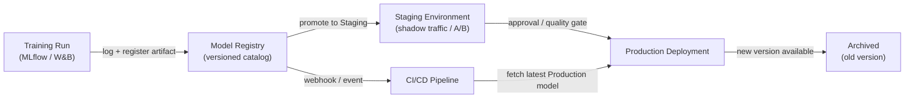

# 模型注册表

## 定义

模型注册表是一个集中式目录，用于在整个生命周期中存储、版本化和管理经过训练的 ML 模型制品——从初始实验到预发布、生产部署，直至最终退役。将其视为软件制品仓库（如 Nexus 或 Artifactory）的等价物，但专为机器学习而构建，每个版本都附有关于训练数据、评估指标和审批状态的额外元数据。

没有注册表，团队通常通过临时渠道共享模型：带有 S3 链接的 Slack 消息、共享目录或部署脚本中的硬编码路径。这使得无法回答基本的治理问题，例如"当前哪个模型在生产中？"、"谁批准了这个模型的部署？"或"上周导致事故的版本是用什么数据集训练的？"。注册表使这些问题变得轻而易举地可回答。

模型注册表同时与训练侧（实验跟踪器记录一次运行，最佳运行的制品被注册）和部署侧（CI/CD 或服务基础设施在 `Production` 阶段拉取制品）集成。它们通常强制执行一个晋升工作流——`None → Staging → Production → Archived`——在模型进入下一阶段之前可能需要人工审批、自动质量门，或两者兼有。

## 工作原理



### 模型注册

训练运行完成并将指标记录到实验跟踪器后，最佳制品通过 `mlflow.register_model()` 或等效的 SDK 调用在注册表中注册。每次注册都会为命名模型（例如 `fraud-detector`）创建一个新的**版本**。版本是不可变的——您无法覆盖已注册的版本，只能创建新版本。运行 ID、数据集哈希、训练参数和评估指标等元数据被附加到版本中，可以通过注册表 API 或 UI 进行查询。

### 预发布工作流

新注册的版本从 `None`（或 `Candidate`）阶段开始。数据科学家或自动门将版本提升到 `Staging` 进行更深入的验证——集成测试、影子部署、金丝雀流量分流或与当前生产模型进行 A/B 比较。预发布是一个安全的环境，回归被限制其中；此处任何失败都会阻止模型进入生产，而不会阻断服务系统。

### 生产晋升和治理

晋升到 `Production` 可能需要人工审批步骤，尤其是在受监管的行业中。许多团队实现类似 pull-request 的审查：注册表发出 webhook，审查者检查模型卡片（记录训练数据、公平性指标和已知限制），晋升记录在审计日志中，包含审批者的身份和时间戳。服务基础设施订阅 `Production` 阶段，并在晋升发生时自动加载新的模型版本，实现零停机模型更新。

### 归档和回滚

当新版本到达 `Production` 时，旧版本被转移到 `Archived`。归档不会删除制品——它仍然完全可检索，用于回滚或取证分析。如果新的生产版本出现退化（由[监控](/docs/mlops/monitoring)检测到），运营团队可以在几秒钟内将归档版本重新晋升到 `Production`，无需代码部署即可回滚。

## 何时使用 / 何时不使用

| 使用时机 | 避免时机 |
|---|---|
| 多个模型或模型版本同时部署 | 您有一个只训练一次、无计划更新的单一模型 |
| 监管或审计要求需要模型溯源 | 团队处于早期研发阶段，尚无生产部署 |
| 不同团队负责训练与部署 | 单人在单个脚本中完成训练和部署 |
| 您需要生产模型的回滚能力 | 治理流程的开销不被风险级别所证明 |
| A/B 测试或影子部署需要管理多个在线版本 | 实验跟踪单独已经满足您的治理需求 |

## 对比

| 标准 | MLflow Model Registry | W&B Registry | AWS SageMaker Model Registry |
|---|---|---|---|
| 托管 | 自托管或 Databricks 托管 | SaaS（W&B 云） | 完全托管的 AWS 服务 |
| 集成 | MLflow 跟踪服务器 | W&B 实验跟踪 | SageMaker 训练 + 端点 |
| 阶段工作流 | None → Staging → Production → Archived | 基于别名（自定义阶段） | Pending → Approved → Rejected |
| 审批流程 | 通过 UI/API 手动 | 通过 UI/API 手动 | 与 AWS IAM / CodePipeline 集成 |
| 成本 | 开源（自托管免费） | 免费层 + 付费计划 | AWS 按使用付费定价 |

## 优缺点

| 优点 | 缺点 |
|---|---|
| 所有生产模型的单一真实来源 | 增加流程开销——团队必须记得注册制品 |
| 无需代码部署即可在几秒内回滚 | 自托管注册表需要基础设施维护 |
| 带有审批者身份和时间戳的完整审计追踪 | 需要集成工作将训练流水线连接到注册表 |
| 将模型晋升与代码部署周期解耦 | 如果过度设计，治理流程可能会减慢快速迭代的团队 |
| 通过服务多个注册版本实现安全的 A/B 测试 | 随着版本积累，制品存储成本随时间增长 |

## 代码示例

```python
# model_registry_example.py
import mlflow
import mlflow.sklearn
from mlflow.tracking import MlflowClient
from sklearn.datasets import make_classification
from sklearn.ensemble import RandomForestClassifier
from sklearn.model_selection import train_test_split
from sklearn.metrics import accuracy_score

mlflow.set_tracking_uri("http://localhost:5000")
mlflow.set_experiment("fraud-detection")

X, y = make_classification(n_samples=5000, n_features=20, random_state=42)
X_train, X_test, y_train, y_test = train_test_split(X, y, test_size=0.2, random_state=42)

with mlflow.start_run(run_name="rf-baseline") as run:
    model = RandomForestClassifier(n_estimators=100, random_state=42)
    model.fit(X_train, y_train)
    accuracy = accuracy_score(y_test, model.predict(X_test))
    mlflow.log_param("n_estimators", 100)
    mlflow.log_metric("accuracy", accuracy)
    signature = mlflow.models.infer_signature(X_train, model.predict(X_train))
    mlflow.sklearn.log_model(
        sk_model=model, artifact_path="model", signature=signature,
        registered_model_name="fraud-detector",
    )

client = MlflowClient()
latest_versions = client.get_latest_versions("fraud-detector", stages=["None"])
new_version = latest_versions[0].version
client.transition_model_version_stage(
    name="fraud-detector", version=new_version, stage="Staging", archive_existing_versions=False,
)
client.transition_model_version_stage(
    name="fraud-detector", version=new_version, stage="Production", archive_existing_versions=True,
)
client.update_model_version(
    name="fraud-detector", version=new_version,
    description="Promoted after passing shadow traffic test with 0.1% error rate improvement.",
)
production_model = mlflow.sklearn.load_model("models:/fraud-detector/Production")
predictions = production_model.predict(X_test)
print(f"Loaded Production model accuracy: {accuracy_score(y_test, predictions):.4f}")
```

## 实用资源

- [MLflow 模型注册表文档](https://mlflow.org/docs/latest/model-registry.html) — 带有 Python API 参考和 UI 演示的官方指南。
- [Weights & Biases Registry](https://docs.wandb.ai/guides/model_registry) — W&B 的模型注册表，包含关联制品和血缘图。
- [AWS SageMaker Model Registry](https://docs.aws.amazon.com/sagemaker/latest/dg/model-registry.html) — 与 SageMaker Pipelines 和 CodePipeline 集成的托管注册表。
- [Google Vertex AI Model Registry](https://cloud.google.com/vertex-ai/docs/model-registry/introduction) — GCP 用于模型版本控制和部署的托管解决方案。

## 另请参阅

- [MLflow](/docs/mlops/mlflow)
- [Weights & Biases (W&B)](/docs/mlops/wandb)
- [模型服务](/docs/mlops/deployment/model-serving)
