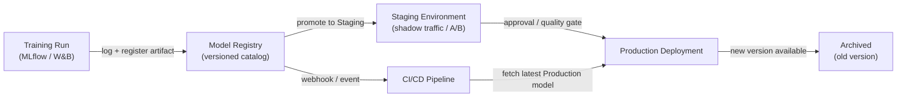

# 模型注册表

## 定义

模型注册表（model registry）是一个集中式目录，用于在整个生命周期内存储、版本化和治理训练好的 ML 模型制品——从最初的实验，经过暂存（staging）、生产部署，到最终退役。可以将其视为软件制品仓库（如 Nexus 或 Artifactory）的等价物，但专为机器学习构建，每个版本都附有关于训练数据、评估指标和审批状态的额外元数据。

没有注册表，团队通常通过临时渠道共享模型：包含 S3 链接的 Slack 消息、共享目录或部署脚本中硬编码的路径。这使得基本的治理问题无法回答，例如"当前生产中的模型是哪个？"、"谁批准了这个模型部署？"或"上周导致事故的那个版本的模型是用什么数据集训练的？"。注册表使这些问题变得轻而易举地可以回答。

模型注册表与训练端（实验追踪器记录运行，最佳运行的制品被注册）和部署端（CI/CD 或服务基础设施拉取处于 `Production` 阶段的制品）都有集成。它们通常执行一个晋升工作流——`None → Staging → Production → Archived`——在模型晋升到下一个阶段之前，可能需要人工签署、自动质量关卡或两者兼有。

## 工作原理



### 模型注册

训练运行完成并将指标记录到实验追踪器后，最佳制品通过 `mlflow.register_model()` 或等效的 SDK 调用注册到注册表中。每次注册都会创建一个命名模型（例如 `fraud-detector`）的新**版本**。版本是不可变的——你不能覆盖已注册的版本，只能创建新版本。运行 ID、数据集哈希、训练参数和评估指标等元数据被附加到版本中，并可通过注册表 API 或 UI 查询。

### 暂存工作流

新注册的版本从 `None`（或 `Candidate`）阶段开始。数据科学家或自动化关卡将版本提升到 `Staging` 进行更深入的验证——集成测试、影子部署（shadow deployment）、金丝雀流量分割或与当前生产模型的 A/B 比较。暂存是一个安全环境，回归在这里被隔离；任何失败都会阻止模型到达生产，而不会阻塞服务系统。

### 生产晋升与治理

晋升到 `Production` 可能需要人工审批步骤，尤其是在受监管的行业中。许多团队实施一种类似拉取请求的审查：注册表发出一个 webhook，审查者检查模型卡片（记录训练数据、公平性指标和已知限制），晋升被记录在审计日志中，包含审批者的身份和时间戳。服务基础设施订阅 `Production` 阶段，并在晋升发生时自动加载新模型版本，实现零停机模型更新。

### 归档与回滚

当新版本达到 `Production` 时，旧版本被转换为 `Archived`。归档不会删除制品——它仍然完全可检索，用于回滚或法证分析。如果新的生产版本退化（由[监控](/docs/mlops/monitoring)检测到），运维团队可以在几秒钟内将归档版本重新提升到 `Production`，无需代码部署即可回滚。

## 何时使用 / 何时不使用

| 适合使用 | 避免使用 |
|---|---|
| 多个模型或模型版本同时部署 | 只有一个模型，只训练一次，没有更新计划 |
| 法规或审计要求需要模型来源记录 | 团队处于早期 R&D 阶段，尚无生产部署 |
| 不同团队负责训练与部署 | 单个人在单个脚本中训练和部署 |
| 需要生产模型的回滚能力 | 治理过程的开销与风险级别不匹配 |
| A/B 测试或影子部署需要管理多个实时版本 | 单独的实验追踪已经满足你的治理需求 |

## 比较

| 标准 | MLflow 模型注册表 | W&B Registry | AWS SageMaker 模型注册表 |
|---|---|---|---|
| 托管方式 | 自托管或 Databricks 托管 | SaaS（W&B 云） | 完全托管的 AWS 服务 |
| 集成 | MLflow 追踪服务器 | W&B 实验追踪 | SageMaker 训练+端点 |
| 阶段工作流 | None → Staging → Production → Archived | 基于别名（自定义阶段） | Pending → Approved → Rejected |
| 审批流程 | 通过 UI/API 手动操作 | 通过 UI/API 手动操作 | 与 AWS IAM/CodePipeline 集成 |
| 成本 | 开源（自托管免费） | 免费层+付费计划 | 按使用量付费的 AWS 定价 |

## 优缺点

| 优点 | 缺点 |
|---|---|
| 所有生产模型的单一真相来源 | 增加流程开销——团队必须记住注册制品 |
| 无需代码部署即可在几秒内回滚 | 自托管注册表需要基础设施维护 |
| 完整的审计追踪，包含审批者身份和时间戳 | 需要集成工作将训练管道连接到注册表 |
| 将模型晋升与代码部署周期解耦 | 治理流程可能会拖慢快速发展的团队（如果过度设计） |
| 通过服务多个注册版本支持安全的 A/B 测试 | 随着版本积累，制品存储成本会随时间增长 |

## 代码示例

```python
# model_registry_example.py
# Demonstrates registering, transitioning, and loading models with MLflow Model Registry

import mlflow
import mlflow.sklearn
from mlflow.tracking import MlflowClient
from sklearn.datasets import make_classification
from sklearn.ensemble import RandomForestClassifier
from sklearn.model_selection import train_test_split
from sklearn.metrics import accuracy_score

# --- 1. Train and log a model to MLflow tracking server ---

mlflow.set_tracking_uri("http://localhost:5000")  # or your MLflow server URI
mlflow.set_experiment("fraud-detection")

X, y = make_classification(n_samples=5000, n_features=20, random_state=42)
X_train, X_test, y_train, y_test = train_test_split(X, y, test_size=0.2, random_state=42)

with mlflow.start_run(run_name="rf-baseline") as run:
    model = RandomForestClassifier(n_estimators=100, random_state=42)
    model.fit(X_train, y_train)

    accuracy = accuracy_score(y_test, model.predict(X_test))

    # Log parameters and metrics — these attach to the registered version
    mlflow.log_param("n_estimators", 100)
    mlflow.log_metric("accuracy", accuracy)

    # Log the model artifact with a schema signature for validation at serving time
    signature = mlflow.models.infer_signature(X_train, model.predict(X_train))
    mlflow.sklearn.log_model(
        sk_model=model,
        artifact_path="model",
        signature=signature,
        registered_model_name="fraud-detector",  # registers on log if name provided
    )

    run_id = run.info.run_id
    print(f"Run ID: {run_id} | Accuracy: {accuracy:.4f}")

# --- 2. Transition the newly registered version to Staging ---

client = MlflowClient()

# Fetch the latest version of the model (just registered above)
latest_versions = client.get_latest_versions("fraud-detector", stages=["None"])
new_version = latest_versions[0].version

# Promote to Staging for integration testing
client.transition_model_version_stage(
    name="fraud-detector",
    version=new_version,
    stage="Staging",
    archive_existing_versions=False,  # keep other Staging versions for comparison
)
print(f"Version {new_version} promoted to Staging")

# --- 3. After validation, promote Staging model to Production ---

# Archive the current Production version and promote Staging to Production
client.transition_model_version_stage(
    name="fraud-detector",
    version=new_version,
    stage="Production",
    archive_existing_versions=True,  # automatically archive the old Production version
)
print(f"Version {new_version} is now Production")

# Add a description to document why this version was promoted
client.update_model_version(
    name="fraud-detector",
    version=new_version,
    description="Promoted after passing shadow traffic test with 0.1% error rate improvement.",
)

# --- 4. Load the Production model in a serving or batch scoring script ---

production_model = mlflow.sklearn.load_model("models:/fraud-detector/Production")
predictions = production_model.predict(X_test)
print(f"Loaded Production model accuracy: {accuracy_score(y_test, predictions):.4f}")
```

## 实践资源

- [MLflow 模型注册表文档](https://mlflow.org/docs/latest/model-registry.html) — 包含 Python API 参考和 UI 演练的官方指南。
- [Weights & Biases Registry](https://docs.wandb.ai/guides/model_registry) — W&B 的模型注册表，具有链接的制品和血缘图。
- [AWS SageMaker 模型注册表](https://docs.aws.amazon.com/sagemaker/latest/dg/model-registry.html) — 与 SageMaker Pipelines 和 CodePipeline 集成的托管注册表。
- [Google Vertex AI 模型注册表](https://cloud.google.com/vertex-ai/docs/model-registry/introduction) — GCP 的用于模型版本化和部署的托管解决方案。

## 另请参阅

- [MLflow](/docs/mlops/mlflow)
- [Weights & Biases (W&B)](/docs/mlops/wandb)
- [模型服务（Model serving）](/docs/mlops/deployment/model-serving)
