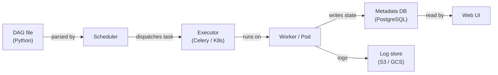

# Apache Airflow

## 定义

Apache Airflow 是一个用于编程式创作、调度和监控工作流的开源平台。工作流以 Python 编写的**有向无环图（DAG）**来表达，这为工程师提供了编程语言的全部表达能力，可以定义复杂的依赖关系、分支逻辑、动态任务生成和重试策略。Airflow 最初由 Airbnb 于 2014 年创建，后来捐赠给 Apache 软件基金会；它已成为数据工程和 MLOps 中批量工作流编排的事实标准。

在 ML 场景中，Airflow 编排整个模型生命周期：数据摄取、预处理、特征工程、模型训练、评估、制品注册和部署。它本身不执行计算——而是通过其丰富的算子生态系统委托给专门的系统（Spark、dbt、SageMaker、Kubernetes）。这种编排与执行的分离是一个关键的架构优势：你可以在不改变 DAG 逻辑的情况下更换底层计算层。

Airflow 的调度器持续解析 DAG 文件，评估每个任务实例的状态，并将就绪任务分派给执行器（LocalExecutor、CeleryExecutor 或 KubernetesExecutor）。Web UI 提供对 DAG 运行、任务日志和血缘的实时可见性。Airflow 专为具有已知计划的批量工作负载设计——不适合亚分钟级流处理或事件驱动管道。

## 工作原理

### DAG 和任务依赖

DAG 是一个实例化 `airflow.DAG` 对象并使用算子定义任务的 Python 文件。任务之间的依赖关系使用 `>>` 位移操作符或 `set_downstream`/`set_upstream` 调用来声明。调度器从 DAGs 文件夹读取这些文件，计算依赖图，并在所有上游依赖都处于 `success` 状态时触发任务实例。DAG 运行可以按 cron 表达式计划，或通过 REST API 或 `TriggerDagRunOperator` 外部触发。

### 算子、传感器和钩子

**算子（Operators）**是 Airflow 中原子工作单元。`PythonOperator` 执行 Python 可调用对象；`BashOperator` 运行 shell 命令；`SparkSubmitOperator` 提交 Spark 作业；`BigQueryOperator` 运行 SQL 查询。**传感器（Sensors）**是一类特殊的算子，在条件满足之前阻塞——文件落入 S3、Hive 表中出现分区或外部 DAG 完成。**钩子（Hooks）**为外部系统（数据库、云 API、消息队列）提供可重用的连接，在算子内部使用，但也可以直接调用。这种分层抽象意味着大多数集成已经存在于 `apache-airflow-providers-*` 包中。

### XComs 和任务间通信

**XComs**（跨通信）允许任务在同一 DAG 运行中的任务实例之间推送和拉取小值——字符串、数字、JSON blobs。任务通过从其 Python 可调用对象返回值或调用 `context['ti'].xcom_push(key, value)` 来推送 XCom。下游任务通过 `context['ti'].xcom_pull(task_ids='upstream_task', key='value')` 拉取它。XComs 存储在 Airflow 元数据数据库中，因此不适合大型有效负载（对此使用对象存储）。它们非常适合在管道步骤之间传递模型评估指标、制品路径或决策标志。

### 调度器架构

Airflow 调度器是一个 Python 进程，按可配置间隔解析 DAG 文件，计算哪些任务实例已准备好运行，并将它们提交给执行器。使用 `CeleryExecutor` 时，任务通过消息代理（Redis 或 RabbitMQ）分派给工作进程池。使用 `KubernetesExecutor` 时，每个任务实例获得自己独立的 Kubernetes Pod——消除了共享工作节点的资源争用，并支持每个任务的资源规范。元数据数据库（生产环境中的 PostgreSQL 或 MySQL）存储 DAG 运行状态、任务实例历史、XComs、变量和连接。



## 何时使用 / 何时不使用

| 适合使用 | 避免使用 |
|----------|------------|
| 需要具有复杂依赖关系的批量工作流编排 | 工作负载需要亚分钟级延迟或是事件驱动的 |
| 团队熟悉用 Python 编写工作流 | 需要低代码或 UI 优先的工作流构建器 |
| 需要与云服务（AWS、GCP、Azure）的丰富集成 | DAG 非常简单，cron 作业就足够了 |
| 需要详细的审计追踪、重试和告警 | 需要开箱即用的托管、零运维编排服务 |
| 需要 KubernetesExecutor 来实现隔离的、可重现的任务环境 | 组织无法维护 Airflow 调度器和工作节点 |

## 比较

| 标准 | Apache Airflow | Prefect |
|-----------|---------------|---------|
| 易用性 | 中等——需要理解 DAG 模型、调度器设置和执行器 | 高——Python 式流，最少样板代码；本地执行即可运行 |
| 可扩展性 | 高——KubernetesExecutor 独立扩展任务 | 高——Prefect Cloud 或使用工作池的自托管服务器 |
| UI 质量 | 良好——DAG 图、甘特图、任务日志；设计稍显过时 | 出色——具有流运行可观测性和制品追踪的现代 UI |
| Kubernetes 支持 | 通过 KubernetesExecutor 一流支持（每个任务一个 Pod） | 通过 Kubernetes 工作池；比 Airflow 更容易配置 |
| 学习曲线 | 陡峭——DAG 语义、XComs、提供者、执行器配置 | 平缓——感觉像写普通 Python；前期学习内容更少 |

## 优缺点

| 优点 | 缺点 |
|------|------|
| 拥有数百个提供者集成的成熟生态系统 | 显著的运营开销（调度器、工作节点、元数据数据库） |
| 完整的 Python 表达能力，可动态生成 DAG | DAG 解析错误可能会悄然破坏调度器 |
| 强大的社区和企业支持（MWAA、Cloud Composer、Astronomer） | 不适合流处理或亚分钟级调度 |
| KubernetesExecutor 支持每个任务的资源隔离 | XComs 大小有限——不适合传递大型制品 |
| 丰富的 UI，包含图形视图、甘特图和任务级日志 | 配置分散在 DAG 文件、环境变量和 Airflow UI 中 |

## 代码示例

```python
"""
Airflow DAG for a complete ML pipeline:
  1. Extract training data from a source database
  2. Preprocess and validate the data
  3. Train a model and register it in a model registry

Requires: apache-airflow >= 2.7, apache-airflow-providers-postgres,
          scikit-learn, pandas, mlflow
"""

from __future__ import annotations

from datetime import datetime, timedelta

from airflow import DAG
from airflow.operators.python import PythonOperator

# --- Default arguments applied to every task ---
default_args = {
    "owner": "ml-team",
    "retries": 2,
    "retry_delay": timedelta(minutes=5),
    "email_on_failure": True,
    "email": ["ml-alerts@example.com"],
}

# ---------------------------------------------------------------------------
# Task callables
# ---------------------------------------------------------------------------

def extract_data(**context) -> None:
    """
    Pull the latest training window from the feature store and
    save it to a shared location. Push the output path via XCom.
    """
    import pandas as pd

    # In production, replace with a real DB/feature-store connection
    df = pd.DataFrame(
        {
            "feature_a": [1.0, 2.0, 3.0, 4.0, 5.0],
            "feature_b": [0.1, 0.4, 0.9, 1.6, 2.5],
            "label": [0, 0, 1, 1, 1],
        }
    )

    output_path = "/tmp/airflow/training_data.parquet"
    import pathlib
    pathlib.Path(output_path).parent.mkdir(parents=True, exist_ok=True)
    df.to_parquet(output_path, index=False)

    # Push artifact path to XCom so downstream tasks can consume it
    context["ti"].xcom_push(key="data_path", value=output_path)
    print(f"[extract] saved {len(df)} rows to {output_path}")


def preprocess_data(**context) -> None:
    """
    Load extracted data, validate schema, apply feature scaling,
    and persist the preprocessed dataset.
    """
    import pandas as pd
    from sklearn.preprocessing import StandardScaler

    # Pull the path produced by the extract task
    data_path = context["ti"].xcom_pull(task_ids="extract_data", key="data_path")
    df = pd.read_parquet(data_path)

    # Validate required columns
    required = {"feature_a", "feature_b", "label"}
    missing = required - set(df.columns)
    if missing:
        raise ValueError(f"Missing columns: {missing}")

    # Scale features
    scaler = StandardScaler()
    df[["feature_a", "feature_b"]] = scaler.fit_transform(
        df[["feature_a", "feature_b"]]
    )

    output_path = "/tmp/airflow/preprocessed_data.parquet"
    df.to_parquet(output_path, index=False)
    context["ti"].xcom_push(key="preprocessed_path", value=output_path)
    print(f"[preprocess] scaled and saved {len(df)} rows to {output_path}")


def train_model(**context) -> None:
    """
    Train a logistic regression model, evaluate on a hold-out split,
    and log the run to MLflow.
    """
    import pandas as pd
    import mlflow
    import mlflow.sklearn
    from sklearn.linear_model import LogisticRegression
    from sklearn.model_selection import train_test_split
    from sklearn.metrics import accuracy_score

    preprocessed_path = context["ti"].xcom_pull(
        task_ids="preprocess_data", key="preprocessed_path"
    )
    df = pd.read_parquet(preprocessed_path)

    X = df[["feature_a", "feature_b"]].values
    y = df["label"].values
    X_train, X_test, y_train, y_test = train_test_split(
        X, y, test_size=0.2, random_state=42
    )

    with mlflow.start_run(run_name="airflow-logistic-regression"):
        model = LogisticRegression()
        model.fit(X_train, y_train)

        accuracy = accuracy_score(y_test, model.predict(X_test))
        mlflow.log_metric("accuracy", accuracy)
        mlflow.sklearn.log_model(model, artifact_path="model")

        print(f"[train] accuracy={accuracy:.4f}")
        mlflow.register_model(
            f"runs:/{mlflow.active_run().info.run_id}/model",
            name="airflow-demo-model",
        )


# ---------------------------------------------------------------------------
# DAG definition
# ---------------------------------------------------------------------------

with DAG(
    dag_id="ml_training_pipeline",
    description="Extract → Preprocess → Train pipeline for nightly model refresh",
    default_args=default_args,
    start_date=datetime(2024, 1, 1),
    schedule="0 2 * * *",  # Run at 02:00 UTC daily
    catchup=False,
    tags=["ml", "training"],
) as dag:

    extract = PythonOperator(
        task_id="extract_data",
        python_callable=extract_data,
    )

    preprocess = PythonOperator(
        task_id="preprocess_data",
        python_callable=preprocess_data,
    )

    train = PythonOperator(
        task_id="train_model",
        python_callable=train_model,
    )

    # Define linear dependency: extract → preprocess → train
    extract >> preprocess >> train
```

## 实践资源

- [Apache Airflow 文档](https://airflow.apache.org/docs/) — DAG、算子、执行器和配置的官方参考
- [Astronomer — Airflow 指南](https://www.astronomer.io/docs/learn/) — DAG 编写、测试和部署的实践教程
- [Airflow 提供者包索引](https://airflow.apache.org/docs/#providers-packages-docs-apache-airflow-providers) — 浏览所有官方集成（AWS、GCP、Spark、dbt 等）
- [托管 Airflow — Amazon MWAA](https://docs.aws.amazon.com/mwaa/latest/userguide/what-is-mwaa.html) — AWS 托管 Airflow 服务参考

## 另请参阅

- [数据管道](/docs/mlops/data-engineering)
- [Apache Spark](/docs/mlops/data-engineering/spark)
- [MLOps CI/CD](/docs/mlops/cicd)
