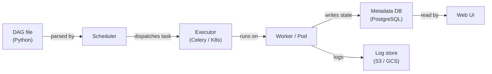

# Apache Airflow

## 定义

Apache Airflow 是一个用于以编程方式创作、调度和监控工作流的开源平台。工作流以用 Python 编写的**有向无环图（DAG）**表示，这赋予工程师编程语言的完整表达能力来定义复杂的依赖关系、分支逻辑、动态任务生成和重试策略。Airflow 最初于 2014 年在 Airbnb 创建，后来捐赠给 Apache 软件基金会；它已成为数据工程和 MLOps 中批处理工作流编排的事实标准。

在 ML 背景下，Airflow 编排整个模型生命周期：数据摄取、预处理、特征工程、模型训练、评估、制品注册和部署。它本身不执行计算——而是通过其丰富的算子生态系统委托给专门的系统（Spark、dbt、SageMaker、Kubernetes）。

## 工作原理

### DAG 和任务依赖

DAG 是一个 Python 文件，它实例化一个 `airflow.DAG` 对象，并使用算子定义任务。任务之间的依赖关系用 `>>` 位移算子或 `set_downstream`/`set_upstream` 调用声明。

### 算子、传感器和钩子

**算子**是 Airflow 中的原子工作单元。**传感器**是一种特殊的算子类，它会阻塞直到满足某个条件。**钩子**提供到外部系统的可重用连接。

### XComs 和任务间通信

**XComs**（跨通信）允许任务在同一 DAG 运行的任务实例之间推送和拉取小值——字符串、数字、JSON blob。它们非常适合在管道步骤之间传递模型评估指标、制品路径或决策标志。

### 调度器架构

使用 `KubernetesExecutor`，每个任务实例都会获得自己的隔离 Kubernetes Pod，消除了共享工作进程的资源争用，并支持每个任务的资源规格。



## 何时使用 / 何时不使用

| 使用时机 | 避免时机 |
|---|---|
| 您需要具有复杂依赖关系的批处理工作流编排 | 您的工作负载需要亚分钟级延迟或是事件驱动的 |
| 您的团队习惯于用 Python 编写工作流 | 您想要低代码或 UI 优先的工作流构建器 |
| 您需要与云服务（AWS、GCP、Azure）的丰富集成 | 您的 DAG 极其简单，cron 作业就足够了 |
| 您需要详细的审计追踪、重试和告警 | 您需要开箱即用的托管零运维编排服务 |

## 对比

| 标准 | Apache Airflow | Prefect |
|---|---|---|
| 易用性 | 中等 | 高 |
| 可扩展性 | 高 | 高 |
| UI 质量 | 良好 | 优秀 |
| 学习曲线 | 陡峭 | 平缓 |

## 优缺点

| 优点 | 缺点 |
|---|---|
| 拥有数百个提供商集成的成熟生态系统 | 显著的运营开销（调度器、工作进程、元数据数据库） |
| 用于动态 DAG 生成的完整 Python 表达能力 | DAG 解析错误可能会悄无声息地破坏调度器 |
| 强大的社区和企业支持 | 不适合流式处理或亚分钟级调度 |
| KubernetesExecutor 支持每任务资源隔离 | XCom 大小有限——不适合传递大型制品 |

## 代码示例

```python
from __future__ import annotations
from datetime import datetime, timedelta
from airflow import DAG
from airflow.operators.python import PythonOperator

default_args = {
    "owner": "ml-team",
    "retries": 2,
    "retry_delay": timedelta(minutes=5),
    "email_on_failure": True,
    "email": ["ml-alerts@example.com"],
}

def extract_data(**context) -> None:
    import pandas as pd, pathlib
    df = pd.DataFrame({"feature_a": [1.0, 2.0], "feature_b": [0.1, 0.4], "label": [0, 1]})
    output_path = "/tmp/airflow/training_data.parquet"
    pathlib.Path(output_path).parent.mkdir(parents=True, exist_ok=True)
    df.to_parquet(output_path, index=False)
    context["ti"].xcom_push(key="data_path", value=output_path)

def train_model(**context) -> None:
    import pandas as pd, mlflow, mlflow.sklearn
    from sklearn.linear_model import LogisticRegression
    from sklearn.model_selection import train_test_split
    from sklearn.metrics import accuracy_score

    data_path = context["ti"].xcom_pull(task_ids="extract_data", key="data_path")
    df = pd.read_parquet(data_path)
    X = df[["feature_a", "feature_b"]].values
    y = df["label"].values
    X_train, X_test, y_train, y_test = train_test_split(X, y, test_size=0.2, random_state=42)
    with mlflow.start_run(run_name="airflow-logistic-regression"):
        model = LogisticRegression()
        model.fit(X_train, y_train)
        accuracy = accuracy_score(y_test, model.predict(X_test))
        mlflow.log_metric("accuracy", accuracy)
        mlflow.sklearn.log_model(model, artifact_path="model")

with DAG(
    dag_id="ml_training_pipeline",
    description="Extract -> Train pipeline for nightly model refresh",
    default_args=default_args,
    start_date=datetime(2024, 1, 1),
    schedule="0 2 * * *",
    catchup=False,
    tags=["ml", "training"],
) as dag:
    extract = PythonOperator(task_id="extract_data", python_callable=extract_data)
    train = PythonOperator(task_id="train_model", python_callable=train_model)
    extract >> train
```

## 实用资源

- [Apache Airflow 文档](https://airflow.apache.org/docs/) — DAG、算子、执行器和配置的官方参考。
- [Astronomer — Airflow 指南](https://www.astronomer.io/docs/learn/) — DAG 创作、测试和部署的实践教程。
- [Airflow 提供商包索引](https://airflow.apache.org/docs/#providers-packages-docs-apache-airflow-providers) — 浏览所有官方集成。
- [托管 Airflow — Amazon MWAA](https://docs.aws.amazon.com/mwaa/latest/userguide/what-is-mwaa.html) — AWS 托管 Airflow 服务参考。

## 另请参阅

- [数据管道](/docs/mlops/data-engineering)
- [Apache Spark](/docs/mlops/data-engineering/spark)
- [MLOps CI/CD](/docs/mlops/cicd)
