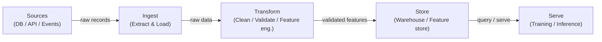

# 数据管道

## 定义

数据管道是一种自动化的步骤序列，将原始数据从一个或多个来源移动到可以被消费的目的地——由分析师、仪表板或机器学习模型使用。在 ML 场景中，管道不仅仅是关于移动数据：它们确保数据以正确的形状、在正确的时间到达，并具有可验证的质量，从而使模型能够可预测地训练和服务。没有可靠的管道，每一个下游制品——特征、训练好的模型、预测——都是可疑的。

数据管道是每个 MLOps 系统的基础。它们涵盖从异构来源（数据库、API、事件流、文件）的摄取，到生成干净结构化数据集或特征向量的转换，再到数据仓库或特征存储中的存储，以及向训练作业或在线推断端点的服务。在管道层做出的设计选择——批处理与流处理、推送与拉取、读时模式（schema-on-read）与写时模式（schema-on-write）——会一直传播到模型延迟、新鲜度和可靠性。

数据质量是数据工程师和模型团队之间隐藏的契约。模式漂移（schema drift）、空值爆炸、分布偏移和重复记录是导致模型悄然退化的最常见原因之一。现代管道在验证检查点中嵌入了（使用 Great Expectations 或 dbt 测试等工具），以在坏数据到达训练或服务之前捕获这些问题。

## 工作原理

### 批处理与流处理

批处理管道按计划对有界数据块进行处理——每小时、每天或由文件到达触发。当下游消费者（夜间训练作业、BI 仪表板）不需要亚分钟级新鲜度时，它们更易于构建和推理，是正确的默认选择。流处理管道在记录到达时进行处理，为在线模型提供近实时特征。代价是运营复杂性：你必须处理迟到数据、乱序事件和恰好一次（exactly-once）语义。大多数成熟的 ML 平台同时运行两者：批处理用于大规模重训练和离线评估，流处理用于在线特征计算。

### ETL 与 ELT

提取-转换-加载（ETL）在数据落入目标存储之前应用转换。这是存储昂贵且仓库缺乏计算能力时的主导模式。提取-加载-转换（ELT）首先加载原始数据，然后在强大的数据仓库或湖仓（例如 BigQuery、Snowflake、Databricks）内部进行转换。ELT 保留了原始历史记录，无需重新摄取即可进行即席探索——这在特征工程不断演进的 ML 工作负载中是一个重大优势。选择主要由工具、治理要求以及目标系统是否能高效处理转换计算来决定。

### 数据质量和模式验证

数据质量检查应该嵌入管道的每个阶段，而不是在最后才添加。在摄取时，检查验证源数据是否符合预期的模式（列名、类型、可空约束）。在转换时，行级检查断言业务规则（非负价格、有效日期范围、引用完整性）。在服务层，统计检查检测分布漂移——已部署模型的无声杀手。模式验证可以使用 Pandera、Great Expectations 或 dbt 测试等工具；分布监控通常由专用的可观测性层处理。



## 何时使用 / 何时不使用

| 适合使用 | 避免使用 |
|----------|------------|
| 多个数据源需要整合用于 ML 训练 | 数据已经存在于一个干净的单一表中可以直接使用 |
| 数据需要按计划或实时刷新 | 你的分析是不会重复的一次性探索 |
| 下游模型需要质量保证（模式、完整性、新鲜度） | 完整管道的开销超过了快速原型的价值 |
| 转换需要被版本化、测试和可重现 | 数据量很小，笔记本中的简单脚本已经足够 |
| 多个消费者（训练、仪表板、API）共享相同的处理数据 | 源系统已经提供了干净的、有契约的 API |

## 比较

| 标准 | 批处理管道 | 流处理管道 |
|-----------|---------------|--------------------|
| 数据新鲜度 | 分钟到小时（计划驱动） | 亚秒到秒级 |
| 复杂性 | 低——有界数据集，简单重试 | 高——迟到数据、窗口、状态 |
| 成本 | 可预测，突发计算 | 持续计算，通常基准成本更高 |
| 容错性 | 重新运行失败的批次 | 需要恰好一次或至少一次语义 |
| 典型 ML 用例 | 离线训练，夜间特征刷新 | 在线特征存储，实时评分 |

## 优缺点

| 优点 | 缺点 |
|------|------|
| 跨团队集中和标准化数据访问 | 建立和维护需要相当大的初始投入 |
| 支持可重现的、经过测试的数据转换 | 管道故障会传播到所有下游消费者 |
| 在坏数据到达模型之前嵌入质量检查 | 调试分布式管道很复杂 |
| 支持版本化和血缘追踪 | 流处理增加了显著的运营开销 |
| 将生产者与消费者解耦 | 需要数据治理和所有权规范 |

## 代码示例

```python
"""
Simple batch data pipeline with pandas.
Reads raw CSV data, validates schema, applies transformations,
and writes a clean Parquet file ready for model training.
"""

import pandas as pd
import pandera as pa
from pandera import Column, DataFrameSchema, Check
from pathlib import Path


# --- Schema definition (contract between pipeline and consumers) ---
raw_schema = DataFrameSchema(
    {
        "user_id": Column(int, nullable=False),
        "event_ts": Column(str, nullable=False),
        "amount": Column(float, Check(lambda x: x >= 0), nullable=False),
        "category": Column(str, nullable=True),
    }
)

output_schema = DataFrameSchema(
    {
        "user_id": Column(int),
        "event_date": Column("datetime64[ns]"),
        "amount": Column(float),
        "category": Column(str),
        "log_amount": Column(float),
    }
)


def extract(source_path: str) -> pd.DataFrame:
    """Load raw data from CSV."""
    df = pd.read_csv(source_path)
    print(f"[extract] loaded {len(df):,} rows from {source_path}")
    return df


def validate(df: pd.DataFrame, schema: DataFrameSchema) -> pd.DataFrame:
    """Fail fast if data does not match the declared schema."""
    validated = schema.validate(df)
    print(f"[validate] schema check passed for {len(validated):,} rows")
    return validated


def transform(df: pd.DataFrame) -> pd.DataFrame:
    """Apply cleaning and feature engineering."""
    df = df.copy()

    # Parse timestamp column
    df["event_date"] = pd.to_datetime(df["event_ts"])
    df.drop(columns=["event_ts"], inplace=True)

    # Fill missing categories with a sentinel value
    df["category"] = df["category"].fillna("unknown")

    # Feature engineering: log-transform amount (handles skew)
    import numpy as np
    df["log_amount"] = np.log1p(df["amount"])

    # Drop duplicates based on user_id + date
    df.drop_duplicates(subset=["user_id", "event_date"], inplace=True)

    print(f"[transform] produced {len(df):,} clean rows")
    return df


def load(df: pd.DataFrame, dest_path: str) -> None:
    """Write clean data to Parquet for efficient downstream reads."""
    Path(dest_path).parent.mkdir(parents=True, exist_ok=True)
    df.to_parquet(dest_path, index=False)
    print(f"[load] wrote {len(df):,} rows to {dest_path}")


def run_pipeline(source: str, destination: str) -> None:
    """Orchestrate the full ETL pipeline."""
    raw = extract(source)
    validated_raw = validate(raw, raw_schema)
    clean = transform(validated_raw)
    validated_clean = validate(clean, output_schema)
    load(validated_clean, destination)
    print("[pipeline] completed successfully")


if __name__ == "__main__":
    run_pipeline(
        source="data/raw/events.csv",
        destination="data/processed/events.parquet",
    )
```

## 实践资源

- [数据工程手册（Andreas Kretz）](https://github.com/andkret/Cookbook) — 涵盖摄取、存储和处理模式的综合开源指南
- [dbt 文档](https://docs.getdbt.com/) — 使用 SQL 进行 ELT 转换的标准工具，内置测试和血缘追踪
- [Great Expectations](https://docs.greatexpectations.io/) — 与大多数管道工具集成的数据质量和验证框架
- [Pandera](https://pandera.readthedocs.io/) — Python 中用于 pandas 和 Spark DataFrames 的轻量级模式验证
- [数据工程基础（O'Reilly）](https://www.oreilly.com/library/view/fundamentals-of-data/9781098108298/) — 涵盖从摄取到服务的完整数据工程生命周期的书籍

## 另请参阅

- [Apache Airflow](/docs/mlops/data-engineering/airflow)
- [Apache Spark](/docs/mlops/data-engineering/spark)
- [Apache Kafka](/docs/mlops/data-engineering/kafka)
- [MLOps](/docs/mlops)
