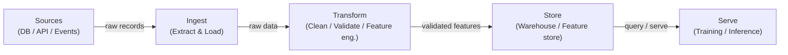

# 数据管道

## 定义

数据管道是一个自动化步骤序列，将原始数据从一个或多个来源移动到可以被分析师、仪表板或机器学习模型消费的目的地。在 ML 背景下，管道不仅仅是关于移动数据：它们确保数据以正确的形式、在正确的时间、以可验证的质量到达，使模型能够可预测地训练和服务。没有可靠的管道，每个下游制品——特征、训练的模型、预测——都是可疑的。

数据管道是每个 MLOps 系统的基础。它们涵盖从异构来源（数据库、API、事件流、文件）的摄取，转换以生成干净且结构化的数据集或特征向量，在数据仓库或特征存储中的存储，以及向训练作业或在线推理端点提供服务。在管道层做出的设计选择——批处理 vs. 流式、推送 vs. 拉取、读时模式 vs. 写时模式——会一直影响模型延迟、新鲜度和可靠性。

数据质量是数据工程师和模型团队之间隐藏的契约。模式漂移、空值爆炸、分布偏移和重复记录是无声模型退化最常见的原因之一。现代管道嵌入验证检查点（使用 Great Expectations 或 dbt 测试等工具），在错误数据到达训练或服务之前捕获这些问题。

## 工作原理

### 批处理 vs. 流式

批处理管道按计划处理有界数据块——每小时、每天或由文件到达触发。它们更易于构建和推理，当下游消费者（夜间训练作业、BI 仪表板）不需要亚分钟级新鲜度时，是正确的默认选择。流式管道在记录到达时处理它们，为在线模型启用近实时特征。权衡是运营复杂性：您必须处理迟到的数据、乱序事件和 exactly-once 语义。

### ETL vs. ELT

提取-转换-加载（ETL）在数据落入目标存储之前应用转换。提取-加载-转换（ELT）先加载原始数据，然后在强大的数据仓库或湖仓中转换它（例如 BigQuery、Snowflake、Databricks）。ELT 保留了原始历史记录，无需重新摄取就能进行即席探索——这在特征工程不断演进的 ML 工作负载中是一大优势。

### 数据质量和模式验证

数据质量检查应嵌入管道的每个阶段，而不是在末尾附加。在摄取时，检查验证源数据是否符合预期模式。在转换时，行级检查断言业务规则。在服务层，统计检查检测分布漂移——已部署模型的无声杀手。



## 何时使用 / 何时不使用

| 使用时机 | 避免时机 |
|---|---|
| 多个数据源需要合并用于 ML 训练 | 数据已经在一个干净的单表中，可直接使用 |
| 数据需要按计划或实时刷新 | 您的分析是不会重复的一次性探索 |
| 下游模型需要质量保证（模式、完整性、新鲜度） | 完整管道的开销超过快速原型的价值 |
| 转换需要版本化、测试和可复现 | 数据量微不足道，笔记本中的简单脚本就足够了 |
| 多个消费者共享相同的处理后数据 | 源系统已经提供了干净的、有契约的 API |

## 对比

| 标准 | 批处理管道 | 流式管道 |
|---|---|---|
| 数据新鲜度 | 分钟到小时（计划驱动） | 亚秒到秒 |
| 复杂性 | 低——有界数据集，简单重试 | 高——迟到数据、窗口化、状态 |
| 成本 | 可预测，突发性计算 | 持续计算，基线通常更高 |
| 容错性 | 重新运行失败的批次 | 需要 exactly-once 或 at-least-once 语义 |
| 典型 ML 用例 | 离线训练、夜间特征刷新 | 在线特征存储、实时评分 |

## 优缺点

| 优点 | 缺点 |
|---|---|
| 集中化并标准化团队间的数据访问 | 构建和维护的初始投入不可忽视 |
| 实现可复现、经过测试的数据转换 | 管道故障会传播到所有下游消费者 |
| 在错误数据到达模型之前嵌入质量检查 | 调试分布式管道很复杂 |
| 支持版本控制和血缘跟踪 | 流式处理增加了显著的运营开销 |
| 将生产者与消费者解耦 | 需要数据治理和所有权纪律 |

## 代码示例

```python
import pandas as pd
import pandera as pa
from pandera import Column, DataFrameSchema, Check
from pathlib import Path

raw_schema = DataFrameSchema({
    "user_id": Column(int, nullable=False),
    "event_ts": Column(str, nullable=False),
    "amount": Column(float, Check(lambda x: x >= 0), nullable=False),
    "category": Column(str, nullable=True),
})

def extract(source_path: str) -> pd.DataFrame:
    return pd.read_csv(source_path)

def validate(df: pd.DataFrame, schema: DataFrameSchema) -> pd.DataFrame:
    return schema.validate(df)

def transform(df: pd.DataFrame) -> pd.DataFrame:
    df = df.copy()
    df["event_date"] = pd.to_datetime(df["event_ts"])
    df.drop(columns=["event_ts"], inplace=True)
    df["category"] = df["category"].fillna("unknown")
    import numpy as np
    df["log_amount"] = np.log1p(df["amount"])
    df.drop_duplicates(subset=["user_id", "event_date"], inplace=True)
    return df

def load(df: pd.DataFrame, dest_path: str) -> None:
    Path(dest_path).parent.mkdir(parents=True, exist_ok=True)
    df.to_parquet(dest_path, index=False)

def run_pipeline(source: str, destination: str) -> None:
    raw = extract(source)
    validated = validate(raw, raw_schema)
    clean = transform(validated)
    load(clean, destination)
    print("[pipeline] 成功完成")

if __name__ == "__main__":
    run_pipeline("data/raw/events.csv", "data/processed/events.parquet")
```

## 实用资源

- [The Data Engineering Cookbook (Andreas Kretz)](https://github.com/andkret/Cookbook) — 涵盖摄取、存储和处理模式的综合开源指南。
- [dbt 文档](https://docs.getdbt.com/) — 带内置测试和血缘的 SQL ELT 转换标准。
- [Great Expectations](https://docs.greatexpectations.io/) — 与大多数管道工具集成的数据质量和验证框架。
- [Pandera](https://pandera.readthedocs.io/) — 用于 Python 中 pandas 和 Spark DataFrame 的轻量级模式验证。
- [Fundamentals of Data Engineering (O'Reilly)](https://www.oreilly.com/library/view/fundamentals-of-data/9781098108298/) — 涵盖从摄取到服务的完整数据工程生命周期的书籍。

## 另请参阅

- [Apache Airflow](/docs/mlops/data-engineering/airflow)
- [Apache Spark](/docs/mlops/data-engineering/spark)
- [Apache Kafka](/docs/mlops/data-engineering/kafka)
- [MLOps](/docs/mlops)
