# Apache Kafka

## 定义

Apache Kafka 是一个分布式事件流平台，最初由 LinkedIn 开发并于 2011 年开源。它被设计为在商品硬件集群上处理高吞吐量、低延迟、持久的事件流——日志消息、用户活动事件、传感器读数、交易。Kafka 充当一个持久的、可回放的日志：生产者将事件写入命名的**主题**，消费者按自己的节奏独立地从这些主题中读取。生产者和消费者的这种解耦是 Kafka 作为集成骨干如此强大的决定性架构属性。

在机器学习场景中，Kafka 扮演两个关键角色。首先，它作为**实时特征管道**的数据骨干：原始事件（点击、交易、传感器读数）流入 Kafka，被流处理器（[Apache Spark](/docs/mlops/data-engineering/spark) Structured Streaming、Apache Flink 或 Kafka Streams）消费，转换为特征向量，并写入在线特征存储（例如 Feast、Tecton）用于低延迟模型服务。其次，Kafka 用于**模型服务管道**：预测请求作为 Kafka 消息到达，消费者应用模型并将预测事件生产到结果主题，从而以异步、解耦的方式实现大规模推断。

Kafka 的持久性保证——消息被持久化到磁盘并跨 broker 复制——意味着消费者组可以从任意偏移量回放事件日志，在部署新特征定义时支持特征存储的数据回填，并为关键 ML 管道支持恰好一次语义。

## 工作原理

### 主题和分区

**主题**是命名的、有序的、不可变的事件日志。主题被划分为**分区**——Kafka 中的并行单元。每个分区是一个有序的、仅追加的记录序列，存储在磁盘上并跨多个 broker 复制以实现容错。分区数量决定了消费者的最大并行度：在消费者组中，每个分区被恰好分配给一个消费者实例。选择正确的分区数量是一个关键的容量决策——太少会限制吞吐量，太多会增加 broker 开销。

### 生产者

**生产者**是将记录发布到一个或多个主题的客户端。记录由可选的键、值（通常序列化为 JSON、Avro 或 Protobuf）、可选的时间戳和可选的头部组成。当存在键时，Kafka 使用一致性哈希将具有相同键的所有记录路由到同一分区——确保给定实体的顺序（例如，给定 `user_id` 的所有事件落在同一分区中）。生产者配置确认语义：`acks=0`（发后即忘）、`acks=1`（leader 确认）或 `acks=all`（完整 ISR 复制——最高持久性）。

### 消费者和消费者组

**消费者**从一个或多个分区读取记录。消费者组织成**消费者组**：每条记录被恰好交付给组中的一个消费者，从而支持水平扩展处理。不同的消费者组可以独立读取相同的主题——特征管道消费者组、监控消费者组和回放消费者组都可以消费相同的原始事件而不互相干扰。消费者偏移量（每个分区中的位置）被提交回 Kafka，提供容错性：如果消费者崩溃，另一个实例从最后提交的偏移量继续。

### Kafka 在实时 ML 管道中的应用

Kafka 通常位于原始事件源和下游 ML 系统之间。来自应用后端或物联网设备的原始事件进入原始主题。流处理器（Spark Structured Streaming、Flink 或 Kafka Streams）消费这些事件，计算特征（滚动聚合、实体查找、嵌入向量），并将结果写入特征主题或直接写入在线特征存储。特征存储为模型服务层提供低延迟读取。预测结果可以反过来写回 Kafka 主题，供监控系统、下游应用或重训练触发器消费。



```mermaid
flowchart LR
  Producer["Producer\n(App / IoT / DB CDC)"] -- "publish events" --> Topic["Kafka Topic\n(partitioned, replicated)"]
  Topic -- "consume raw events" --> StreamProcessor["Stream Processor\n(Spark / Flink / Kafka Streams)"]
  StreamProcessor -- "write features" --> FeatureStore["Online Feature Store\n(Feast / Redis)"]
  FeatureStore -- "low-latency read" --> ModelServer["Model Server\n(REST / gRPC)"]
  ModelServer -- "publish predictions" --> PredictionTopic["Prediction Topic"]
  PredictionTopic -- "consume" --> Consumer["Consumer\n(Monitoring / Downstream app)"]
```

## 何时使用 / 何时不使用

| 适合使用 | 避免使用 |
|----------|------------|
| 需要高吞吐量、持久的事件流（每秒数百万事件） | 用例是简单的任务队列，消息速率适中 |
| 多个独立的消费者组必须读取相同的事件流 | 需要复杂的路由逻辑、消息优先级或开箱即用的死信队列 |
| 需要回放历史事件以回填特征存储 | Kafka 集群的运营复杂性与工作负载不相称 |
| 在线 ML 服务需要实时特征计算 | 消息很大（> 几 MB）——Kafka 针对小型、频繁的记录进行了优化 |
| 必须保留每个实体的事件顺序（例如每个用户） | 团队需要运维负担最小的完全托管消息代理（考虑 SQS、Pub/Sub） |

## 比较

| 标准 | Apache Kafka | RabbitMQ |
|-----------|-------------|----------|
| 吞吐量 | 极高——每个集群每秒数百万消息 | 中等——每秒数十万条 |
| 延迟 | 低（单位数毫秒），但优化吞吐量而非最低延迟 | 非常低——在某些配置中低于毫秒 |
| 消息持久性 | 消息保留可配置的时间段（天/周）；完全可回放 | 消息在被确认后默认删除；回放不是原生支持的 |
| 消费者模型 | 拉取式；消费者追踪自己的偏移量；多个组独立读取 | 推送式；broker 路由消息；每条消息交付给一个消费者 |
| 复杂性 | 高——broker 集群、ZooKeeper（3.x 之前）或 KRaft、模式注册表、监控 | 中等——更容易运维；适合传统任务队列 |
| 最佳 ML 用例 | 实时特征管道、事件溯源、日志聚合 | 异步 ML 作业的任务队列（例如预处理请求） |

## 优缺点

| 优点 | 缺点 |
|------|------|
| 极高的吞吐量和水平可扩展性 | 显著的运营复杂性——集群、复制、监控 |
| 持久、可回放的日志支持数据回填和审计 | 不适合非常小或不频繁的消息工作负载 |
| 解耦生产者和消费者——各自独立扩展 | 模式演进需要模式注册表（Confluent Schema Registry） |
| 多个消费者组可以独立读取相同的主题 | 调整分区数量、复制因子和保留策略需要专业知识 |
| 强大的生态系统：Kafka Connect、Kafka Streams、ksqlDB、Confluent Cloud | 运营开销历来高于托管替代方案（SQS、Pub/Sub） |

## 代码示例

```python
"""
Kafka producer and consumer example using kafka-python.

Scenario: a feature pipeline for real-time ML scoring.
  - Producer: simulates user events (clicks) and publishes to Kafka.
  - Consumer: reads events, computes a simple feature, and logs predictions.

Requires: kafka-python >= 2.0
  pip install kafka-python

Start a local Kafka broker before running (e.g. via Docker):
  docker run -d -p 9092:9092 --name kafka \
    -e KAFKA_CFG_NODE_ID=0 \
    -e KAFKA_CFG_PROCESS_ROLES=controller,broker \
    -e KAFKA_CFG_LISTENERS=PLAINTEXT://:9092,CONTROLLER://:9093 \
    -e KAFKA_CFG_ADVERTISED_LISTENERS=PLAINTEXT://localhost:9092 \
    -e KAFKA_CFG_LISTENER_SECURITY_PROTOCOL_MAP=CONTROLLER:PLAINTEXT,PLAINTEXT:PLAINTEXT \
    -e KAFKA_CFG_CONTROLLER_QUORUM_VOTERS=0@kafka:9093 \
    -e KAFKA_CFG_CONTROLLER_LISTENER_NAMES=CONTROLLER \
    bitnami/kafka:latest
"""

import json
import time
import random
import threading
from datetime import datetime

from kafka import KafkaProducer, KafkaConsumer
from kafka.admin import KafkaAdminClient, NewTopic


BROKER = "localhost:9092"
EVENTS_TOPIC = "user-events"
PREDICTIONS_TOPIC = "predictions"


# ---------------------------------------------------------------------------
# Topic creation (idempotent)
# ---------------------------------------------------------------------------

def ensure_topics() -> None:
    """Create Kafka topics if they do not already exist."""
    admin = KafkaAdminClient(bootstrap_servers=BROKER)
    existing = admin.list_topics()
    topics_to_create = [
        NewTopic(name=t, num_partitions=3, replication_factor=1)
        for t in [EVENTS_TOPIC, PREDICTIONS_TOPIC]
        if t not in existing
    ]
    if topics_to_create:
        admin.create_topics(new_topics=topics_to_create, validate_only=False)
        print(f"[admin] created topics: {[t.name for t in topics_to_create]}")
    admin.close()


# ---------------------------------------------------------------------------
# Producer: simulate user click events
# ---------------------------------------------------------------------------

def run_producer(num_events: int = 20, delay: float = 0.5) -> None:
    """
    Publish synthetic user-click events to the events topic.
    Each event carries a user_id (used as the partition key for ordering),
    a page_id, and a timestamp.
    """
    producer = KafkaProducer(
        bootstrap_servers=BROKER,
        # Serialize Python dicts to JSON bytes
        value_serializer=lambda v: json.dumps(v).encode("utf-8"),
        # Key is UTF-8 encoded string (user_id) — ensures per-user ordering
        key_serializer=lambda k: k.encode("utf-8"),
        # Wait for full ISR replication before confirming (highest durability)
        acks="all",
        retries=3,
    )

    for i in range(num_events):
        user_id = f"user_{random.randint(1, 5)}"
        event = {
            "event_id": i,
            "user_id": user_id,
            "page_id": random.choice(["home", "product", "checkout", "search"]),
            "dwell_time_sec": round(random.uniform(1.0, 120.0), 2),
            "timestamp": datetime.utcnow().isoformat(),
        }
        future = producer.send(
            topic=EVENTS_TOPIC,
            key=user_id,    # Partition key — all events for a user go to same partition
            value=event,
        )
        record_metadata = future.get(timeout=10)
        print(
            f"[producer] sent event {i:02d} | user={user_id} | "
            f"partition={record_metadata.partition} offset={record_metadata.offset}"
        )
        time.sleep(delay)

    producer.flush()
    producer.close()
    print("[producer] finished")


# ---------------------------------------------------------------------------
# Consumer: compute features and produce a mock prediction
# ---------------------------------------------------------------------------

def score_event(event: dict) -> float:
    """
    Trivial scoring function — in production this calls a model server
    or retrieves features from an online feature store.
    """
    # Higher dwell time on 'product' or 'checkout' pages → higher purchase probability
    base = event["dwell_time_sec"] / 120.0
    multiplier = {"checkout": 1.5, "product": 1.2, "search": 0.9, "home": 0.7}.get(
        event["page_id"], 1.0
    )
    return min(round(base * multiplier, 4), 1.0)


def run_consumer(max_messages: int = 20) -> None:
    """
    Consume user events, compute a purchase-probability score,
    and publish the prediction to the predictions topic.
    """
    consumer = KafkaConsumer(
        EVENTS_TOPIC,
        bootstrap_servers=BROKER,
        group_id="ml-feature-pipeline",            # Consumer group for offset tracking
        value_deserializer=lambda b: json.loads(b.decode("utf-8")),
        auto_offset_reset="earliest",              # Start from beginning if no committed offset
        enable_auto_commit=True,
        consumer_timeout_ms=5000,                  # Stop after 5 s of inactivity
    )

    prediction_producer = KafkaProducer(
        bootstrap_servers=BROKER,
        value_serializer=lambda v: json.dumps(v).encode("utf-8"),
        key_serializer=lambda k: k.encode("utf-8"),
    )

    count = 0
    for message in consumer:
        if count >= max_messages:
            break

        event = message.value
        score = score_event(event)

        prediction = {
            "event_id": event["event_id"],
            "user_id": event["user_id"],
            "purchase_probability": score,
            "scored_at": datetime.utcnow().isoformat(),
        }

        prediction_producer.send(
            topic=PREDICTIONS_TOPIC,
            key=event["user_id"],
            value=prediction,
        )
        print(
            f"[consumer] event={event['event_id']:02d} user={event['user_id']} "
            f"page={event['page_id']} score={score:.4f}"
        )
        count += 1

    consumer.close()
    prediction_producer.flush()
    prediction_producer.close()
    print(f"[consumer] processed {count} messages")


# ---------------------------------------------------------------------------
# Main: run producer and consumer concurrently
# ---------------------------------------------------------------------------

if __name__ == "__main__":
    ensure_topics()

    # Start consumer in a background thread so it reads while producer writes
    consumer_thread = threading.Thread(target=run_consumer, args=(20,))
    consumer_thread.start()

    # Give the consumer a moment to initialize
    time.sleep(1.0)

    # Run producer in the main thread
    run_producer(num_events=20, delay=0.3)

    consumer_thread.join()
    print("[main] pipeline demo complete")
```

## 实践资源

- [Apache Kafka 文档](https://kafka.apache.org/documentation/) — 涵盖 broker、生产者、消费者、Kafka Streams 和 Kafka Connect 的官方参考
- [Confluent Developer — Kafka 教程](https://developer.confluent.io/tutorials/) — 生产者、消费者、模式注册表和 ksqlDB 的实践教程
- [Kafka：权威指南，第 2 版（O'Reilly）](https://www.oreilly.com/library/view/kafka-the-definitive/9781492043072/) — 涵盖内部机制、运维和流处理的综合书籍
- [kafka-python 库](https://kafka-python.readthedocs.io/) — 包含生产者、消费者和管理 API 参考的 Python 客户端文档
- [Feast — 开源特征存储](https://docs.feast.dev/) — 与 Kafka 集成实时特征摄取的特征存储

## 另请参阅

- [数据管道](/docs/mlops/data-engineering)
- [Apache Spark](/docs/mlops/data-engineering/spark)
- [MLOps 监控](/docs/mlops/monitoring)
