# Apache Kafka

## 定义

Apache Kafka 是一个分布式事件流平台，最初由 LinkedIn 开发，于 2011 年开源。它被设计为在商用硬件集群上处理高吞吐量、低延迟、持久的事件流——日志消息、用户活动事件、传感器读数、交易。Kafka 充当持久的、可重播的日志：生产者将事件写入命名的**主题**，消费者以自己的速度独立地从这些主题中读取。

在机器学习背景下，Kafka 扮演两个关键角色。首先，它作为**实时特征管道**的数据骨干。其次，Kafka 用于**模型服务管道**：预测请求以 Kafka 消息形式到达，消费者应用模型并将预测事件生产到结果主题，实现大规模异步、解耦的推理。

## 工作原理

### 主题和分区

**主题**是命名的、有序的、不可变的事件日志。主题被分成**分区**——Kafka 中的并行单元。分区数量决定了消费者的最大并行度。

### 生产者

**生产者**是将记录发布到一个或多个主题的客户端。当存在键时，Kafka 使用一致性哈希将所有具有相同键的记录路由到同一分区——确保给定实体的有序性。

### 消费者和消费者组

**消费者**从一个或多个分区读取记录。消费者组织成**消费者组**：每条记录恰好被组内的一个消费者消费，实现处理的水平扩展。

```mermaid
flowchart LR
  Producer["Producer\n(App / IoT / DB CDC)"] -- "publish events" --> Topic["Kafka Topic\n(partitioned, replicated)"]
  Topic -- "consume raw events" --> StreamProcessor["Stream Processor\n(Spark / Flink / Kafka Streams)"]
  StreamProcessor -- "write features" --> FeatureStore["Online Feature Store\n(Feast / Redis)"]
  FeatureStore -- "low-latency read" --> ModelServer["Model Server\n(REST / gRPC)"]
  ModelServer -- "publish predictions" --> PredictionTopic["Prediction Topic"]
  PredictionTopic -- "consume" --> Consumer["Consumer\n(Monitoring / Downstream app)"]
```



## 何时使用 / 何时不使用

| 使用时机 | 避免时机 |
|---|---|
| 您需要高吞吐量、持久的事件流（每秒数百万事件） | 您的用例是简单的任务队列，消息速率适中 |
| 多个独立的消费者组必须读取同一事件流 | 您需要复杂的路由逻辑、消息优先级或死信队列 |
| 您需要重播历史事件以回填特征存储 | Kafka 集群的运营复杂性不被工作负载证明合理 |
| 在线 ML 服务需要实时特征计算 | 消息很大（> 几 MB）——Kafka 针对小而频繁的记录进行了优化 |
| 必须保留每个实体的事件顺序 | 您的团队需要最小运维负担的全托管消息代理 |

## 对比

| 标准 | Apache Kafka | RabbitMQ |
|---|---|---|
| 吞吐量 | 极高——每集群每秒数百万条消息 | 中等——每秒数十万条 |
| 延迟 | 低（个位数毫秒） | 非常低——某些配置下亚毫秒级 |
| 消息持久性 | 消息保留可配置时间段；完全可重播 | 消息默认在确认后删除；不原生支持重播 |
| 消费者模型 | 基于拉取；消费者跟踪自己的偏移量 | 基于推送；代理路由消息 |
| 复杂性 | 高 | 中等 |
| 最佳 ML 用例 | 实时特征管道、事件溯源、日志聚合 | 异步 ML 任务队列 |

## 优缺点

| 优点 | 缺点 |
|---|---|
| 极高的吞吐量和水平可扩展性 | 显著的运营复杂性——集群、复制、监控 |
| 持久、可重播的日志支持回填和可审计性 | 不适合非常小或不频繁的消息工作负载 |
| 解耦生产者和消费者——各自独立扩展 | 模式演进需要模式注册表 |
| 多个消费者组可以独立读取同一主题 | 调整分区数、复制因子和保留需要专业知识 |
| 强大的生态系统：Kafka Connect、Kafka Streams、ksqlDB | 运营开销历史上高于托管替代品 |

## 代码示例

```python
import json, time, random, threading
from datetime import datetime
from kafka import KafkaProducer, KafkaConsumer
from kafka.admin import KafkaAdminClient, NewTopic

BROKER = "localhost:9092"
EVENTS_TOPIC = "user-events"
PREDICTIONS_TOPIC = "predictions"

def ensure_topics() -> None:
    admin = KafkaAdminClient(bootstrap_servers=BROKER)
    existing = admin.list_topics()
    topics_to_create = [
        NewTopic(name=t, num_partitions=3, replication_factor=1)
        for t in [EVENTS_TOPIC, PREDICTIONS_TOPIC] if t not in existing
    ]
    if topics_to_create:
        admin.create_topics(new_topics=topics_to_create, validate_only=False)
    admin.close()

def run_producer(num_events: int = 20, delay: float = 0.5) -> None:
    producer = KafkaProducer(
        bootstrap_servers=BROKER,
        value_serializer=lambda v: json.dumps(v).encode("utf-8"),
        key_serializer=lambda k: k.encode("utf-8"),
        acks="all", retries=3,
    )
    for i in range(num_events):
        user_id = f"user_{random.randint(1, 5)}"
        event = {
            "event_id": i, "user_id": user_id,
            "page_id": random.choice(["home", "product", "checkout", "search"]),
            "dwell_time_sec": round(random.uniform(1.0, 120.0), 2),
            "timestamp": datetime.utcnow().isoformat(),
        }
        producer.send(topic=EVENTS_TOPIC, key=user_id, value=event)
        time.sleep(delay)
    producer.flush()
    producer.close()

def score_event(event: dict) -> float:
    base = event["dwell_time_sec"] / 120.0
    multiplier = {"checkout": 1.5, "product": 1.2, "search": 0.9, "home": 0.7}.get(event["page_id"], 1.0)
    return min(round(base * multiplier, 4), 1.0)

def run_consumer(max_messages: int = 20) -> None:
    consumer = KafkaConsumer(
        EVENTS_TOPIC, bootstrap_servers=BROKER,
        group_id="ml-feature-pipeline",
        value_deserializer=lambda b: json.loads(b.decode("utf-8")),
        auto_offset_reset="earliest", enable_auto_commit=True, consumer_timeout_ms=5000,
    )
    prediction_producer = KafkaProducer(
        bootstrap_servers=BROKER,
        value_serializer=lambda v: json.dumps(v).encode("utf-8"),
        key_serializer=lambda k: k.encode("utf-8"),
    )
    count = 0
    for message in consumer:
        if count >= max_messages:
            break
        event = message.value
        score = score_event(event)
        prediction = {
            "event_id": event["event_id"], "user_id": event["user_id"],
            "purchase_probability": score, "scored_at": datetime.utcnow().isoformat(),
        }
        prediction_producer.send(topic=PREDICTIONS_TOPIC, key=event["user_id"], value=prediction)
        count += 1
    consumer.close()
    prediction_producer.flush()
    prediction_producer.close()

if __name__ == "__main__":
    ensure_topics()
    consumer_thread = threading.Thread(target=run_consumer, args=(20,))
    consumer_thread.start()
    time.sleep(1.0)
    run_producer(num_events=20, delay=0.3)
    consumer_thread.join()
```

## 实用资源

- [Apache Kafka 文档](https://kafka.apache.org/documentation/) — 涵盖代理、生产者、消费者、Kafka Streams 和 Kafka Connect 的官方参考。
- [Confluent Developer — Kafka 教程](https://developer.confluent.io/tutorials/) — 生产者、消费者、模式注册表和 ksqlDB 的实践教程。
- [Kafka: The Definitive Guide, 2nd edition (O'Reilly)](https://www.oreilly.com/library/view/kafka-the-definitive/9781492043072/) — 涵盖内部原理、运营和流处理的综合书籍。
- [kafka-python 库](https://kafka-python.readthedocs.io/) — 带生产者、消费者和管理 API 参考的 Python 客户端文档。
- [Feast — 开源特征存储](https://docs.feast.dev/) — 与 Kafka 集成用于实时特征摄取的特征存储。

## 另请参阅

- [数据管道](/docs/mlops/data-engineering)
- [Apache Spark](/docs/mlops/data-engineering/spark)
- [MLOps 监控](/docs/mlops/monitoring)
