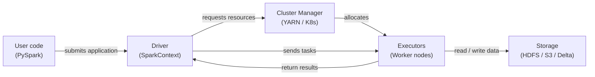

# Apache Spark

## 定义

Apache Spark 是一个专为大规模数据处理而设计的开源分布式计算引擎。它于 2009 年在 UC Berkeley 的 AMPLab 创建，并捐赠给 Apache 软件基金会，在那里它成为大数据分析的主导框架。Spark 在机器集群上以内存方式执行计算，对于迭代工作负载，其性能远超基于磁盘的前身（如 Hadoop MapReduce）——这一特性使其特别适合机器学习。

Spark 为四种主要工作负载提供统一的 API：批处理、SQL 分析、流处理（Structured Streaming）和机器学习（MLlib）。

## 工作原理

### RDD 和 DataFrame

弹性分布式数据集（RDD）是 Spark 的低级抽象。**DataFrame**（以及 Scala/Java 中的类型化对应物 Dataset）在 RDD 之上添加了命名模式并公开了类似 SQL 的 API。Catalyst 优化器可以对 DataFrame 查询应用谓词下推、列修剪和 join 重排序。

### Spark SQL

Spark SQL 允许使用标准 SQL 语法查询 DataFrame，在同一程序中混合 SQL 和 DataFrame API 调用。

### MLlib

MLlib 是 Spark 的分布式机器学习库。Pipeline API（`pyspark.ml`）反映了 scikit-learn 的设计：`Transformer` 步骤（缩放器、编码器）和 `Estimator` 步骤（模型拟合）被链接成可以拟合和序列化的 `Pipeline` 对象。

### Driver 和 Executor 架构

Spark 应用程序有一个 **driver** 进程和一个或多个 **executor** 进程。Driver 运行用户程序，构建逻辑计划，并将工作划分为**任务**。



## 何时使用 / 何时不使用

| 使用时机 | 避免时机 |
|---|---|
| 数据集无法放入单台机器的 RAM（> ~50 GB） | 数据可以舒适地放在内存中——pandas 或 Polars 会更快 |
| 特征工程需要在数十亿行上进行 join 或聚合 | 您的团队缺乏分布式系统和集群管理经验 |
| 您需要分布式 ML 训练（MLlib）或超参数搜索 | Job 启动开销对延迟敏感型任务不可接受 |
| 您已经有 Spark 集群（Databricks、EMR、Dataproc） | 您需要实时亚秒级处理 |

## 对比

| 标准 | Apache Spark | Pandas |
|---|---|---|
| 数据规模 | 拍字节——跨集群分区 | 吉字节——受单机 RAM 限制 |
| 执行模型 | 分布式、并行、惰性评估 | 进程内、即时、默认单线程 |
| 配置复杂性 | 高 | 低 |
| 小数据性能 | 由于序列化和任务调度开销而较慢 | 快速——最小开销 |

## 优缺点

| 优点 | 缺点 |
|---|---|
| 无需更改代码即可扩展到拍字节 | 显著的基础设施和运营复杂性 |
| 批处理、SQL 和流式处理的统一引擎 | JVM 启动和任务调度增加延迟——不适合小型作业 |
| 内存处理比基于磁盘的 MapReduce 快得多 | 内存管理（溢出、GC 压力）需要仔细调优 |
| 丰富的生态系统：Delta Lake、Iceberg、Hudi、MLflow | PySpark 通过 Py4J 序列化 Python UDF——自定义逻辑可能较慢 |

## 代码示例

```python
from pyspark.sql import SparkSession
from pyspark.sql import functions as F
from pyspark.ml import Pipeline
from pyspark.ml.feature import VectorAssembler, StandardScaler, StringIndexer
from pyspark.ml.classification import LogisticRegression
from pyspark.ml.evaluation import BinaryClassificationEvaluator

spark = (
    SparkSession.builder
    .appName("MLPipelineExample")
    .master("local[*]")
    .config("spark.sql.shuffle.partitions", "8")
    .getOrCreate()
)

raw_df = spark.createDataFrame(
    [(1, 25.0, "engineer", 55000.0, 0), (2, 32.0, "manager", 85000.0, 1),
     (3, 28.0, "engineer", 62000.0, 0), (4, 45.0, "manager", 110000.0, 1),
     (5, 38.0, "analyst", 72000.0, 1), (6, 22.0, "analyst", 48000.0, 0)],
    schema=["id", "age", "role", "salary", "high_earner"],
)

feature_df = raw_df.withColumn("log_salary", F.log1p(F.col("salary"))).drop("salary")

role_indexer = StringIndexer(inputCol="role", outputCol="role_idx")
assembler = VectorAssembler(inputCols=["age", "log_salary", "role_idx"], outputCol="raw_features")
scaler = StandardScaler(inputCol="raw_features", outputCol="features", withMean=True, withStd=True)
lr = LogisticRegression(featuresCol="features", labelCol="high_earner", maxIter=100, regParam=0.01)

pipeline = Pipeline(stages=[role_indexer, assembler, scaler, lr])
train_df, test_df = raw_df.randomSplit([0.8, 0.2], seed=42)
model = pipeline.fit(train_df)

predictions = model.transform(test_df)
evaluator = BinaryClassificationEvaluator(labelCol="high_earner")
auc = evaluator.evaluate(predictions)
print(f"=== AUC on test set: {auc:.4f} ===")

model.write().overwrite().save("/tmp/spark_lr_model")
spark.stop()
```

## 实用资源

- [Apache Spark 文档](https://spark.apache.org/docs/latest/) — 包括 PySpark、SQL、Streaming 和 MLlib 在内的所有 API 的官方参考。
- [PySpark API 参考](https://spark.apache.org/docs/latest/api/python/) — DataFrame、SQL 和 MLlib 的完整 Python API 文档。
- [Databricks — Spark 教程](https://docs.databricks.com/en/getting-started/index.html) — 使用 Spark 和 Delta Lake 的实践笔记本。
- [Learning Spark, 2nd edition (O'Reilly)](https://www.oreilly.com/library/view/learning-spark-2nd/9781492050032/) — 涵盖 Spark 3.x 的综合书籍。

## 另请参阅

- [数据管道](/docs/mlops/data-engineering)
- [Apache Kafka](/docs/mlops/data-engineering/kafka)
- [Apache Airflow](/docs/mlops/data-engineering/airflow)
