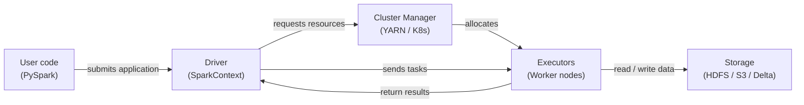

# Apache Spark

## 定义

Apache Spark 是一个开源的分布式计算引擎，专为大规模数据处理而设计。它于 2009 年在加州大学伯克利分校的 AMPLab 创建，并捐赠给 Apache 软件基金会，成为大数据分析的主导框架。Spark 在机器集群中将计算在内存中执行，对于迭代工作负载，其性能远超基于磁盘的前辈，如 Hadoop MapReduce——这一特性使其特别适合机器学习。

Spark 为四种主要工作负载提供统一的 API：批处理、SQL 分析、流处理（Structured Streaming）和机器学习（MLlib）。这种统一意味着团队可以使用单一集群和单一编程模型处理整个 ML 数据管道——从 PB 级别的原始日志摄取和特征工程，一直到使用 MLlib 的分布式模型训练。PySpark（Python API）是数据科学社区中使用最广泛的接口。

编程模型围绕分布式集合上的转换和操作构建。转换（map、filter、join、groupBy）是惰性的——它们构建执行计划，但直到操作（count、collect、write）被调用时才运行。Spark 的优化器（Catalyst）在执行前重写并优化此计划，通常胜过手动调优的 SQL。结果是一个富有表达力的高级 API，从笔记本电脑（本地模式）扩展到数千个核心无需更改代码。

## 工作原理

### RDD 和 DataFrame

弹性分布式数据集（RDD）是 Spark 的低级抽象：跨集群分布的不可变、容错、分区记录集合。RDD 在 Python、Scala 或 Java 中支持任意转换，但没有模式信息，因此优化器对数据的可见性有限。**DataFrame**（以及在 Scala/Java 中其类型化的对应物 Dataset）在 RDD 之上添加了命名模式，并暴露了类似 SQL 的 API。Catalyst 优化器可以对 DataFrame 查询应用谓词下推（predicate pushdown）、列裁剪（column pruning）和连接重排序（join reordering），这是原始 RDD 无法实现的。在实践中，除非你需要只有 RDD 才能暴露的功能，否则使用 DataFrame。

### Spark SQL

Spark SQL 允许你用标准 SQL 语法查询 DataFrame，在同一程序中混合 SQL 和 DataFrame API 调用。它连接到 Hive Metastore、Delta Lake、Iceberg 和其他表格格式，使 Spark 能够充当数据湖仓上的查询引擎。在 ML 管道中，Spark SQL 用于特征聚合查询——跨大型表的滚动窗口、用户级聚合和连接操作——这在单机上会非常慢。

### MLlib

MLlib 是 Spark 的分布式机器学习库。它提供分类、回归、聚类、协同过滤和特征工程的算法，所有算法都实现为在集群中并行运行。Pipeline API（`pyspark.ml`）反映了 scikit-learn 的设计：`Transformer` 步骤（缩放器、编码器）和 `Estimator` 步骤（模型拟合）被链接到一个可以拟合和序列化的 `Pipeline` 对象中。当训练数据太大而无法装入单机内存时，或者当需要通过 `CrossValidator` 进行分布式超参数调优时，MLlib 最为适用。

### Driver 和 Executor 架构

Spark 应用程序有一个 **driver** 进程和一个或多个 **executor** 进程。Driver 运行用户程序，构建逻辑计划，与集群管理器（YARN、Kubernetes 或 Spark Standalone）协商资源，并将工作划分为**任务**。Executor 是运行在工作节点上的 JVM 进程；每个 executor 持有可配置数量的 CPU 核心和内存槽（任务槽）。任务被序列化并发送给 executor，executor 处理其分配的数据分区，并将结果写回内存、磁盘或输出槽。通过重新计算丢失的分区（产生它们的转换序列）来实现容错性。



## 何时使用 / 何时不使用

| 适合使用 | 避免使用 |
|----------|------------|
| 数据集不适合单机 RAM（> ~50 GB） | 数据能舒适地放入内存——pandas 或 Polars 会更快 |
| 特征工程需要跨数十亿行的连接或聚合 | 团队缺乏分布式系统和集群管理经验 |
| 需要分布式 ML 训练（MLlib）或超参数搜索 | 作业启动开销（JVM、集群分配）对延迟敏感任务不可接受 |
| 已经有 Spark 集群（Databricks、EMR、Dataproc） | 需要实时、亚秒级处理（使用 Flink 或 Kafka Streams） |
| 需要一个用于相同数据的批处理、SQL 和流处理的统一引擎 | 转换是复杂的自定义逻辑，受益于单线程调试 |

## 比较

| 标准 | Apache Spark | Pandas |
|-----------|-------------|--------|
| 数据规模 | PB 级——跨集群分区 | GB 级——受单机 RAM 限制 |
| 执行模型 | 分布式、并行、惰性求值 | 进程内、即时求值、默认单线程 |
| 设置复杂性 | 高——集群、JVM、依赖管理 | 低——`pip install pandas` 然后运行 |
| 小数据性能 | 慢——序列化和任务调度开销 | 快——最小开销，缓存友好 |
| API 熟悉度 | PySpark 类似 pandas，但具有分布式语义 | 广为人知；Python 数据科学的标准 |
| ML 集成 | MLlib 用于分布式训练；与 Spark 上的 XGBoost 集成 | scikit-learn 生态系统；单机 ML 的最佳选择 |

## 优缺点

| 优点 | 缺点 |
|------|------|
| 无需更改代码即可扩展到 PB 级别 | 显著的基础设施和运营复杂性 |
| 批处理、SQL 和流处理的统一引擎 | JVM 启动和任务调度增加延迟——不适合小型作业 |
| 内存处理比基于磁盘的 MapReduce 快得多 | 内存管理（溢出、GC 压力）需要仔细调优 |
| 丰富的生态系统：Delta Lake、Iceberg、Hudi、MLflow 集成 | PySpark 通过 Py4J 序列化 Python UDF——自定义逻辑可能很慢 |
| 通过血缘重计算实现容错性 | 调试分布式作业比单机 pandas 代码更难 |

## 代码示例

```python
"""
PySpark examples:
  1. DataFrame operations for feature engineering at scale
  2. MLlib Pipeline for training a logistic regression model

Requires: pyspark >= 3.4
Run locally with: spark-submit spark_ml_example.py
  or in a notebook with a SparkSession already available.
"""

from pyspark.sql import SparkSession
from pyspark.sql import functions as F
from pyspark.sql.types import DoubleType
from pyspark.ml import Pipeline
from pyspark.ml.feature import VectorAssembler, StandardScaler, StringIndexer
from pyspark.ml.classification import LogisticRegression
from pyspark.ml.evaluation import BinaryClassificationEvaluator


# --- 1. Create a SparkSession (local mode for demo) ---
spark = (
    SparkSession.builder
    .appName("MLPipelineExample")
    .master("local[*]")           # Use all local CPU cores
    .config("spark.sql.shuffle.partitions", "8")  # Reduce for small data
    .getOrCreate()
)

spark.sparkContext.setLogLevel("WARN")


# --- 2. Load raw data ---
# In production: spark.read.parquet("s3://bucket/path/") or .format("delta")
raw_df = spark.createDataFrame(
    [
        (1, 25.0, "engineer", 55000.0, 0),
        (2, 32.0, "manager", 85000.0, 1),
        (3, 28.0, "engineer", 62000.0, 0),
        (4, 45.0, "manager", 110000.0, 1),
        (5, 38.0, "analyst", 72000.0, 1),
        (6, 22.0, "analyst", 48000.0, 0),
        (7, 51.0, "manager", 125000.0, 1),
        (8, 29.0, "engineer", 59000.0, 0),
    ],
    schema=["id", "age", "role", "salary", "high_earner"],
)

print("=== Raw data ===")
raw_df.show()


# --- 3. DataFrame feature engineering ---
feature_df = (
    raw_df
    # Log-transform salary to reduce skew
    .withColumn("log_salary", F.log1p(F.col("salary")))
    # Normalized age within role group (window function)
    .withColumn(
        "age_norm",
        (F.col("age") - F.mean("age").over(
            __import__("pyspark.sql.window", fromlist=["Window"])
            .Window.partitionBy("role")
        )).cast(DoubleType())
    )
    # Drop the original salary column (replaced by log_salary)
    .drop("salary")
)

print("=== Engineered features ===")
feature_df.show()


# --- 4. MLlib Pipeline: encode → assemble → scale → train ---

# 4a. Encode categorical column 'role' to numeric index
role_indexer = StringIndexer(inputCol="role", outputCol="role_idx")

# 4b. Assemble feature columns into a single vector
assembler = VectorAssembler(
    inputCols=["age", "log_salary", "role_idx"],
    outputCol="raw_features",
)

# 4c. Standardize feature vector (zero mean, unit variance)
scaler = StandardScaler(
    inputCol="raw_features",
    outputCol="features",
    withMean=True,
    withStd=True,
)

# 4d. Logistic regression classifier
lr = LogisticRegression(
    featuresCol="features",
    labelCol="high_earner",
    maxIter=100,
    regParam=0.01,
)

# 4e. Build and fit the pipeline
pipeline = Pipeline(stages=[role_indexer, assembler, scaler, lr])

# Use the raw_df (with salary) because VectorAssembler picks log_salary after transform
train_df, test_df = raw_df.randomSplit([0.8, 0.2], seed=42)
model = pipeline.fit(train_df)

# --- 5. Evaluate ---
predictions = model.transform(test_df)
evaluator = BinaryClassificationEvaluator(labelCol="high_earner")
auc = evaluator.evaluate(predictions)
print(f"=== AUC on test set: {auc:.4f} ===")

predictions.select("id", "high_earner", "prediction", "probability").show()

# --- 6. Save model for serving ---
model.write().overwrite().save("/tmp/spark_lr_model")
print("Model saved to /tmp/spark_lr_model")

spark.stop()
```

## 实践资源

- [Apache Spark 文档](https://spark.apache.org/docs/latest/) — 包括 PySpark、SQL、Streaming 和 MLlib 在内的所有 API 的官方参考
- [PySpark API 参考](https://spark.apache.org/docs/latest/api/python/) — DataFrame、SQL 和 MLlib 的完整 Python API 文档
- [Databricks — Spark 教程](https://docs.databricks.com/en/getting-started/index.html) — 涵盖 Delta Lake 大规模 Spark 使用的实践笔记本
- [Learning Spark，第 2 版（O'Reilly）](https://www.oreilly.com/library/view/learning-spark-2nd/9781492050032/) — 涵盖 Spark 3.x、Structured Streaming 和 Delta Lake 的综合书籍

## 另请参阅

- [数据管道](/docs/mlops/data-engineering)
- [Apache Kafka](/docs/mlops/data-engineering/kafka)
- [Apache Airflow](/docs/mlops/data-engineering/airflow)
