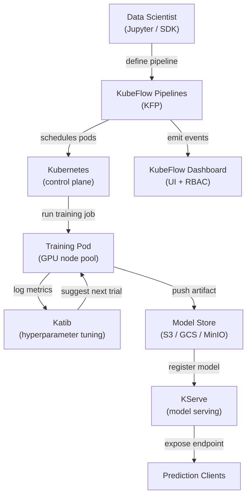

# KubeFlow

## 定义

KubeFlow 是一个开源 ML 工具包，旨在使 Kubernetes 上的 ML 工作流部署变得简单、可移植且可扩展。它最初由 Google 创建，现在是一个 Cloud Native Computing Foundation（CNCF）项目，在行业中得到广泛采用。KubeFlow 并不试图成为一个单一的整体平台；相反，它是一个精心策划的 Kubernetes 原生组件集合，每个组件解决一个不同的 ML 基础设施问题。

核心组件包括：**KubeFlow Pipelines（KFP）**，用于将基于 DAG 的 ML 工作流定义和运行为 Kubernetes 作业；**Katib**，用于使用贝叶斯优化、随机搜索或强化学习进行自动超参数调优和神经架构搜索；**KFServing（现为 KServe）**，用于具有无服务器扩缩容、金丝雀部署和多种服务运行时支持的可扩展模型服务；以及由 KubeFlow 仪表板管理的 **Jupyter Notebook Server**，用于多租户环境中的交互式开发。整个平台通过一套 Kubernetes 清单安装并通过 Web UI 管理。

KubeFlow 的优势在于它可以在任何 Kubernetes 集群上运行——本地、GKE、EKS、AKS 或本地 kind 集群——使其适合要求数据保留在其自己基础设施内的组织。其主要代价是运营复杂性：学习曲线陡峭，在生产环境中运行 KubeFlow 需要扎实的 Kubernetes 专业知识。

## 工作原理



### KubeFlow Pipelines（KFP）

KFP 允许数据科学家使用 KFP SDK 将 ML 管道定义为 Python 代码。每个管道步骤是一个容器化组件：用 `@dsl.component` 装饰的 Python 函数被编译成 KFP 作为 Kubernetes Pod 执行的容器规范。管道 DAG 被编译为 KFP 后端控制器在集群上调度的中间表示（IR YAML）文件。这种方法意味着每个步骤都是完全可重现的：容器镜像被固定，输入和输出作为制品追踪在 KFP 的元数据存储（ML Metadata / MLMD）中，整个执行图在 UI 中可见，每个步骤都有日志、输入、输出和状态。

### Katib——超参数调优

Katib 是 KubeFlow 的 AutoML 组件。它定义一个 `Experiment` Kubernetes 自定义资源，指定搜索空间（参数范围和类型）、目标指标（最小化损失、最大化准确率）以及搜索算法（通过高斯过程的贝叶斯优化、CMA-ES、随机搜索或网格搜索）。Katib 运行并行试验——每次试验是一次完整的训练作业——并使用结果为后续试验推荐更好的配置。与 KFP 的集成意味着完整的管道（数据 → 特征工程 → 训练 → 评估）可以被视为单个 Katib 试验，支持跨复杂管道的端到端 AutoML。

### KServe（前身为 KFServing）

KServe 用 `InferenceService` 自定义资源扩展 Kubernetes，以声明式方式定义模型服务部署。指定框架（sklearn、xgboost、pytorch、tensorflow、自定义）和模型 URI（S3 路径、PVC），KServe 负责：拉取模型、选择正确的服务运行时、配置 sidecar 代理、通过 Istio 暴露端点，以及在空闲时将副本缩容到零（无服务器模式）。金丝雀部署按百分比在两个模型版本之间分割流量，支持安全的滚动更新。转换器和解释器组件允许在预测器旁边插入预处理逻辑和基于 SHAP 的可解释性。

### 多租户和 RBAC

KubeFlow 仪表板通过 Kubernetes 命名空间实现多租户：每个用户或团队获得一个独立的命名空间，拥有自己的资源配额、Notebook 服务器和管道运行。基于角色的访问控制（RBAC）限制哪些用户可以查看、运行或管理管道和模型。这使 KubeFlow 适合多个团队共享单个 GPU 集群并需要隔离而无需独立集群的大型组织。

## 何时使用 / 何时不使用

| 适合使用 | 避免使用 |
|---|---|
| 在现有 Kubernetes 集群上运行 ML 工作负载 | 团队没有 Kubernetes 专业知识且没有专职平台工程师 |
| 需要在一个平台中完成管道编排、AutoML 和服务 | 托管服务（SageMaker、Vertex AI）适合云提供商策略 |
| 数据驻留要求阻止使用托管云 ML 服务 | 只需要模型服务，不需要完整管道编排 |
| 组织运行具有多租户需求的共享 GPU 集群 | ML 工作流足够简单，单个训练脚本即可 |
| 需要高级服务功能（无服务器扩缩容、金丝雀、转换器） | 快速上线时间比基础设施控制更重要 |

## 比较

| 标准 | KubeFlow | 原生 Kubernetes 上的 ML |
|---|---|---|
| 复杂性 | 高——许多 CRD、控制器和 Istio 依赖 | 中等——仅标准 Kubernetes 对象 |
| 功能 | 管道、AutoML（Katib）、服务（KServe）、Notebook 管理 | 手动构建和配置的任何内容 |
| 学习曲线 | 陡峭——需要 Kubernetes + KubeFlow 领域知识 | 中等——标准 K8s 知识已足够 |
| 灵活性 | 中等——可扩展但受限于 KubeFlow 抽象 | 高——完全控制每个 Kubernetes 资源 |
| 托管选项 | GKE 上的 KubeFlow（Vertex AI Pipelines）、AWS 托管 KubeFlow | 任何托管 Kubernetes（EKS、GKE、AKS） |
| 设置时间 | 生产级安装需要数天到数周 | 根据工作负载复杂性需要数小时到数天 |

## 优缺点

| 优点 | 缺点 |
|---|---|
| 统一 ML 平台——管道、调优、服务集于一体 | 极高的运营复杂性和大量移动部件 |
| 云无关——在任何 Kubernetes 集群上运行 | 陡峭的学习曲线；需要 Kubernetes 专业知识来运维 |
| 自动缩容到零的无服务器模型服务 | 资源密集型安装（Istio、Argo Workflows、MLMD、Knative） |
| 通过命名空间隔离和 RBAC 实现强大的多租户 | KubeFlow 版本之间的升级可能涉及复杂操作 |
| 活跃的 CNCF 社区和广泛的生态系统集成 | 调试故障通常需要理解多个层面（K8s → Argo → Python SDK） |

## 代码示例

```python
# kubeflow_pipeline.py
# KubeFlow Pipelines v2 SDK — defines a two-step ML pipeline:
#   1. Data preprocessing component
#   2. Training component
# Requires: pip install kfp==2.*

from kfp import dsl
from kfp.client import Client


# --- Component 1: Preprocess raw CSV data ---

@dsl.component(
    base_image="python:3.11-slim",
    packages_to_install=["pandas==2.2.0", "scikit-learn==1.4.0"],
)
def preprocess(
    raw_data_path: str,
    output_features: dsl.Output[dsl.Dataset],
) -> None:
    """
    Reads raw CSV, applies feature engineering, and writes features as Parquet.
    KFP tracks output_features as a Dataset artifact with URI and metadata.
    """
    import pandas as pd
    from sklearn.preprocessing import StandardScaler

    df = pd.read_csv(raw_data_path)

    # Simple feature engineering: scale numeric columns
    scaler = StandardScaler()
    numeric_cols = df.select_dtypes("number").columns.tolist()
    df[numeric_cols] = scaler.fit_transform(df[numeric_cols])

    # KFP provides output_features.path — write artifact there
    df.to_parquet(output_features.path, index=False)
    print(f"Wrote {len(df)} rows to {output_features.path}")


# --- Component 2: Train a model on the preprocessed features ---

@dsl.component(
    base_image="python:3.11-slim",
    packages_to_install=["pandas==2.2.0", "scikit-learn==1.4.0", "joblib==1.3.0"],
)
def train(
    features: dsl.Input[dsl.Dataset],
    n_estimators: int,
    model_output: dsl.Output[dsl.Model],
    metrics_output: dsl.Output[dsl.Metrics],
) -> None:
    """
    Trains a RandomForestClassifier and writes the model artifact + metrics.
    """
    import json
    import joblib
    import pandas as pd
    from sklearn.ensemble import RandomForestClassifier
    from sklearn.model_selection import train_test_split
    from sklearn.metrics import accuracy_score

    df = pd.read_parquet(features.path)
    X = df.drop(columns=["label"]).values
    y = df["label"].values
    X_train, X_test, y_train, y_test = train_test_split(X, y, test_size=0.2, random_state=42)

    clf = RandomForestClassifier(n_estimators=n_estimators, random_state=42)
    clf.fit(X_train, y_train)

    accuracy = float(accuracy_score(y_test, clf.predict(X_test)))

    # Write model artifact (KFP tracks the URI and lineage)
    joblib.dump(clf, model_output.path)

    # Log metrics — visible in the KubeFlow Pipelines UI
    metrics_output.log_metric("accuracy", accuracy)
    metrics_output.log_metric("n_estimators", n_estimators)
    print(f"Accuracy: {accuracy:.4f}")


# --- Pipeline definition ---

@dsl.pipeline(
    name="fraud-detection-pipeline",
    description="Two-stage pipeline: preprocess CSV data, then train RandomForest.",
)
def fraud_pipeline(
    raw_data_path: str = "gs://my-bucket/data/train.csv",
    n_estimators: int = 100,
) -> None:
    # Step 1: preprocess — runs in its own pod
    preprocess_task = preprocess(raw_data_path=raw_data_path)

    # Step 2: train — depends on the Dataset artifact from step 1
    train_task = train(
        features=preprocess_task.outputs["output_features"],
        n_estimators=n_estimators,
    )
    # Assign this task to a node pool with GPU (optional resource request)
    train_task.set_accelerator_type("NVIDIA_TESLA_T4").set_accelerator_limit(1)


# --- Submit the pipeline to a running KubeFlow Pipelines instance ---

if __name__ == "__main__":
    # Connect to KFP backend (port-forward: kubectl port-forward -n kubeflow svc/ml-pipeline 8888:8888)
    client = Client(host="http://localhost:8888")

    run = client.create_run_from_pipeline_func(
        pipeline_func=fraud_pipeline,
        arguments={
            "raw_data_path": "gs://my-bucket/data/train.csv",
            "n_estimators": 200,
        },
        run_name="fraud-pipeline-run-v1",
        experiment_name="fraud-detection",
    )
    print(f"Pipeline run created: {run.run_id}")
    print(f"View at: http://localhost:8888/#/runs/details/{run.run_id}")
```

## 实践资源

- [KubeFlow 官方文档](https://www.kubeflow.org/docs/) — 架构概述、组件指南和安装说明。
- [KubeFlow Pipelines SDK 参考](https://kubeflow-pipelines.readthedocs.io/) — KFP v2 Python SDK 的完整 API 参考。
- [KServe 文档](https://kserve.github.io/website/) — 服务运行时、InferenceService 规范和金丝雀滚动更新指南。
- [Katib 超参数调优指南](https://www.kubeflow.org/docs/components/katib/overview/) — 实验规范、搜索算法以及与训练算子的集成。

## 另请参阅

- [Kubernetes 上的 ML](/docs/mlops/deployment/ml-kubernetes)
- [模型服务（Model serving）](/docs/mlops/deployment/model-serving)
- [监控（Monitoring）](/docs/mlops/monitoring)
