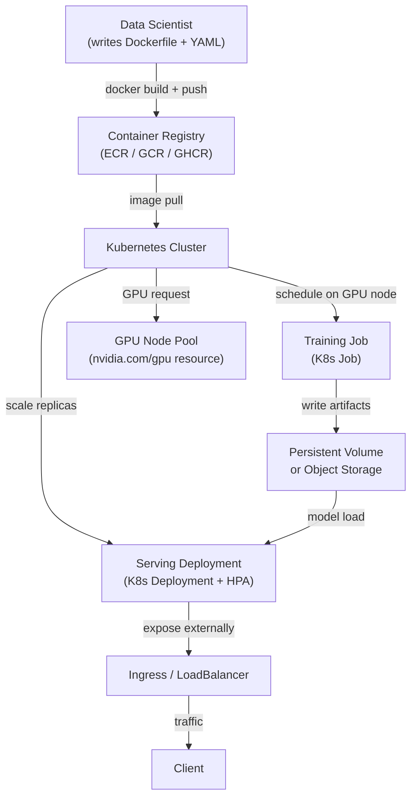

# Kubernetes 上的 ML

## 定义

Kubernetes（K8s）是一个容器编排平台，用于自动化容器化工作负载的部署、扩缩容和管理。虽然 Kubernetes 是为无状态 Web 服务设计的，但 ML 社区已将其广泛采用作为训练作业、批量评分和模型服务的基础设施骨干——因为它解决了最难的 ML 基础设施问题：资源隔离、可重现环境、GPU 调度和水平扩展。

在原生 Kubernetes 上运行 ML——无需像 [KubeFlow](/docs/mlops/deployment/kubeflow) 这样的高级抽象——意味着组合标准 Kubernetes 原语：`Job` 用于一次性训练运行，`CronJob` 用于定时重训练，`Deployment` 用于长时间运行的服务实例，以及 `HorizontalPodAutoscaler` 用于自动扩缩容。这种方法让团队对工作负载的每个方面拥有完全控制权，代价是更多的 YAML 编写和较少的内置 ML 专用工具。

与在裸机虚拟机上运行 ML 的关键区别在于 Kubernetes 提供声明式资源管理：你指定训练作业需要多少 CPU、RAM 和 GPU，调度器会自动将其放置在合适的节点上。Kubernetes 还可以处理节点故障、Pod 重启和滚动部署，无需手动干预。对于已经运行 Kubernetes 集群（或所在组织有集群）的 ML 团队，这通常是在投资 KubeFlow 等完整平台之前走向生产的务实路径。

## 工作原理



### 容器化 ML 模型

在 Kubernetes 上运行 ML 的第一步是将模型代码及其依赖项打包到 Docker 镜像中。结构良好的 ML Dockerfile 使用多阶段构建来分离依赖安装层（很少更改且可缓存）和应用代码层（频繁更改）。基础镜像应该固定到特定版本——对于 GPU 工作负载，NVIDIA 提供包含预安装和验证过的 CUDA、cuDNN 和 NCCL 的 `nvcr.io/nvidia/pytorch` 和 `nvcr.io/nvidia/tensorflow` 基础镜像。生成的镜像被推送到容器注册表，并在 Kubernetes 清单中通过名称和摘要（而非 `latest`）引用，确保每次都使用完全相同的环境。

### GPU 调度和资源管理

Kubernetes 通过 NVIDIA 设备插件支持 GPU 调度，该插件将 GPU 暴露为可调度资源（`nvidia.com/gpu`）。请求 `nvidia.com/gpu: 1` 的 Pod 只会被调度到有空闲 GPU 的节点上，GPU 在其生命周期内被独占分配给该 Pod。节点池通常配置不同类型的 GPU（用于推断的 T4，用于大型训练作业的 A100），并相应地打标签，允许 Pod 使用 `nodeSelector` 或 `nodeAffinity` 定向到适当的硬件。命名空间级别的资源配额防止任何单个团队垄断集群的 GPU 容量。

### 训练作业

一次性训练运行表示为 Kubernetes `Job` 对象。Job 创建一个或多个 Pod，等待它们成功完成（退出码 0），并记录结果。对于跨多个 GPU 或节点的分布式训练，`training-operator`（前身为 KubeFlow 训练算子，但可独立部署）使用 `PyTorchJob` 和 `TFJob` 自定义资源扩展 Kubernetes，通过 PyTorch DDP 或 Horovod 协调多节点、多 GPU 训练。每个工作节点 Pod 获得相同的容器镜像，但有不同的 rank 和 world-size 环境变量，支持自动 rendezvous 的数据并行训练。

### 服务部署和自动扩缩容

模型服务表示为具有所需副本数和资源请求/限制的 Kubernetes `Deployment`。`ClusterIP` 类型的 `Service` 在副本之间路由流量，`Ingress` 或 `LoadBalancer` 服务对外暴露端点。`HorizontalPodAutoscaler`（HPA）根据 CPU 利用率、自定义指标（例如来自 Prometheus 的每秒请求数）或外部指标（例如批量工作节点的 SQS 队列深度）缩放副本数量。对于延迟敏感的服务，`PodDisruptionBudget` 确保滚动更新永远不会同时下线超过可配置比例的副本。

## 何时使用 / 何时不使用

| 适合使用 | 避免使用 |
|---|---|
| 组织已经运行 Kubernetes 集群 | 团队没有 Kubernetes 经验且没有平台团队支持 |
| 需要完全控制基础设施（本地、气隔离环境） | 托管 ML 服务（SageMaker、Vertex AI）可用且适合用例 |
| ML 工作负载必须与其他工程工作负载共享集群 | VM 或云训练作业的简单性已经足够 |
| 需要 GPU 调度而无需完整 ML 平台的开销 | K8s 的设置和维护成本超过了运营收益 |
| 跨云提供商的可移植性是硬性要求 | 需要 AutoML、实验追踪或多租户（考虑 KubeFlow） |

## 比较

| 标准 | 原生 Kubernetes 上的 ML | KubeFlow |
|---|---|---|
| 复杂性 | 中等——标准 K8s 对象 | 高——许多 CRD、Istio、Argo、MLMD |
| 功能 | 手动——构建你需要的 | 内置管道、AutoML（Katib）、服务（KServe）、Notebook |
| 学习曲线 | 中等——K8s 知识已足够 | 陡峭——需要在 K8s 之上的 KubeFlow 专业知识 |
| 灵活性 | 高——不受限制地使用 K8s 原语 | 中等——受限于 KubeFlow 抽象 |
| 托管选项 | EKS、GKE、AKS（任何托管 K8s） | Vertex AI Pipelines（基于 GKE）、AWS 托管 KubeFlow |
| 设置时间 | 数小时到数天 | 数天到数周 |

## 优缺点

| 优点 | 缺点 |
|---|---|
| 完全控制——使用任何 K8s 资源无框架约束 | 所有 ML 专用工具（管道 UI、实验追踪）必须单独添加 |
| 使用 training-operator 进行 GPU 调度和多节点训练 | YAML 密集——清单编写可能繁琐且容易出错 |
| 在任何云或本地集群上运行（无供应商锁定） | K8s 上的 GPU 调试需要熟悉节点污点、限制和设备插件 |
| 使用标准 K8s HPA 进行滚动部署和自动扩缩容 | 资源配额和节点亲和性配置需要平台团队参与 |
| 适合现有 GitOps 工作流（Argo CD、Flux） | 没有内置的模型注册表、实验追踪器或管道 UI |

## 代码示例

```dockerfile
# Dockerfile — Multi-stage build for an ML model serving image
# Stage 1: install Python dependencies (cacheable layer)
# Stage 2: copy application code on top

# --- Stage 1: dependency builder ---
FROM python:3.11-slim AS builder

WORKDIR /build

# Install build tools and compile dependencies
RUN apt-get update && apt-get install -y --no-install-recommends \
    gcc \
    libgomp1 \
 && rm -rf /var/lib/apt/lists/*

COPY requirements.txt .
# Install dependencies into an isolated prefix so we can copy only them to the final image
RUN pip install --prefix=/install --no-cache-dir -r requirements.txt


# --- Stage 2: lean runtime image ---
FROM python:3.11-slim AS runtime

WORKDIR /app

# Copy only the installed packages from the builder (keeps image small)
COPY --from=builder /install /usr/local

# Copy application source code
COPY src/ ./src/

# The model artifact is mounted via a Kubernetes PersistentVolumeClaim or downloaded at startup
# It is NOT baked into the image to keep image size manageable
ENV MODEL_PATH=/models/model.joblib
ENV MODEL_VERSION=unknown
ENV PORT=8080

EXPOSE 8080

# Run as non-root for security best practices
RUN useradd -m appuser
USER appuser

CMD ["python", "-m", "uvicorn", "src.fastapi_serving:app", "--host", "0.0.0.0", "--port", "8080"]
```

```yaml
# k8s-manifests.yaml
# Three Kubernetes resources:
#   1. Deployment — runs the model serving pods
#   2. Service — routes traffic to the pods
#   3. HorizontalPodAutoscaler — scales replicas based on CPU usage

---
apiVersion: apps/v1
kind: Deployment
metadata:
  name: fraud-detector
  namespace: ml-serving
  labels:
    app: fraud-detector
    version: v1
spec:
  replicas: 2
  selector:
    matchLabels:
      app: fraud-detector
  strategy:
    type: RollingUpdate
    rollingUpdate:
      maxSurge: 1          # allow one extra pod during rollout
      maxUnavailable: 0    # never take a pod down before a new one is ready
  template:
    metadata:
      labels:
        app: fraud-detector
        version: v1
    spec:
      # Pull the model from an init container instead of baking it into the image
      initContainers:
        - name: download-model
          image: amazon/aws-cli:2.15.0
          command:
            - aws
            - s3
            - cp
            - s3://my-ml-bucket/models/fraud-detector/v1/model.joblib
            - /models/model.joblib
          env:
            - name: AWS_REGION
              value: us-east-1
          volumeMounts:
            - name: model-volume
              mountPath: /models

      containers:
        - name: serving
          image: ghcr.io/org/fraud-detector:sha-abc1234  # pinned by digest, not latest
          ports:
            - containerPort: 8080
          env:
            - name: MODEL_PATH
              value: /models/model.joblib
            - name: MODEL_VERSION
              value: v1
          resources:
            requests:
              cpu: "500m"
              memory: "512Mi"
            limits:
              cpu: "1"
              memory: "1Gi"
              # Uncomment for GPU-based inference:
              # nvidia.com/gpu: "1"
          volumeMounts:
            - name: model-volume
              mountPath: /models
          # Liveness probe — restart if the app hangs
          livenessProbe:
            httpGet:
              path: /health
              port: 8080
            initialDelaySeconds: 15
            periodSeconds: 10
          # Readiness probe — do not send traffic until model is loaded
          readinessProbe:
            httpGet:
              path: /health
              port: 8080
            initialDelaySeconds: 10
            periodSeconds: 5

      volumes:
        - name: model-volume
          emptyDir: {}  # ephemeral volume shared between init and main containers

---
apiVersion: v1
kind: Service
metadata:
  name: fraud-detector
  namespace: ml-serving
spec:
  selector:
    app: fraud-detector
  ports:
    - name: http
      port: 80
      targetPort: 8080
  type: ClusterIP

---
apiVersion: autoscaling/v2
kind: HorizontalPodAutoscaler
metadata:
  name: fraud-detector-hpa
  namespace: ml-serving
spec:
  scaleTargetRef:
    apiVersion: apps/v1
    kind: Deployment
    name: fraud-detector
  minReplicas: 2
  maxReplicas: 10
  metrics:
    - type: Resource
      resource:
        name: cpu
        target:
          type: Utilization
          averageUtilization: 70   # scale out when average CPU exceeds 70%
```

```bash
# Useful kubectl commands for ML workloads on Kubernetes

# Check GPU node availability and allocatable GPUs
kubectl get nodes -l accelerator=nvidia-tesla-t4 -o custom-columns="NODE:.metadata.name,GPU:.status.allocatable.nvidia\.com/gpu"

# Watch pod startup (useful for debugging model download in init containers)
kubectl logs -n ml-serving deploy/fraud-detector -c download-model --follow

# View resource usage of serving pods
kubectl top pods -n ml-serving -l app=fraud-detector

# Scale the deployment manually (overrides HPA temporarily)
kubectl scale deploy/fraud-detector -n ml-serving --replicas=4

# Trigger a rolling update with a new image
kubectl set image deploy/fraud-detector serving=ghcr.io/org/fraud-detector:sha-def5678 -n ml-serving

# Watch rollout status
kubectl rollout status deploy/fraud-detector -n ml-serving
```

## 实践资源

- [Kubernetes 官方文档](https://kubernetes.io/docs/) — 所有 Kubernetes 概念和 API 对象的综合参考。
- [NVIDIA GPU Operator for Kubernetes](https://docs.nvidia.com/datacenter/cloud-native/gpu-operator/overview.html) — 自动化 K8s 节点上 GPU 驱动程序、设备插件和监控的设置。
- [KubeFlow 训练算子](https://www.kubeflow.org/docs/components/training/) — PyTorchJob、TFJob 和 MPI 分布式训练的独立 CRD（可在不安装完整 KubeFlow 的情况下部署）。
- [Kubernetes HPA 文档](https://kubernetes.io/docs/tasks/run-application/horizontal-pod-autoscale/) — CPU、内存和自定义指标自动扩缩容的官方指南。

## 另请参阅

- [KubeFlow](/docs/mlops/deployment/kubeflow)
- [模型服务（Model serving）](/docs/mlops/deployment/model-serving)
- [用于 ML 基础设施的 Terraform](/docs/mlops/iac/terraform)
