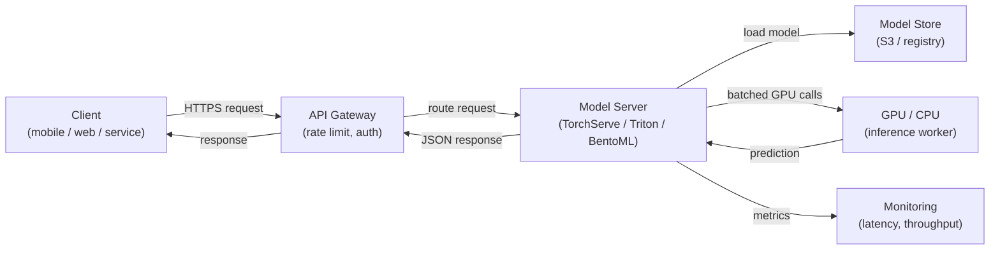

# 模型服务

## 定义

模型服务（model serving）是使训练好的 ML 模型可用于推断的过程——接受输入数据、运行预测并将结果返回给调用者。它是训练和实验的离线世界与生产应用的在线世界之间的桥梁。设计良好的服务层与模型质量同样重要：一个 98% 准确率但延迟 10 秒的模型，在产品场景中通常毫无用处。

模型服务涵盖三种在延迟、吞吐量和基础设施需求上根本不同的模式。**批量推断**（Batch inference）按计划处理大量数据，将预测写入数据库或文件；它是吞吐量最高的选项，但无法实时响应单个请求。**实时（在线）推断**（Real-time inference）暴露一个在毫秒内返回预测的 API 端点；它优先考虑低延迟而非吞吐量。**流处理推断**（Streaming inference）在事件从队列或流到达时处理它们，在延迟和复杂性方面介于批处理和实时之间。

扩展模型服务系统涉及 ML 特有的挑战：模型通常是被加载到内存（或 GPU 显存）中的大文件，启动时间对自动扩缩容很重要，GPU 利用率必须最大化才能具有成本效益，预测延迟在负载下具有不可预测的尾部分布。NVIDIA Triton Inference Server、TorchServe 和 BentoML 等框架专门用于解决这些挑战。

## 工作原理



### 批量推断

在批量推断中，定时作业（cron、Airflow DAG 或云调度器）从存储中读取数据集，对整个集合运行预测，并将结果写回。每次作业运行时模型只加载一次，因此加载的每次预测摊销成本可以忽略不计。这种模式适用于生成夜间推荐、为所有客户评分流失风险或为数据仓库注释预测情感等用例。主要的扩展杠杆是跨数据分区的并行性——每个分区可以由单独的工作进程处理。一个常见的陷阱是训练-服务偏差：批量评分脚本使用与训练管道不同的预处理逻辑。

### 实时 API 推断

实时服务将模型暴露在同步响应单个请求的 HTTP（或 gRPC）端点后面。关键工程挑战是延迟：模型加载很慢（大型模型需要几秒到几分钟），因此实例必须保持预热或预扩缩容。TorchServe 和 BentoML 等框架处理模型加载、请求反序列化、并发请求批处理（动态批处理）和健康检查。通过 Kubernetes 或托管服务（AWS SageMaker Endpoints、GCP Vertex AI Endpoints）进行水平扩展，在吞吐量超过阈值时添加副本。GPU 内存决定单个节点上可以运行多少模型副本，这直接驱动成本。

### 流处理推断

流处理推断将模型服务器连接到事件流（Kafka、Kinesis、Pub/Sub）。事件持续到达，预测被发送到输出主题。这种模式适合交易流上的欺诈检测、传感器数据上的实时异常检测，或任何需要在数百毫秒内对新事件评分但量太高无法进行同步 HTTP 的用例。模型服务器充当消费者-生产者：它从输入主题读取，运行推断，并写入输出主题。背压管理至关重要——在流量高峰期间，消费者必须不落后于生产者。

### 扩缩容考虑

GPU 调度是大型模型的主要成本因素。关键杠杆包括：**动态批处理**（将多个请求累积到单个 GPU 调用中）、**模型量化**（将精度从 FP32 降低到 INT8，以便每个 GPU 放置更多模型）、**模型缓存**（跨请求将模型保留在 VRAM 中）和**自动扩缩容**（基于队列深度或延迟 SLO 添加或删除副本）。Triton Inference Server 通过每个模型的声明式配置文件支持所有这些，使其成为生产中异构模型队列的首选。

## 何时使用 / 何时不使用

| 适合使用 | 避免使用 |
|---|---|
| 下游应用需要在请求时获得预测 | 所有消费者都可以容忍提前数小时计算的预测 |
| 预测必须立即反映最新的模型版本 | 数据集足够小，可以在夜间批次中廉价评分 |
| 需要事件驱动的评分（流处理） | 模型仅用于离线分析，没有下游系统 |
| 模型推断成本高，必须最大化 GPU 利用率 | 原型阶段，直接调用简单脚本已经足够 |

## 比较

| 标准 | TorchServe | TF Serving | NVIDIA Triton | BentoML | FastAPI（自定义） |
|---|---|---|---|---|---|
| 框架支持 | PyTorch 原生 | TensorFlow/Keras | 多框架（ONNX、TF、PyTorch、TensorRT） | 框架无关 | 框架无关 |
| 动态批处理 | 是 | 是 | 是（高度可配置） | 是 | 手动实现 |
| gRPC 支持 | 是 | 是 | 是 | 是 | 通过 grpcio |
| GPU 优化 | 良好 | 良好 | 同类最佳 | 良好 | 手动 |
| 易用性 | 中等 | 中等 | 高（配置复杂） | 低（Python 原生） | 非常低 |
| 生产就绪性 | 高 | 高 | 非常高 | 高 | 取决于实现 |

## 优缺点

| 优点 | 缺点 |
|---|---|
| 将模型更新与应用代码发布解耦 | 比内联运行推断增加了基础设施复杂性 |
| 支持独立扩展推断容量 | 大型模型的冷启动延迟可能很显著 |
| 专用框架处理批处理、健康检查、版本管理 | GPU 实例昂贵；成本管理需要谨慎 |
| 原生支持 A/B 测试和金丝雀部署 | 流处理推断需要 Kafka/Kinesis 专业知识 |
| 延迟、吞吐量和预测漂移的监控钩子 | 模型-服务偏差（不同的预处理）是持久性风险 |

## 代码示例

```python
# fastapi_serving.py
# Production-ready FastAPI model serving endpoint with dynamic model loading,
# input validation via Pydantic, and health check endpoint.

from __future__ import annotations

import os
from contextlib import asynccontextmanager
from typing import List

import joblib
import numpy as np
import uvicorn
from fastapi import FastAPI, HTTPException
from pydantic import BaseModel, Field

# --- Input/output schemas ---

class PredictionRequest(BaseModel):
    """Input features for a single inference request."""
    features: List[float] = Field(
        ...,
        min_length=20,
        max_length=20,
        description="Exactly 20 numerical features (must match training schema).",
        example=[0.1, -0.5, 1.2] + [0.0] * 17,
    )


class PredictionResponse(BaseModel):
    label: int
    probability: float
    model_version: str


# --- Model lifecycle management ---

MODEL: dict = {}  # holds the loaded model and metadata


@asynccontextmanager
async def lifespan(app: FastAPI):
    """Load model at startup; release resources on shutdown."""
    model_path = os.environ.get("MODEL_PATH", "models/model.joblib")
    model_version = os.environ.get("MODEL_VERSION", "unknown")

    if not os.path.exists(model_path):
        raise RuntimeError(f"Model file not found at {model_path}")

    MODEL["clf"] = joblib.load(model_path)
    MODEL["version"] = model_version
    print(f"Model v{model_version} loaded from {model_path}")
    yield
    MODEL.clear()
    print("Model unloaded.")


# --- API definition ---

app = FastAPI(
    title="ML Model Serving API",
    description="Real-time inference endpoint for the fraud detection model.",
    version="1.0.0",
    lifespan=lifespan,
)


@app.get("/health")
def health() -> dict:
    """Liveness probe — returns 200 when the model is loaded."""
    if "clf" not in MODEL:
        raise HTTPException(status_code=503, detail="Model not loaded")
    return {"status": "ok", "model_version": MODEL["version"]}


@app.post("/predict", response_model=PredictionResponse)
def predict(request: PredictionRequest) -> PredictionResponse:
    """
    Run inference on a single input vector.
    Returns the predicted label and the positive-class probability.
    """
    clf = MODEL.get("clf")
    if clf is None:
        raise HTTPException(status_code=503, detail="Model not ready")

    X = np.array(request.features).reshape(1, -1)
    label = int(clf.predict(X)[0])
    probability = float(clf.predict_proba(X)[0][label])

    return PredictionResponse(
        label=label,
        probability=probability,
        model_version=MODEL["version"],
    )


if __name__ == "__main__":
    # For local testing: MODEL_PATH=models/model.joblib MODEL_VERSION=v1 python fastapi_serving.py
    uvicorn.run(app, host="0.0.0.0", port=8080, log_level="info")
```

```python
# client_example.py
# Simple client that calls the FastAPI serving endpoint

import httpx

BASE_URL = "http://localhost:8080"

# Health check
response = httpx.get(f"{BASE_URL}/health")
print(response.json())  # {"status": "ok", "model_version": "v1"}

# Prediction
payload = {"features": [0.1, -0.5, 1.2] + [0.0] * 17}
response = httpx.post(f"{BASE_URL}/predict", json=payload)
print(response.json())
# {"label": 1, "probability": 0.87, "model_version": "v1"}
```

## 实践资源

- [BentoML 文档](https://docs.bentoml.com/) — 框架无关的模型服务，内置批处理、容器化和部署集成。
- [NVIDIA Triton Inference Server](https://docs.nvidia.com/deeplearning/triton-inference-server/user-guide/docs/index.html) — 针对多框架模型队列的高性能 GPU 优化服务。
- [TorchServe 文档](https://pytorch.org/serve/) — 官方 PyTorch 模型服务解决方案，支持处理器自定义。
- [FastAPI 文档](https://fastapi.tiangolo.com/) — 广泛用于自定义 ML 服务 API 的现代高性能 Python Web 框架。

## 另请参阅

- [KubeFlow](/docs/mlops/deployment/kubeflow)
- [Kubernetes 上的 ML](/docs/mlops/deployment/ml-kubernetes)
- [监控（Monitoring）](/docs/mlops/monitoring)
