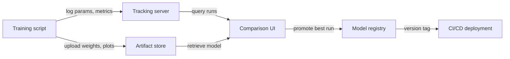

# 实验追踪

## 定义

实验追踪是系统地记录 ML 训练运行每个细节的实践，使结果可以被重现、比较和审计。没有它，团队会忘记哪些超参数产生了哪些结果，浪费计算资源去重新发现配置，并在模型影响高风险决策时无法证明合规性。

一条完整的实验记录捕获四类信息。**参数**（Parameters）是训练的输入：学习率、批量大小、模型架构选择、特征集。**指标**（Metrics）是输出：损失曲线、准确率、F1、AUC、延迟。**制品**（Artifacts）是生成的文件：训练好的模型权重、预处理数据集、评估图表、混淆矩阵。**元数据**（Metadata）是上下文：代码版本（git commit）、环境（库版本、硬件）、数据集版本、实际运行时间以及运行者姓名。

模型版本化是自然的延伸：一旦追踪实验，就可以将最佳运行的制品提升到模型注册表，为其标记语义版本，并将每次服务部署追溯到特定实验。这闭合了实验与生产之间的循环，使回滚变得简单且审计成为可能。

## 工作原理

### 埋点（Instrumentation）

训练脚本通过几行 SDK 代码进行埋点，这些代码打开一个"运行"上下文，并在训练过程中将数据记录到中央服务器。大多数框架（PyTorch Lightning、Hugging Face Trainer、Keras）都有原生集成，无需额外代码即可自动记录常见指标。

### 集中存储

记录的数据持久化到后端存储——本地文件系统、托管云数据库或 SaaS 平台。参数和指标以结构化记录的形式存储；制品被推送到对象存储（S3、GCS、Azure Blob）。后端由 UI 和 SDK 查询。

### 比较与分析

追踪 UI 允许你在所有四个维度上筛选、排序和比较运行。你可以在同一图表上绘制多个运行的指标曲线，按参数值分组，并将结果导出到数据帧进行自定义分析。这使得识别帕累托最优运行（例如在给定延迟预算下精度最高的运行）变得容易。

### 模型晋升

最佳运行的制品以版本号和过渡状态（暂存 → 生产 → 归档）注册到模型注册表。下游 CI/CD 系统查询注册表以获知要部署哪个模型版本，从而在实验和服务之间创建干净的交接。



## 何时使用 / 何时不使用

| 适合使用 | 避免使用 |
|----------|------------|
| 你运行了很多实验且需要比较结果 | 你只运行一次训练且永远不会回顾 |
| 需要可重现性（受监管行业、研究发表） | 实验非常简单（例如，结果显而易见的两参数网格搜索） |
| 多名团队成员共享实验结果 | 团队独自工作且个人电子表格中的记录已经足够 |
| 你想系统地将模型版本提升到生产环境 | 模型从未部署且结果不需要被审计 |

## 工具比较

| 标准 | MLflow | Weights & Biases (W&B) |
|-----------|--------|------------------------|
| 配置简易度 | 可自托管，只需 `mlflow ui`；仅需 pip 安装 | 需要 SaaS 账户；CLI 安装；提供免费层 |
| UI 质量 | 功能性但简洁；适合表格比较 | 精美、交互性强；出色的媒体和曲线叠加 |
| 协作 | 需要共享服务器；开源版无内置访问控制 | 内置团队工作区、基于角色的访问和共享 |
| 定价 | 免费开源；通过 Databricks 提供托管服务 | 个人免费层；大型团队付费 |
| 集成 | 与 Databricks、Spark、sklearn、PyTorch 深度集成 | 广泛集成；在研究和学术界实力强劲 |

## 代码示例

```python
# generic_tracking.py
# Framework-agnostic experiment tracking pattern.
# Works with any ML library; swap out the model training code as needed.
# pip install mlflow scikit-learn pandas

import mlflow
from sklearn.linear_model import LogisticRegression
from sklearn.datasets import make_classification
from sklearn.model_selection import train_test_split
from sklearn.metrics import accuracy_score, roc_auc_score
import numpy as np

# --- Configuration ---
EXPERIMENT_NAME = "binary-classification-demo"
PARAMS = {
    "C": 0.1,           # Regularization strength
    "max_iter": 1000,
    "solver": "lbfgs",
    "random_state": 42,
}

# --- Data preparation ---
X, y = make_classification(
    n_samples=2000, n_features=20, n_informative=10, random_state=42
)
X_train, X_test, y_train, y_test = train_test_split(
    X, y, test_size=0.2, random_state=42
)

# --- Tracking boilerplate (works with MLflow, swap with wandb.init() for W&B) ---
mlflow.set_experiment(EXPERIMENT_NAME)

with mlflow.start_run(run_name=f"logreg-C{PARAMS['C']}") as run:
    # 1. Log all hyperparameters at the start
    mlflow.log_params(PARAMS)

    # 2. Train the model
    model = LogisticRegression(**PARAMS)
    model.fit(X_train, y_train)

    # 3. Evaluate and log metrics
    y_pred = model.predict(X_test)
    y_prob = model.predict_proba(X_test)[:, 1]

    metrics = {
        "accuracy": accuracy_score(y_test, y_pred),
        "roc_auc": roc_auc_score(y_test, y_prob),
        "n_train": len(X_train),
        "n_test": len(X_test),
    }
    mlflow.log_metrics(metrics)

    # 4. Log the model artifact
    mlflow.sklearn.log_model(model, artifact_path="model")

    # 5. Log any extra files (e.g., feature importance, plots)
    import json, tempfile, os
    with tempfile.TemporaryDirectory() as tmp:
        meta_path = os.path.join(tmp, "run_metadata.json")
        with open(meta_path, "w") as f:
            json.dump({"git_commit": "abc1234", "dataset_version": "v1.3"}, f)
        mlflow.log_artifact(meta_path)

    print(f"Run ID : {run.info.run_id}")
    print(f"Accuracy: {metrics['accuracy']:.4f} | ROC-AUC: {metrics['roc_auc']:.4f}")
```

## 实践资源

- [MLflow 追踪文档](https://mlflow.org/docs/latest/tracking.html) — 涵盖追踪 API、后端、制品存储和自动记录的官方指南。
- [Weights & Biases – 实验追踪快速入门](https://docs.wandb.ai/quickstart) — 在五分钟内记录第一个 W&B 运行的逐步指南。
- [Neptune.ai – 实验追踪指南](https://neptune.ai/blog/ml-experiment-tracking) — 关于追踪什么、为何追踪以及如何比较工具的供应商中立概述。
- [Made With ML – 实验追踪](https://madewithml.com/courses/mlops/experiment-tracking/) — 将 MLflow 集成到真实训练循环的实用笔记本演练。

## 另请参阅

- [MLflow](/docs/mlops/mlflow)
- [Weights & Biases](/docs/mlops/wandb)
- [MLOps](/docs/mlops)
